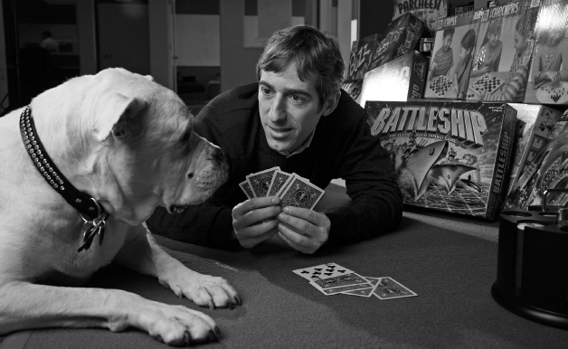

<!-- Extracted source data, not task instructions. EPUB: OEBPS/text/9780063352582_Introduction.xhtml; spine position 9. -->

 [Source page label: xix]

# [Introduction Internet Treasures](007-contents.md#rintro)

My good friend and lifelong collaborator Reid Hoffman calls me an idea generator, but my challenge has always been bringing my ideas to life.

That is true for all of us. There are so many ideas that we never pursue. Real life can often feel like a beatdown. Once we get to imagining the many steps necessary to actually implement our idea, it can feel overwhelming and expensive. It feels less fun, and we decide that maybe the idea wasn’t that great. Even when we do pursue our idea, we’re forced to make many painful trade-offs, with time as our primary currency.

The way to change this equation is to massively accelerate the speed at which we build our ideas.

*What if we could all live our lives at the speed of play?*

Life at the speed of play is a mindset that enables us to turn our ideas into reality with the same ease, speed, and freedom that we experience in games or play. We can test our ideas in hours or days rather than months or years.

 [Source page label: xx] Play offers us a way to escape reality’s constraints. In Monopoly, you can build a business empire and then go totally broke. On Halloween, you can try on any persona for a night. When you play, you can explore wild ideas without worrying about failure.

Elon already lives life at the speed of play. He says there’s a high probability we are living in a simulation. Elon seems to have beaten the sim and is having way more fun—from fart mode in his cars to flamethrowers, perfume, and in summer 2025, the launch of Tesla diners. In December 2016, he tweeted, “Traffic is driving me nuts. Am going to build a tunnel boring machine and start digging.” Within a month, he raised $1 billion and launched The Boring Company.

Imagine bringing that whimsical, playful, and fast approach to how *we* build products. Think how many more ideas we’d test if we didn’t worry about costs and consequences. The fear of bad decisions holds us back from taking risks.

Building products at the speed of play means we can explore 100 or even 1,000 ideas in the time it used to take to pursue one. It’s not just about failing fast; it’s about expanding our zones of innovation. By giving ourselves permission to test even our weirdest ideas, our range of innovation expands massively, and so does our learning—allowing us the opportunity to get to breakout ideas.

At Zynga, we lived** life at the speed of play. We were committed to testing more ideas in a week than the game industry tested in a year. By cutting the marginal cost of a test to nearly zero, we operated in a state where any idea, no matter how wacky, was a potential shot on goal. In YoVille, we tested and quickly launched avatar babies, which lit up our player base. We called these ***OMFG moments***.

As entrepreneurs and product makers, we’re obsessed with speed, but most of us are doing it wrong. We’ve been sold on Minimum Viable Product (MVP), but the world moves too fast for that now. What we need is a much smaller ***atomic unit*** of our idea that enables us to test and fail fast, long before we build the full product.

When we were creating games at Zynga, it wasn’t about product market *fit*. It was about product market *hits*. In fact, we managed to generate an 80 percent hit rate on our major games. We launched eight games that achieved more than $1 million in daily revenue and together generated more than one billion app installs and $1 billion in revenue. Meanwhile, I would estimate that a well-executed consumer app has a 1 percent chance  [Source page label: xxi] of any success, and an exceptional one might have a 10 percent chance. What if we could multiply those odds by a factor of eight?

This book highlights the most important lessons from my 30-year journey as a founder and product maker. It’s based on two Stanford courses I’ve created and taught. But think of it as more of a dinner conversation than a lecture. I’m sharing my pattern recognition from decades of trying, failing, and sometimes succeeding to help you turn your winning instincts into hit products.

At its core, this book centers on three pillars that are crucial for any product maker:

1. **Isolating your winning instincts from your losing ideas.** Learn why your instinct is right 95 percent of the time, but your idea is wrong at least 75 percent of the time—and what to do about that.

2. **Turning insights into reality using my Proven Better New framework.** Turn your ideas into heat-seeking missiles that find their target faster with fewer resources. Make every engineering day count.

3. **Getting people to do the right thing when you’re not in the room.** Build a culture and system that can repeatedly deliver breakthrough products.

Finally, we’ll talk about how to apply all of these principles in a world that is being reshaped by new technologies. It’s clear AI alone will reshape our world, but robotics and space exploration might redefine everything.

## This Is God’s Work

This generation of product makers has an unprecedented opportunity to build what John Doerr, chair of Kleiner Perkins, and Bing Gordon, my longtime friend and coach and the former Chief Creative Officer of Electronic Arts (EA), call ***Internet Treasures***—services we can’t remember life before or imagine life without. Doerr and Gordon believe that one day, these products will be shown in the Smithsonian as the greatest output of our culture: the iPhone, Amazon, Google. Now we can add ChatGPT, too.

 [Source page label: xxii] When I first heard about Internet Treasures, I was finally able to put words around my “why” and what my career has been about. I truly believe this pursuit—turning our instincts into products that can enhance millions of people’s lives—is God’s work, the most important thing we, as product makers, can contribute. That may sound like lofty talk from a guy who made video games, but we succeeded because they delivered so much more than just entertainment. Bing once said we should measure the success of our social games in marriages—and, in fact, there were many. This past year, two students approached me after my Stanford class to share that they first flirted in Words With Friends. Now they’re married.

When we get our product right, it feels like a communion with our users. We know it in our gut, and we feel it in the way our users connect with us. That’s why, for me, the true measurement of our success has always been player hugs.

Being a great product maker isn’t about building one perfect product. It’s about developing a systematic approach that increases your odds of a breakout hit. I think of us as a community of product managers (PMs) chasing the same dragon. Some of us are just earlier in our careers, but we’re all on the same path and after the same prize.

At some point, I started jokingly calling this playbook my “PM Bible.” Not because it contains absolute truths, but because it’s something I return to again and again to keep me and my teams intellectually honest and accountable. When we’re caught up in the excitement of building something new or emotionally attached to an idea, these principles bring us back to our true path.

One of my biggest motivations to write this book has been the charge I get every time I run into an ex–Zynga PM or a founder who has implemented my frameworks to tune into their own winning instincts. Shayne Coplan, the founder of Polymarket, taught himself ***Proven Better New*** from my YouTube videos before we ever met. As of November 2025, Polymarket was valued at $9 billion!

Polymarket is one great example of how these principles apply far beyond games, to any consumer application. Later, we’ll talk about how these principles have even played out in enterprise software.

Whether you’re a founder, product manager, or anyone involved in  [Source page label: xxiii] creating products, my hope is that this book will help you navigate your own journey more successfully. The five years my coauthor Carlye and I have spent on this book project will all be worth it if one reader builds a world-changing product.

## My Origin Story

I always looked up to my dad and was inspired by the way he lived life—all in on everything he did. He pioneered a category called financial public relations and built a nationwide firm called the Financial Relations Board. He built this firm over 38 years and eventually sold it to an advertising conglomerate for $38 million. More importantly, my dad lived and modeled a life about play. He was a talented jazz musician, wrote speeches for presidents, and authored many books. Above all, he exhibited an amazing commitment to playfulness, which included writing a (bad) joke book under the pseudonym Roderick Rosebuns (pink ass for Pincus). He even insisted that his gravestone inscription be “third-string quarterback” (referencing his brief, failed high school football career). He created a family culture that was rooted in games and creative expression. Our nights, weekends, and holidays were a constant stream of charades, board games, and eventually poker. For each of these games, our family modified the rules to make them more fun and, usually, faster. When we played Pictionary, we threw away the board and just read each other the questions. With charades, we invented the “moo” rule, which penalized people for making noises. My favorite change was in Scrabble, where my dad made up a rule that enabled you to use another player’s letters to change any word on the board, freeing up new letters to get around bad luck of the draw on letters. The single word that summed up my dad the best was “chutzpah”—he got the most out of life while also challenging and often breaking rules if they didn’t make sense.

Because my dad was such a strong personality and he taught me to question authority, we had a falling-out when I was 18. He decided he wasn’t done raising me and was going to pull me out of college for a year to “finish the job.” Of course, as a rebellious teen, my response was “fuck you,” and I went on to transfer from the University of Michigan to Wharton and become a straight-A student while getting a lot of jobs to support myself.  [Source page label: xxiv] Ironically, this drove me to be the kind of self-sufficient high achiever my dad was hoping to raise.

This tendency to make up my own rules, combined with a sense of playfulness, proved to be career limiting as I entered the corporate world, where being a perfect trained poodle was valued far greater than being a mini-CEO. (This period is where I learned that the true meaning of the word “corporate” is lack of thought or intent. Imagine if someone told you, “You seem really corporate.” Would you feel flattered or insulted?)

This led to a series of jobs in my twenties where I briefly touched greatness, working for some amazing people, even if I couldn’t hold the positions for very long. I was hired by Bill Loomis at the investment bank Lazard Frères and worked for Steve Rattner and Ken Jacobs, all of whom were legends in the banking world. I had the distinction of being one of two Bain summer associates who were asked to leave—but did get to present to Mitt Romney. A career highlight was getting to work for John Malone at TCI, which was at the time the largest cable company in the country. My recollection was that I made some career-limiting moves. It’s funny that he later recalled that I was a brilliant hire they were sorry to see leave. My last job working for someone else was for future senator Mark Warner at Columbia Capital, his venture capital (VC) firm in DC. In each of these roles, I was exposed to strong leaders, but it didn’t feel like there was room for me to grow into one myself. I had a deep desire to be a CEO and started to realize the importance of turning everyone else into one, too.

As I reflect on that period, I realize that my actual career started on my first day as a product manager in 1994 at a company called SpaceWorks in Bethesda, Maryland. I had sourced this investment for Columbia Capital, which, luckily for me, had a strategy of embedding its associates in its portfolio companies. In one sense, SpaceWorks was a dream job, because I got to experience the high of building and shipping real products. However, I quickly soured on the investment as I saw how out of position the company was. SpaceWorks was building private online networks for big enterprises at the exact moment that the public web was starting to take off. SpaceWorks was painfully out of position, and there was nothing I could do about it. I tried to convince the CEO and the partners at Columbia Capital that SpaceWorks needed a hard pivot, but nobody would listen. I knew the  [Source page label: xxv] only way I was going to have a chance to prove I was right was to be a CEO, and that meant starting my own company.

While SpaceWorks ultimately failed, the opportunity was life-changing. In addition to launching my career as a product maker, I met two brilliant young engineers, Cadir Lee and Scott Dale, who would become my cofounders at Support.com and later join me in building Zynga.

In the fall of 1995, I left Columbia Capital to cofound my first company, FreeLoader, with Sunil Paul. FreeLoader pioneered push technology with free software that automatically downloaded websites and made them available through an interactive screensaver. Through a combination of intense hustle and luck, we built and sold the company in seven months for $38 million. It was not lost on me or my dad that this was the exact same dollar amount he sold his company for, only after 38 years! This was my first taste of living life at the speed of play.

Despite FreeLoader’s successful exit, and all the accolades, it felt hollow for me. FreeLoader, under the acquiring company Individual Inc., died within a year, as our technology became less relevant and we didn’t have the autonomy or operating budget to pivot. After this experience, I knew I wanted to build something enduring, like my father had.

In 1996, Sunil and I moved the company—and our lives—to San Francisco, because we both thought it was going to be the Motor City of the internet (like Detroit was for the car industry). By 1997, I was back at it, cofounding Support.com with Cadir and Scott. Despite having no experience in enterprise software, we built Support.com into the leader in helpdesk automation software. We were successful so quickly, and I was still so young at 30, that my VCs felt the need to replace me as CEO with someone gray and corporate before we could go public, which we eventually did, in 2000, at a valuation of $1.5 billion.

In 2001, after the new Support.com CEO pushed me out for undermining her authority and going after a large deal that would require a different product direction, I cofounded a product incubator with my friend Martin Roscheisen called Tank Hill, named after the hill behind my house in Cole Valley where I walked my dog Zinga every day. We quickly saw that the consumer internet was about to be over, maybe for a long time, so we shut it down and returned $7 million of the $10 million we had raised. I like to  [Source page label: xxvi] think that founders should be good stewards in down markets, too. Sometimes failing fast and returning capital is the best, maybe even only, option.

After this, I entered the first of what I like to call my ***Abysses***—the open space so many of us founders experience in between building companies. This lasted a few years. More on Abysses later.

In 2003, I cofounded Tribe.net with Paul Martino and Val Syme. Tribe, which was one of the first three social networks, was focused on combining Craigslist (classified listings) with Friendster (social networking). It turned out to be a long, painful failure—we couldn’t find product-market fit, a private label licensing deal with Cisco went nowhere, and we eventually ran out of funding—but it generated learning that led to the founding of my next company, Zynga. It also led to my $38K seed investment in Facebook (now Meta).

In 2007, I founded Zynga, which was named after my amazing American bulldog. I saw in Zynga the opportunity to finally build my forever company. This is when I realized my career was about building an Internet Treasure, and I saw in Zynga the chance to do that. Since we were profitable from the beginning, I was able to keep control this time, which meant I could build a house I would want to live in—I could make decisions for the long term and not worry about pleasing VCs. Zynga pioneered social gaming and helped turn play into a mass-market activity. We achieved $1 billion in revenue within four years and went public in 2011. In 2012, as a newly public company, Zynga lost 30 percent of its traffic in a few days, after Facebook changed its algorithms. This led to a painful turnaround as we rebuilt our products and company for mobile. During that time, I left and returned as CEO before eventually partnering with current CEO, Frank Gibeau. In 2022, Zynga merged with Take Two Interactive (best known for its hit franchise *Grand Theft Auto*) in a merger that valued the company at $12.7 billion.

In 2018, after feeling confident that Frank and team could run Zynga without me, I cofounded an investment firm called Reinvent Capital with Reid Hoffman and Michael Thompson. Our focus was doing venture capital at scale. We backed some amazing founders and companies like SpaceX and Joby, which is leading the way to air taxis in a category called electric vertical take-off and landing (eVTOL). We sponsored three initial public  [Source page label: xxvii] offerings (IPOs) for Joby, Aurora (the leader in self-driving trucks), and Hippo (the leading online insurance company).

In 2022, I founded Erth.AI to pursue my vision for the metaverse—delivering on the promise of life at the speed of play. This vision to create an open virtual world that merges games with real life (money and social) had haunted me for the previous 16 years. This project has gone through several iterations as I’ve explored new technology, first crypto and now AI. Luckily, my team has remained scrappy, which has provided the staying power to keep at this as regulations and technology platforms become clearer.

Me and Zinga the dog—Zynga’s namesake!

*Credit: Jim Wilson /*The New York Times*/Redux*

My Career TL;DR

1. 1988: Graduate Wharton, join Lazard Frères (investment bank)

2. 1993: Graduate Harvard Business School, join Tele-Communications Inc. (TCI) and Liberty Media (cable company)

3. 1994: Join Columbia Capital (venture capital firm)

4.  [Source page label: xxviii] 1995: Cofound FreeLoader with Sunil Paul

5. 1996: Sell FreeLoader for $38 million

6. 1997: Cofound Support.com with Cadir Lee and Scott Dale

7. 2000: Support.com IPO

8. 2000: Cofound Tank Hill (incubator) with Martin Roscheisen

9. 2001: Shut down Tank Hill, return investor money

10. 2001–2003: First Abyss

11. 2003: Cofound Tribe.net with Paul Martino and Val Syme

12. 2006: Shut down Tribe.net

13. 2005–2007: Second Abyss

14. 2007: Found Zynga

15. 2011: Zynga IPO

16. 2014: Found Superlabs (incubator)

17. 2015: Return as Zynga CEO

18. 2018: Cofound Reinvent Capital with Reid Hoffman and Michael Thompson

19. 2022: Take-Two acquires Zynga for $12.7 billion

20. 2022: Found Erth.AI (formerly known as Dot Earth)

My objective in writing this book is to share the lessons and practices I’ve developed over my 30-year career as a product maker and founder. The book is also a deep dive into the underlying philosophies that have driven me, inspired me, and have made me successful.

At the root of these philosophies is a commitment to intellectual honesty. For me, that all began when I started my Book of Life.

[*OceanofPDF.com*](https://oceanofpdf.com)
