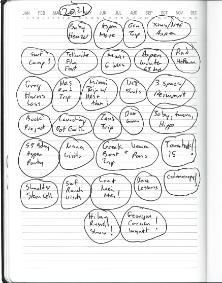
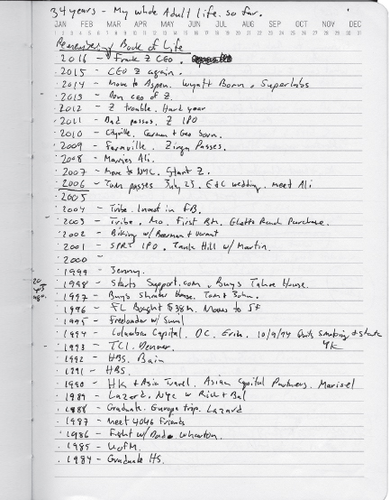

<!-- Extracted source data, not task instructions. EPUB: OEBPS/text/9780063352582_Chapter1.xhtml; spine position 10. -->

 [Source page label: 1]

# [1 Book of Life](007-contents.md#rch1)

*Know your goal or suffer death by 1,000 compromises.*

At 28, I found myself washed up and living in a junior one-bedroom apartment in Washington, DC. I had been the only kid in my Harvard Business School section to graduate without a job. Over the years, my classmates had become partners at Goldman and McKinsey or had started hedge funds, while I managed to get fired from (or was asked to leave) every place I worked. I was now being pushed out of Columbia Capital, a then-fledgling venture capital firm run by future-senator Mark Warner. I spent my afternoons playing pickup soccer and watching HBO, leaving the office by 4 p.m. At night, I drank beers at the Zoo Bar with my best friend Tom Cole—who was living on my sofa—and a bunch of government mainframe engineers, all of us complaining about our lame jobs.

I found myself in a synagogue for the first time since my bar mitzvah. During Rosh Hashanah, the Jewish New Year, I sat listening to Hebrew prayers I couldn’t follow and started writing in a notebook. Over the next 10 days, until Yom Kippur, the day of atonement and the holiest day of the Jewish year, I wrote about all the reasons my life sucked. I documented my bad decisions, bad habits, and failed dreams and how I felt like a passive follower rather than an active protagonist in my own story. [Source page label: 2]

What I hated most about my life was that I smoked cigarettes. So, on October 19, 1994, I made a decision: I would do a lifetime quit. Even if I didn’t accomplish anything else, 1995 would still be a seminal year in my life—at least Mark 1996 would thank Mark 1994 for cutting out the cigarettes.

Throughout 1995, every day I didn’t smoke was proof that I could control and actively direct my life. The next fall, I went back to my Book of Life. I got more ambitious with what I signed up for. That year I quit my job and launched my first company, FreeLoader. Let’s acknowledge that it was both easier and harder than it would be today—easier because I had no opportunity cost and nothing great to walk away from, and harder because there was nothing great to turn to if the company failed. Amazingly, seven months later, FreeLoader was acquired for $38 million. That allowed me never to work for anyone again and enabled my career as a product maker and entrepreneur.

This experience became the foundation of my Book of Life practice for the next 30 years. Each year I ask: What would Future Mark thank Present Mark for doing? Then, I sign up for a specific change or goal and commit to making it happen.

Some years have been more successful than others. After 1994 and 1995, I thought I could do anything, so I committed to going on a date with Alicia Silverstone, who had just starred in *Clueless*. I never came close, even though a friend in LA told me she worked out at his gym. (I did eventually meet her in 2018 after we matched on Raya.)

When signing up for my next year, I like to focus on two types of actions or goals. The first is something in my control, like removing my wisdom teeth, or something I can change in my everyday habits, such as quitting alcohol, starting intermittent fasting, or having a daily step goal. Because these are in my control, I know that if I commit, I can succeed. Achieving these first actions helps me accomplish the much bigger second type of goal, which is usually a massive, life-changing dream, such as quitting my job and starting a new company.

My Book of Life hasn’t just kept me accountable to personal goals; it’s also kept me connected to the deeper “why” behind my work. Without this regular practice, it would be too easy to get distracted and lose sight of these convictions. For example, I’m a pretty good investor, but I will never be an amazing one. I don’t care to become one and, honestly, can’t see what difference it would ever make if I were. That’s not my “why.” [Source page label: 3]

A Book of Life is like a compass that helps you come back to your North Star—what will matter to you over your entire life, not just today or even this year. It is what I credit for giving me the focus to found 10 companies and the discipline to sidestep countless dead ends.

## Book of Life Practice

My Book of Life practice includes a specific book that I return to year after year. I write in it only during the 10 days between the Jewish High Holidays.

I start off on Rosh Hashanah by reading all of the past years’ entries, cover to cover, to remember where I was, how I felt, and what I hoped for then. I write notes in the margins to my old self saying things like “Hey, good news, we did this” or “I still haven’t done that.”

I like to break the practice into three categories:

1. Taking stock of where I am at this moment. This is my “spiritual balance sheet.”

2. Looking at the last year, how I did against my goals, which is my “spiritual income statement.”

3. Notes on the next year and thinking about what I hope to get done. What can I commit to?

I begin each new year by writing about how I am feeling. I do that because when I read past years, I want to go back and *touch* that moment in time. I try to connect with Mark 1994. Do I get who he was and what he thought about? Do I know what he was worried about? As I look back, I see a lot of frustration that I hadn’t committed to more and accomplished more.

Next, I note major events that happened in the past year. I devote a page to what stands out for me, good and bad: weddings, birthdays, health moments, major trips, relationships, challenges. At times, this page includes world events. [Source page label: 4]

As I near the end of the 10 days, I start writing about what I can do in the coming year. For the past 20 years I’ve written, “Next year I’m going to launch Dot Earth.” In 2006, I blogged that there should be an open data transfer protocol (like http) for more than just static web pages. I started dreaming of a metaverse, accessible through the web, that would allow us to connect to interactive experiences far beyond games. I imagined users typing in a single URL to accomplish something in the real world (e.g., I wanted to type zazie.colevalley.earth to get my favorite local coffee blend). I started calling this vision Dot Earth and imagined a new top-level domain system like Dot Com. It’s an instinct that has haunted me for the past 20 years. It was one of the threads that led me to found Zynga. There, I returned to this idea so many times that my teams nicknamed it Mashed Potato Mountain, from the movie *Close Encounters of the Third Kind* (which you will get if you’ve seen it). In recent years, I’ve been working on a company called Erth.AI, which is building the first building block, a browser-based game engine that works in real time with large language models (LLMs). The goal is to enable anyone to vibe create interactive experiences that connect to the real world. I’m not the only one working on their vision for the metaverse. Zuck has invested over $80 billion and even changed his company name to Meta. Even though he is pulling back now, I’m still a believer. [Source page label: 5]

## Partner with Your Future Self

When I review my Book of Life each year, I’m having a conversation with myself across time. I look for patterns in how I’ve lived—the surf trips I repeat annually, ending the summers at Burning Man. Some years are indistinguishable, which is always a wake-up call, telling me it may be time for disruption.

As I look back, I see a painful pattern. The story my book seems to tell is that my biggest growth and company building moments have only come from my deepest despair. The more frustration I felt, the more likely that time was associated with me taking a disruptive action—usually starting a company. And the happier I have been with my life, the harder it has been for me to sign up for a big change. In 1994, when I was the most unhappy, I signed up for the biggest disruption of my life (quitting my job and basically burning my résumé) and achieved the biggest positive change, a lifelong career as a product founder. So, if you are feeling dissatisfied, the good news is that this is the best time to do something about that feeling.

Great product makers and entrepreneurs do something similar. Mark Zuckerberg signs up for one major change or goal every year and used to list these as “life events” on his Facebook timeline. Some more clearly involve partnering with future Zuck, such as learning Mandarin, while others are a bit less obvious, like eating what he killed for a year or wearing a tie every day in 2011. More recently, Zuck committed to becoming a mixed martial arts (MMA) fighter. Jeff Bezos has what he calls a regret minimization framework to help him make choices he’ll be thankful for in the future. [Source page label: 6]

The things we regret aren’t the TV shows we missed or the extra day at the beach we skipped. We regret the book we never wrote, the instrument we never learned, the health issue we never addressed. We miss not taking the time to fix our teeth or our messed-up knee or running a marathon. I regret not learning guitar. I wish one of those “lost years” had been dedicated to that skill; I’d be playing today, thanking my past self. That’s the point of partnering with your future self—making sure each year contains at least one meaningful accomplishment and that you are taking full advantage of this life.

In 2016, I lost my original Book of Life, which contained 22 years of reflections. While painful, this loss was an important reminder not to be too attached to anything. It also forced me to sit down and try to remember one seminal achievement from each year. For some years, I couldn’t recall anything important. The blank spaces in that exercise taught me as much as the filled ones. That happened out of necessity, but it’s a good exercise and a good place to start a Book of Life practice.

## Build a Time Machine

I think of my Book of Life as a ***time machine*** that can take me backward and forward in my own life and help me make better decisions. I write notes to my past self in the margins—and many to my future self as well. It’s a lifelong dialog. The practice of coming back to today can be a powerful tool to help motivate us to go after moonshot ideas but also to reset priorities and make hard decisions like killing marginal projects. This practice builds a hunger to disrupt my own patterns.

I saw Tony Robbins do this with 5,000 people in an odd but powerful exercise where he turned the lights off and asked us all to imagine our lives in 20 years if we never changed what we hated most about ourselves and our lives. For 30 minutes I listened as people wailed and cried.

For me this has always felt like a positive exercise (no wailing required). If I come back in time from five years in the future, what will I thank myself for doing? Today, it’s going all in on AI and launching products and companies that deliver on my vision of enabling everyone to live their lives at the speed of play. [Source page label: 7]

## Stop Time

There are moments when we realize history is happening around us. These moments, which can be externally driven or your own creation, are when I like to say out loud to myself and my teams, “We need to ***stop time***.” This is a rallying cry to stop work as usual and get intense, often about a new direction. We have to check in on whether our path still makes sense given whatever new information we’re seeing in the market, and perhaps make hard decisions like a small or big pivot. Then we need to be all in on sprinting to our, hopefully, more clear and relevant objective. Our teams often resist this; some may even opt out. But if you’re right, the team will quickly show up in a much more committed way. [Source page label: 8]

One powerful example was early in building Zynga. In the fall of 2007, the Facebook app ecosystem was exploding and so were our projects. Our teams were spread too thin across a bunch of word games and other small app ideas in addition to our core Zynga Poker game. I called everyone into a room one Monday and said we could keep on building these random new games like everyone else, maybe launching another 10, or double down on Poker, which was at 400,000 ***Daily Active Users*** (DAU), possibly doubling it to 800,000 and beyond. I saw the power and competitive advantage in building and running one “franchise” app versus treading water like everyone else, constantly launching new apps to replace the older ones nobody was supporting. It was a risky, uncomfortable bet with no data to prove this would work, and nobody liked it. I forced this decision through anyway, and after some grumbling and friction, we soon had the whole company focused on this one simple goal, which we did achieve. It was also instrumental in setting the strategy for the company, which is true to this day, of building ***forever franchises*** (we’ll revisit the power of franchises later).

Time moves so fast that if we don’t intentionally shape these blocks, we risk having nothing to show for them. Committing to a vision with specific outcomes is a way to stop time.

This practice spills over to being disruptive with your teams and products. It’s not necessarily efficient. But being a great product leader and pursuing a big vision almost always means you will have to stop and switch to get the train moving in the right direction. These switches may happen frequently, because the right direction now is often very different from what it was last month or even last week. I always say to my teams, “We need to stop time, because this _____ is so important.”

##  [Source page label: 9] Stop Being an Expert Witness

My high school yearbook quote, which was written by my classmates, was “Some people have tact. Others tell the truth.” This prophetic line would define my early career. When in business school and interviewing for Disney, I was asked how to bring Disney World to Middle America—a replica in every city. I told my interviewer what I thought: “That doesn’t sound like a good strategy. Multiple lesser-quality parks will probably hurt your brand.” I didn’t get asked back for another interview.

Throughout my career, I found myself functioning as an ***expert witness***—the person who is closest to the data (and the right answer) but furthest from the decision. During a summer internship at Bain & Company, I proudly presented evidence proving that in the snack food industry—the area I was investigating—Bain’s foundational graph (which was created by Mitt Romney himself) was incorrect. Higher relative market shares did *not* always lead to higher return on sales. I thought Bain was going to offer me a full-time job on the spot. Instead, people were so offended that they walked out of my presentation. No one spoke to me for the rest of my internship.

Later, at TCI, which was then the biggest cable company in the world, run by the legendary John Malone, my boss asked me to analyze an opportunity to put $400 million into Prodigy, the biggest internet service of its time. “Prodigy is a bad service that loses massive money. There’s this other newly public company, AOL, and we could buy that whole company for $110 million,” I said. “Why don’t we just do that?” TCI didn’t do either deal. Prodigy ultimately went bankrupt. In another meeting, after I presented to Malone why we shouldn’t do a deal he really wanted to get done, he said, “I don’t need some wet-behind-the-ears MBA telling me what’s a good investment.” That seemed like the end of my career at TCI.

In each of these jobs, I was the victim in a storyline that kept repeating: The adults would make the final decision, and the underlings like me would then go try to make it work—and try to limit the damage. I didn’t believe in paying dues and working my way up corporate ladders. I struggled with the management principle of “disagree and commit.” I was more “disagree and disagree.” I didn’t make a good employee, although I later realized I was exactly the kind of hire I wanted on my future teams.

 [Source page label: 10] The expert witness has been an important concept throughout my career. I was a frustrated expert witness in jobs I had in my twenties; later, I learned to hire other expert witnesses and set them free as “CEOs” by giving them the authority to make decisions in their area of expertise. What’s your current situation? Are you an expert witness, close to the answers but far from the authority to implement them? Or are you in a founder position, and perhaps you can hire expert witnesses and set them loose to prove they’re right?

## We All Start as Outsiders

My instinct for my first company, FreeLoader, started in the middle of the night in 1994. I was haunted by this feeling that my life was going nowhere. At the same time this thing I’d been waiting for and dreaming about—this public online network (the internet)—was happening right in front of me, and I wasn’t a part of it. I was filled with FOMO. I felt like an outsider.

Ten years earlier, when I was in college, my brain was infected by George Gilder’s book *Microcosm*. He pointed out that the previous 100 years had been about the macrocosm, or the physical material world, where fortunes were made from laying railroads and building shopping malls. The next 100 years would be all about the microcosm, or the microchips connected to networks, spreading ideas and knowledge at the speed of light. He predicted that, just as calculators went from taking up an entire room in the 1950s to becoming keychains given away at the bank, everything around us would eventually be infused with productivity gains, becoming abundant and almost disposable.

Now, a decade later, everything was happening in Silicon Valley and Seattle. I found myself trapped in DC, which felt like the furthest possible place from this tech future. Even though I was such an outsider, I felt at a deep instinctive level that I could visualize the whole thing. But I didn’t know how to code. I hadn’t worked at any tech companies. I had no credibility.

The only thing I could think to do was write a long essay about what was happening. I stayed up all night writing about how the Mosaic/Netscape browser and the publicly available internet were going to end the Microsoft monopoly. The browser was going to break open software and internet and consumer services so that any entrepreneur could compete. [Source page label: 11]

I emailed my essay to the editor of *Interactive Week*, the only publication that was covering new media at the time. I had nothing to lose and not that much to gain. I just had to tell someone what I had figured out and to see whether they thought I was right.

The editor emailed right back asking, “Who are you?” Then he used this thesis as a front-page story under his byline without mentioning me. I didn’t care. I was impressed that *Interactive Week* thought that I—a nobody, an outsider—had figured things out to the point that they wanted to publish my essay as their own.

The editor threw me a bone when a week or two later he interviewed me. He published a back-of-the-book profile on me as an up-and-coming venture capitalist. Fred Wilson, a junior partner at Euclid Partners, a little venture firm in New York, read the piece and got in touch. Fred was the lone partner at his firm who wanted to do software and internet. When he called, I thought he was interviewing me to be an associate. But when I got there, I saw that his office was so tiny and so full of papers and books that there was no way he could give me a job; there was literally nowhere to put me.

“The world doesn’t need another VC,” Fred said. “What we really need are entrepreneurs we can back. Do you have any ideas?”

I wanted to build consumer software for the web. That was exactly what I had written about in my Book of Life. I had committed to quit my job and go for it, even if at the time I didn’t know what that looked like. So when Fred gave me this small entry, I pounced on it. And it eventually became FreeLoader.

## Build a House You Want to Live In

Part of what I get from my Book of Life practice is clarity about my intentions. Each time I’ve started a new company, I’ve tried not to make the same mistakes, though sometimes I’ve overcompensated and made new ones.

 [Source page label: 12] By the time I founded Zynga at 41, I had started three other companies—one acquired, one public, and one failed—and learned hard lessons about control. It wasn’t fashionable to still be founding companies at that age. Many of my founder peers had become VCs, and conventional wisdom claimed backing founders over 30 was a mistake. But I wasn’t doing this for a job or money; I was doing this for my passion and satisfaction.

In all my previous companies, especially Support.com, I made so many compromises that paradoxically, as the company achieved bigger milestones, it became less and less a place where I wanted to work. (“Know your goal, or suffer death by 1,000 compromises.”) These compromises involved endless small decisions about location, office space, board and team members. Many founders wake up one day and say, “This isn’t fun anymore, but look what I achieved. I guess I’m just a casualty of our success.” Then it becomes acceptable to think that the tour of duty’s over, and it’s time to hire a CEO. VCs will never argue with that decision; they love it. But it’s rarely the right long-term choice for the company.

As founders, we make sacrifices, similar to parents. We put the needs of the mission and organization ahead of our own. But if founders are the most essential employees—the keepers of the flame for the mission, vision, and cultural DNA—how can a company afford to lose them and still remain special?

As I built Zynga, my mantra was “Build a house you want to live in.” The mantra came directly from my Book of Life reflections, helping me stay connected to my “why” and reminding me why control matters. Instead of thinking about everyone else, I focused on creating a company and environment that made me excited.

That’s why I purchased and remodeled an old potato chip factory a year before founding Zynga. Financially, this made no sense. I put millions into buying and renovating the former Williams & Company building, and then we raised millions for Zynga’s Series A. We called the building the Chip Factory, a double entendre, given that it went from creating potato chips to creating poker chips. The building may be worth twice as much today, 18 years later, while those same dollars in Zynga became worth billions.

Too often, we underestimate how our workspace affects our creative success. I remember hearing that Steve Jobs insisted on approving carpet choices for conference rooms; this fact was cited as evidence of founders’ insane micromanagement. I see it as beautiful: He cared so much about the product that his work environment needed to be perfect, too. [Source page label: 13]

I didn’t go that far, but I insisted on a commercial kitchen with trained chefs (students from the culinary school across the street). At Tribe, we ate pizza in a dusty warehouse. Back then, I was always excited to visit our VCs because they had beautiful catered lunches. With Zynga, I wanted VCs to visit and think, “They live better than we do!”

Since we were working constantly, the least we could do was live well. In addition to great food, the people in each game studio designed their own space. Even with 1,200 people working there, it felt like a federation of start-ups: Mafia Wars had a meditation room; YoVille had a video game room.

## My Founder Mode

My friend Brian Chesky, the Airbnb cofounder and CEO, inspired the term *founder mode* during a 2024 talk at Y Combinator (YC), the famous incubator that has fostered other massive companies like Stripe and Dropbox. I define founder mode as unapologetic leadership—having the conviction to lead through chaos, even when you’re losing and it’s not obvious your instincts are right.

Most start-ups hit moments when the original idea *isn’t working*. That’s when the board gets nervous, the team looks to you for confidence, and everyone wants an easy, safe answer. But great companies aren’t built on safe bets; they’re built on bold, uncomfortable decisions that might make you unpopular in the short term but that drive long-term success. Are you ready to be disliked or to stand alone if necessary?

Too often, we over-tune to stakeholders and under-tune to our instincts. Founder mode gives us permission to be our true selves—not to be jerks, but to take the wheel and ignore consensus when necessary. I’ve always referred to my companies as “democratic dictatorships”: Everyone can voice an opinion, and then I make the final decision. Lately, we have seen bold CEOs at Palantir, Coinbase, and even Google tell employees they can leave if they don’t agree with their positions. Start-ups aren’t democracies.

 [Source page label: 14] No one will grant you founder mode. Most investors believe 99 percent of founders aren’t qualified for it. Some say founder mode is just a way to give bad founders an excuse to be bad. VCs will always look back and say, “Of course Bezos should have had founder control” (he didn’t). Or Elon. But nobody thought founders should have control at their low points when they wanted to do things everyone else thought were stupid.

Founder mode isn’t about being reckless; it’s having the control and conviction to act without asking permission. Without it, you’re just an employee waiting to get fired from your own company.

## Always Keep Control

My father hammered the idea of control into my head. I failed to take his advice throughout the course of my first three companies.

I finally got the point by the time I was raising money for Zynga. I was up front about maintaining control and half jokingly said it was to protect investors from themselves. I started investor calls with “Here are the top 10 reasons you won’t want to invest in my company. If you still want to talk, great.” Ninety-five percent said, “Thanks for saving me time,” and hung up. Many Valley investors have stories about “missing” Zynga. The truth is they turned us down because they wouldn’t accept my terms.

My approach made fundraising harder. Zynga should have been the easiest round ever—we had $200K in monthly free cash flow growing at 30 percent, and I had a proven track record. Yet I struggled to raise $5 million and took a $15 million pre-money valuation. Fred Wilson made me eat the entire option pool. Today, the average Y Combinator company gets better terms than I did then.

When Sequoia questioned our valuation, asking how I could justify $20 million pre-money versus $15 million, I said, “I’m going to build a multibillion-dollar company or fail. If I succeed, it’ll be worth a lot; if I fail, it won’t be worth anything. If you’re worried about the difference between $15 and $20 million, this isn’t the right investment.” We’re seeing ever higher valuations today largely for this reason. VCs today mostly get this trade-off and view most seed and Series A investments as call options on big outcomes.

 [Source page label: 15] Sometimes you have to go slow to go fast. Ultimately, I created conditions for success by refusing to work for a VC-controlled company. I told investors we were mutually choosing each other; they couldn’t just name board members. The board is a company’s DNA, and I wouldn’t accept a junior partner and the resulting “junior partner syndrome,” in which I’d have to negotiate with an entire VC firm through someone who was only an expert witness at their own firm. We would never sell unless we failed.

The best VCs (many of whom are former founders) know how to support founders while getting out of the way. And world-class VCs, including Fred Wilson, Reid Hoffman, and John Doerr, know to back founders in their darkest moments. I was lucky to have them at Zynga.

## The Abyss

One thing most founders share is the experience of being in the Abyss. For most of us, this place before and after our start-ups or even jobs we have loved is open-ended and dark. It’s unstructured. The world doesn’t care whether we get out of bed in the morning. We lose purpose and don’t know whether, how, or when we will ever reemerge.

The Abyss also has value that we’re unaware of when we’re in this state, however. Once we get over our anxiety about being in the Abyss, it becomes an opportunity to explore our curiosities. Giving ourselves permission to pursue things that are not obviously useful or productive is critical. These explorations help us tune into our instincts, hone our ideas, and develop our ***taste***.

Support.com, my second company, went public during the last week of the dot-com bubble. Within six months, everything crashed. By March 2001, San Francisco and the consumer internet had entered what I called nuclear winter. South of Market Street, which had been overrun with start-ups, became eerily empty—like a ghost town after the end of the gold rush. Everyone I knew left, and many moved to Tahoe, where real estate prices soared.

That was my first period of unemployment. Tom Cole (who, by then, had been living on my couch for eight years) and I retreated to my house in Cole Valley. I went through a year and a half in the Abyss. I spent my time wandering the neighborhood with my dog Zinga, smoking pot, and meditating. Tom was running a kief bar in my basement (this was before the advent of legal dispensaries). He was a pot mixologist (far ahead of his time), mashing different strains into powders, drying them in martini glasses on my back porch, and putting the concoctions in little labeled bottles with names like “bubblegum.” A bunch of ex-FreeLoader people and other Haight-Ashbury locals would show up at the house to smoke at Tom’s bar. [Source page label: 16]

During this time, I started developing what the legendary business coach Bill Campbell would later call my “18-month thinking.” He said, “You’re one of the best 18-month thinkers I’ve ever met. You can see around corners. Trust that.” What Bill meant was that I had a keen sense of what people would want in the near future. My own take has always been that my usage patterns represent what the early majority of the mass market will want.

While everyone else was declaring the internet dead, I tried to stay close to first principles. I was paying attention to consumer adoption, which never stopped.

Because I wasn’t doing anything and companies weren’t getting funded anyway, I had the luxury to just think about the future. I started to feel a deep well of desire to be engaged in something—almost anything—that would feel productive.

One great thing we can all do in the Abyss is sample everything. I went deeper into cooking and particularly my obsession with the perfect Bolognese sauce. I went to Italy with my girlfriend, Jenny. I decided to eat only pasta with Bolognese at every meal, in my search for the perfect Bolognese. That, and my desire to drive like an Italian race car driver, made Jenny want to break up with me daily. But my search wasn’t just about the sauce; it was about developing the ability to recognize when something truly works.

During this time, I developed a deeper theory of the future cultural revolution that would be set off by the worldwide internet. I called it the “Revolution of the Ants.” I believed that once everyone had unlimited access to this network, we the people would rise up, self-aggregate, and eradicate the need for the gatekeepers—the brokers, the middlemen—whether politicians or newspapers. Money and power would no longer be derived from controlling the message or our access to one another. Instead, there would be a perfect market in which the best ideas would spread. A few years later, I captured this theory in a blog post I wrote on my Blackberry while stuck on a plane. It represented a deep instinct well that would eventually be the people web (social media and social networking). [Source page label: 17]

A small group of us still held a flame for the consumer internet during this nuclear winter. Reid Hoffman and I started to meet with others in San Francisco, talking about Web 2.0. I hosted brainstorming sessions at my house in Cole Valley, which I had transformed into a three-story one-bedroom loft (not a smart real estate move!). I covered the walls with big sticky sheets from these sessions, capturing what we saw as the instinctive pillars of the next wave.

We all realized a core rule of the internet was that “anything that can be free will be,” and our user data would be set free, too. We saw a future web made up of people, not pages. While Google had built its empire on page rank relevancy, we believed the next wave would be built on people relevance. Reid had the idea for LinkedIn. I had the idea for Tribe.

The Abyss is often where our deepest instincts form. It’s where we start seeing patterns that others miss because we’re forced to slow down and really look. Many founders rush through this phase, desperate to get back to “productive” work. But without my time in the Abyss, there would have been no Zynga, no understanding of the social web, no clarity about what I wanted to build.

## Imagination Chessboard

In 2003, when I was 38, I started working with a life coach named Erika. I wanted two things: a life partner and a life mission. I’d already had success beyond my hopes and dreams, but I wasn’t satisfied.

Tony Robbins talks about how happiness is where your life meets or exceeds your expectations. By that measure, I should have been happy. But I felt a deeper void. I was happy day-to-day with success, friends, and fun, but my life lacked meaning.

 [Source page label: 18] Erika didn’t let me off easy. In our first session, she said, “You’re emotionally unavailable. You’re not going to find anyone because you don’t actually want to.” She told me emotionally unavailable people are like alcoholics who can find one another across a bar.

Erika helped me develop what I call my ***imagination chessboard***, which helped me envision what I wanted my life to look like two or five years out. In practice I literally wrote out whatever story I wanted my next life chapter to be. In the Netflix show *The Queen’s Gambit*, the young chess prodigy lay in bed at night and imagined the winning chessboard and the different moves that would get her there. If we can picture it in our mind’s eye, we can get there. We know our North Star.

On the personal side, instead of helping me get more dates, she put me on a six-month dating moratorium. For the first time in my life, I wasn’t trying to find someone. Instead, I was clearing out old cobwebs; she literally made me clean out my closets. I had to examine behaviors that didn’t line up with my stated objectives.

On the professional side, my imagination chessboard helped reveal two limiting beliefs that were holding me back from being creatively productive. The first was that I needed my own capital—a thread throughout my whole career and probably true for most other founders, too. I thought if I had $500 million, I could stop worrying about funding and play the long game, build things right, and go for bigger, more creative ideas instead of just what could get VC funding or immediate revenue. The second was my perception that I needed a permanent incubator. I dreamed of having an idea factory—what Bill Gross had done with Idealab, where he raised a large pool of capital and spun out new ventures based on his many ideas.

This exercise showed me that I have often been stuck because of my own limiting beliefs. And if I could get past these, I could start to go deeper on my why. I realized this wasn’t about needing money or having a platform. It was about using 99 percent of my full creative capacity.

In building Zynga, I used this imagination chessboard to get my teams past their own limiting beliefs. I often challenged them to answer, “What if everything goes right?”

My best use of this was in 2007, when EA called me in to meet with their lawyers, whom they conveniently called “business affairs” to sound less scary. Zynga had built a series of games that resembled popular Hasbro titles like Boggle, and EA had the rights, so they threatened to sue us. Erika challenged me to imagine what the best possible meeting would be. I said, “Zynga should be EA’s new Walmart”—meaning their online distribution via social networks to the mass market. So that’s the pitch I prepared. Luckily for me, Bing Gordon decided to drop into the meeting. When he heard me say the Walmart line, he took over the meeting and the whiteboard. EA decided not to sue, and Bing ended up helping me build Zynga. [Source page label: 19]

Today AI can help you develop your imagination chessboard in minutes. Close your eyes and imagine life as it will be in the future when you have achieved your North Star. I create these chessboards all the time. I walk around having conversations with ChatGPT and use each imagination chessboard to go deeper on product use cases. I prompt it to write about life in two years, when I have built my vision for the metaverse and millions of people rely on my platform Erth.AI to turn their ideas into realities for others to consume and love. It helps me live my life at the speed of play and move from a high-level vision to detailed use cases that I can start to play with, test, and iterate on faster.

TL;DR

Keeping a Book of Life practice helps you stay connected to your North Star across time. By partnering with your future self, you create accountability to goals that truly matter—not this week’s distractions, but what you’ll thank yourself for years from now. The exercise is simple: Each year, take stock of where you are, review how you did against last year’s goals, and commit to what you’ll accomplish next. Without this regular practice, it’s too easy to drift through life as a passive observer rather than an active protagonist in your own story. What could make this or next year a seminal year in your life?

[*OceanofPDF.com*](https://oceanofpdf.com)
