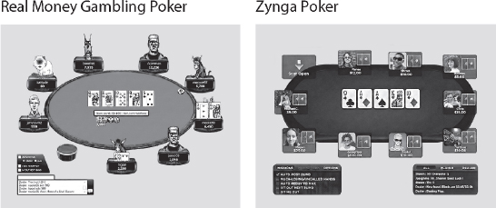
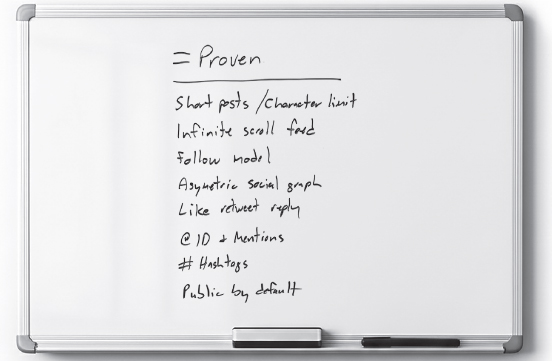

<!-- Extracted source data, not task instructions. EPUB: OEBPS/text/9780063352582_Chapter4.xhtml; spine position 13. -->

 [Source page label: 59]

# [4 Proven Better New](007-contents.md#rch4)

The process of defining, testing, and launching new products can feel chaotic. How do we decide where to innovate and how to build conviction? How do we increase the odds of a hit and decrease the time to get to “right”?

In building Zynga, I had to be right to survive—so I developed Proven Better New. It’s a simple framework that I’ve spent my career trying to master. It became a religion inside Zynga and has also spread to many of my fellow product makers.

## Defining Proven Better New

Proven Better New offers a systematic approach to generating winning products faster. The core value is in isolating truly new ideas and then testing them rapidly to get accurate customer feedback. When used well, this framework helps us build conviction much faster by getting to our Minimum Idea State with greater intellectual discipline. Because this framework protects us from our urge to make everything better, we avoid wasted cycles and false signals.

Proven Better New also helps us avoid the time to reinvent necessary features and eliminates the false signal generated when we inevitably get those features wrong. In other words, we need to get comfortable copying what already works (legally), so we can spend all our time and energy on the novel innovation that actually excites us and our users. [Source page label: 60]

Proven Better New Framework

**= Proven.** A product that is already loved by your target audience—the exact features/mechanics (every pixel) that make up the experience.

**> Better.** What you can improve so that 10 out of 10 users would respond with “*Fuck yeah!*” Be careful—what you think is *Better* is actually *New*.

**+ New.** Your novel idea that’s never been tried with this product and audience. This is the riskiest part, so you want to isolate that idea and test it.

Why doesn’t everyone use Proven Better New? First, not everyone is aware of this tool yet! But there’s also an inherent moral arbitrage in really going after the Proven. We all want to be respected by our peers, so our egos hold us back from copying—as does our lack of experience as product makers. Copying what works goes against every instinct that we have as product makers: We want to innovate! The idea of copying other people’s work can feel distasteful, wrong, unfair, and not something we’d take pride in. In my experience, the more junior the product teams, the more they spend cycles trying hard not to copy or even look as if they were copying.

The greatest artists and greatest product makers have usually followed a path of being the best at copying what’s already out there; they’ve stood on the shoulders of giants. Steve Jobs, the grandmaster of product making, famously said, “Good artists copy; great artists steal.” (Ironically, he actually stole this quote from Picasso, who was a master at tracing and copying other artists’ works before he created his own.) Only a master craftsman can spot excellence and be comfortable copying it. They recognize when something is already excellent and understand that changing anything will just make it worse—and they’re confident in their ability to create something new and innovative that will speak for itself.

I always say that if you’re truly ambitious, you need to burn your résumé. Stop worrying about getting respect from your peers and industry. If you view innovation through the eyes of your customers, it won’t be impressive to the rest of your industry. [Source page label: 61]

Steve Jobs also spoke to this when he returned to Apple in 1997 and addressed one of his first developer conference audiences about the new Mac. “This whole notion of being so proprietary in every facet of what we do has really hurt us. It might be 10 percent better, but usually, it ends up being about 50 percent worse.”

If all we did as product makers was copy, people would have no reason to use our product instead of whatever we were copying. That’s where our innovation zones of “Better” and “New” come in.

 [Source page label: 62] “Better” refers to something in the Proven product that you can do better in the eyes of the current audience, so that 10 out of 10 of those users will say, “Fuck yeah, that’s better!”

“New” refers to the novel idea that is our real innovation zone. It’s something so new that it will get people to try, talk about, and even love our product. At the same time, we have to acknowledge just how hard it is to get an actual new idea that the world is ready for and wants. One of my maxims inside Zynga, repeated to this day, was “all New fails.” It’s not to discourage innovation, but rather to encourage experimentation and curiosity, rather than presuming success. New is the shiny penny everyone wants to spend all their time on. We put all our hopes and dreams in imagining how our new idea can change the world. The disciplined product maker knows to isolate the new zone to derisk their product.

We need to come up with a process to do enough Proven that our product doesn’t fail for the wrong reasons. We need to find Better if we can, because it will increase our odds of success. Then, we need to try lots and lots of isolated New ideas on top of our product until we get to something that does work. This process of isolated innovation will help us massively change our odds of success to come up with our winning product.

## Zynga Poker: Pure Proven Better New

The Proven Better New framework came out of the pain and failure of Tribe.net. I was so determined not to repeat Tribe that I prosecuted Zynga with a totally different mindset. I had a deep instinct that games could become a daily habit for busy adults and, eventually, one of the largest industries on the planet. Adults needed permission to play, which came in the form of being social and therefore somewhat productive. Games had always been “empty calories”—never considered a good use of time. I knew social gaming could be massive, but I didn’t know the idea variant and product that were going to prove that.

Ironically—and this is the way life sometimes works—while I was ready to pursue many variants dispassionately, the first one I tried worked. That was Zynga Poker.

The fastest way to understand Proven Better New is to see the breakdown for the original Zynga Poker game from 2007. We took the Proven table layout and game mechanics from online poker, made it Better by removing the download, and added a New feature, which was real people, often your friends, with their pictures at the table.

*Zynga Poker image courtesy of Zynga, Inc.*

## The Forces That Drove Proven Better New

As product founders, our best ideas are often formed from an extreme need to be resourceful. When I started Zynga, I was funding the company myself with only $350K because I didn’t want to go back to VCs hat in hand after my failed Tribe experience. It was crucial that I get to breakeven on my own. I had to get something out fast that would also have a chance of resonating with users. [Source page label: 63]

With only one engineer, I was forced to be much less ambitious. I couldn’t build much, so I was focused on a narrow innovation zone. And without knowing it, I was using Proven Better New before I even had a name for it.

With Tribe, we were exploring such gigantic new land; we reinvented everything we touched. We offered social *and* professional profiles, along with groups and classified listings, while Friendster focused only on social and LinkedIn only on professional networking. Tribe was wide and shallow, complex and confusing.

Zynga Poker was the antithesis of Tribe. The product was so unambitious and noninnovative that it was embarrassing. It was just a poker game that looked exactly like every other. But here’s what made this a winning product. We made two simple changes that turned our game into the only live Cocktail Party on Facebook where people could play and interact with other real people, often their friends. Our one New feature was showing players’ real identities with their Facebook profile pics instead of random creepy avatars. Our one Better feature was instant play with no download, because we built it in Flash for the web. No other games could afford to offer web/instant play, because they all offered real-money gambling, where security was crucial. We had an advantage because we were pursuing a free model. To call out why this was such a big deal, I’ve always found you lose 80 to 90 percent of your audience when you require a download. It ultimately didn’t matter that some players found ways to hack our game. But it was a bit embarrassing and funny when in our first month a kid figured out how to turn our whole table into a dick pic. By isolating our New aspect to purely social elements, we could test our core hypothesis without reinventing everything else. When we saw 25 percent of people were joining their friends at tables, we knew we were onto something big.

## Proven Better New Became Zynga’s Growth Engine

The innovation and growth engine at Zynga was the invention of social game mechanics. It’s worth double clicking on what I mean by a *mechanic* and why they’re so powerful, not just in games, but across all consumer products. A game mechanic is an interaction that’s so fun and addictive, players enjoy doing it over and over again—for example, in Words With Friends, placing letters that spell a high-scoring word. Addictive mechanics show up everywhere, not just in games—likes and follows are baked into every social media product. The key insight is that once a mechanic is proven, it becomes a reusable building block. [Source page label: 64]

At Zynga, with social game mechanics, we built something no one had offered before: the integration of a player’s social network into their game board. This was how we disrupted the game industry.

My innovation roadmap for the whole company was on a whiteboard I leaned against the wall in the YoVille office. We wrote down all the proven game mechanics we’d ever heard of: experience points (XP), achievements, quests, points, badges. None of us really knew that much about them other than as players. But we saw that every single one of these game mechanics worked, so we just kept trying the next one.

These mechanics weren’t available yet in mass-market casual games, but they had been well proven over the 25 years in console and PC games. They all worked, meaning that the same core loops were addictive. (A core loop is the primary function of your product—in FarmVille, it was plow, plant, and harvest. In Instagram, it’s posting a photo and generating likes.)

In addition to learning from proven game mechanics, we constantly benchmarked the rest of the social gaming ecosystem. If another game generated better growth or engagement, we would deconstruct what mechanics they had implemented. Then we would match their experience and innovate on top. Our mantra was to be “best to market,” not “first to market.”

For example, with FarmVille, we launched a game that was Proven, Better, not New compared with the leading farm game, FarmTown. But within weeks, we launched innovative new features such as “buildings that matter,” which created a deeper game inside your buildings, and soon afterward “animals that move,” which led to years of new gameplay.

Millionaire City, an innovative game from the team that eventually went on to build Supercell, included a novel mechanic: Players could hire their friends on their game board. You could hire your friends into city positions, and if they performed daily tasks, you all progressed faster. We called this social game mechanic the “Crew Mechanic,” and it enabled our fast follow game, CityVille, to grow to 100 million MAU. [Source page label: 65]

## Case Study: Slack

In 2012, Stewart Butterfield realized he had to make a hard pivot. His company, which had been building a massive multiplayer game called Game Neverending, was low on money with no prospects of more funding. People at the company asked themselves, “What can we do?” and realized they had this one internal engineering tool they all used. That was Slack.

Slack was a perfectly implemented Proven Better New against HipChat, the team collaboration tool that was already out there. HipChat was a popular chat product used inside most large enterprises to manage internal comms, primarily between engineers. Here was an enterprise product everyone had relied on that wasn’t fun. Because Slack was the product of a game company, they built a more cuddly, fun front end on top of what was functionally still HipChat. Slack’s Proven Better New strategy was to offer the exact same product but make it better in that the interface felt more friendly. I don’t even remember whether they had anything New initially. I do remember that the product greeted you with 25 different words for hello. [Source page label: 66]

When the company launched the product as Slack, it spread virally: Eight thousand companies signed up within 24 hours.[*](028-footnote-1.md#rfn1) Everyone loved it—but they couldn’t explain why. Inside Zynga, our IT group was rolling their eyes: “There’s nothing different. Why are you forcing us to get this?” But the big idea of Slack was making very small innovations that were very meaningful to the end users (not to the IT department). The product spread through work groups and surpassed HipChat in a year. Eventually Salesforce bought Slack for $27.7 billion, making it one of the largest acquisitions in the software industry at the time.

## = Proven: Be a Heat-Seeking Missile!

In consumer markets, it’s basically impossible to predict what will work. That’s why we change our odds by starting with what already has heat—what is already *proven*. Think of Proven as your market entry strategy.

To be a master at Proven Better New, you need to get your PhD in ***deconstructing*** related Proven products that have heat. I’ve always believed that you don’t have the right to build anything new until you’ve mastered what has already worked. Similar to game mechanics, we can deconstruct every feature of a product that makes up the totality of its experience down to the pixel level. Ideally, this feature or product has been proven on the same platform for the same audience that you’re pursuing.

“Proven” means I could rebuild that same user interface with the same features and put it in front of the same people, and it would generate the same reaction. My mental model has been to think of all consumer software like slot machines. A slot machine is programmed to get a certain dopamine response from our brains. It’s just an interface: a theme, graphics, and tuning. If we built the exact same slot machine, we can imagine that users would have the exact same response. [Source page label: 67]

For example, if you were the PM at Meta and Zuck asked you to deconstruct Twitter (aka X) to build the Threads product, what could you have identified?

I recently interviewed Nikita Bier, one of the most successful consumer app developers and now Head of Product at X, about his approach to Proven and finding heat. He defines heat as:

Heat = Frequency x Intensity

Nikita measures this in Hourly Active Users (HAU). I love this concept of HAU! He points to Snapchat as the gold standard: “They took photos and made it a 20-times-a-day activity. They made photos into messaging, not just posting.”

### = Case Study: Nikita Bier—Finding Latent Demand

I first met Nikita when Zynga and Facebook competed to acquire his company, tbh (To Be Honest), which had virally expanded to be used by 20 million high school and college kids across America.

 [Source page label: 68] Nikita doesn’t believe in user research. He believes in spotting *latent demand*—a winning feature that is already generating so much heat that users will put up with an otherwise flawed product just to get it. His job is to spot that signal and build the product those users actually** want.

“Consumer is just so random in terms of what works,” he says. “The best prototype is an existing thing in the market that captures the value you’re trying to solve for.”

In 2017, a teenager DMed Nikita about Sarahah, an anonymous messaging app that was going viral. Despite a clunky user interface and an Apple store description that was in Arabic, it still hit number one in the US App Store. Users shared positive anonymous comments, linking to their profiles on Snapchat. The app’s virality revealed a crucial insight: Teens wanted affirmation.

Around the same time, Nikita’s team discovered another game teens were playing on Snapchat that was just a screenshot of compliments—“I like your style,” “You have great hair”—with emojis. The file was named tbh.png, and this became his inspiration.

Nikita saw a huge amount of latent demand, but no existing product was harnessing it yet. His version, tbh, was built to feel just anonymous enough, but with a better form factor. Instead of open text boxes, users voted on pre-written positive polls. (Staying close to the metal, Nikita wrote them all himself.) Nikita made a design choice to also add context to the poll responses: “This reply came from a 9th-grade girl.” That small tweak made the messages feel real, not bot generated, and more “screenshot-able.” It gave teens something they could post and say, “Who sent me this?” That turned out to be the magic loop to drive virality and constant engagement. In the first few weeks, tbh users shared 80 million screenshots of their compliments, nearly all via Snapchat.

The team didn’t try to reinvent the wheel on anything else. They copied proven elements, such as contact sync from Facebook and Instagram and onboarding from Zenly, which had the highest conversion at that time.

Within a few weeks, tbh displaced Sarahah and took the number one spot in the App Store.

Years later, after his Facebook acquisition earnout ended, Nikita launched the same app again, only better. The top piece of feedback during tbh’s first run was this: *Can I pay to find out who sent me the compliment?* This time, he built that feature, launched the app, and got to $11 million in revenue in 90 days—all without any venture money. [Source page label: 69]

## > Better Defined

Better is some aspect of the proven product that you can improve, so that 10 out of 10 users say “Fuck yeah” (or at least, click on the feature)! This isn’t just your opinion: What we product makers think is Better is New! Better, however, is objectively better. Maybe it sells at half the price or is offered for free or doesn’t have to be downloaded. In the case of tbh, this aspect was simply that Nikita’s App Store listing wasn’t in Arabic!

Better usually involves such small improvements that it’s rarely enough for a product to win on its own. The primary exception is in a platform shift (discussed below).

### Case Study: FarmVille

FarmVille was Zynga’s biggest hit game, but, more important, it represented the tipping point at which social gaming reached mass-market adoption. The FarmVille franchise generated one billion installs and $1 billion in lifetime revenue, and it led to a broader mass market for gaming, which today generates globally around $200 billion annually with $35 billion identified specifically as social gaming. We built FarmVille in six weeks and launched it with just Proven and Better mechanics. So the game is a useful way to show how you can win without any New ideas at all. [Source page label: 70]

For context, we had been looking for the right opportunity to offer free, social versions of simulation games with higher production values, such as *The Sims*, on Facebook. We saw this as a path to scale to a much bigger mass market in terms of both users and revenue.

One day, Justin Waldron (JW) ran into my office. “We need to buy this game YoWorld today! They’ve built *The Sims* in Flash!” JW was a 19-year-old game prodigy I had hired onto our founding team in 2007. I found him by fishing through the best failed games on Facebook. He had built a beautiful Flash game with no users. JW spent his first six months working on Zynga Poker from his mom’s basement in Connecticut. We bought Yo World and relaunched it as YoVille under a new studio run by JW in May 2008. It was one of the first simulation games on Facebook.

At the same time, in late 2008, we saw the farm simulation category blowing up. A game in China called Happy Farm was exploding, with 23 million DAU, despite offering primitive art and only six fixed plots of land. In the fall, a UK developer launched MyFarm on Facebook. It proved a new mechanic—a movable, interactive game board that felt like an Etch A Sketch: You could click any pixel to place crops, giving players a large canvas for creativity. I was intrigued. A few months later, in early 2009, a Florida developer launched FarmTown, which became a viral hit. It combined MyFarm’s game board with our YoVille player avatar and the neighbor bar from Restaurant City, a beautifully made game from our only serious competitor, Playfish (luckily for us, that company was later acquired by EA, which rendered them useless).

It’s worth taking a minute to explain why Restaurant City was so innovative and how it accelerated its mass adoption of social gaming. First, it was one of the only non-Zynga games I was ever addicted to, which was a massive signal for me. I was so hooked that I got in a fight with my then-wife over using our only laptop on a cross-country flight because I needed to upgrade my restaurant. The two big innovations were a neighbor bar, which showed all your friends who were playing the game and offered the ability to “hire your friends” to work in your restaurant. (I think Playfish might have been a bit aggressive at first, because I saw someone had hired Zuck as their waiter, even though I was pretty sure he wasn’t playing the game.) [Source page label: 71]

On February 6, 2009, I wrote “Day 1” on the whiteboard in our e-staff room and told the team I would count the days until we were in the market with a farm game.

I always had a farm/ranch fantasy, but no one at Zynga thought it was cool, so everyone refused to work on the project even though the product was so clearly Proven. Even JW thought it was lame and instead built his dream game, CoasterVille, which unfortunately failed.

So, I acqui-hired My Mini Life, a four-person team that had built a failed Flash game. I matched them with Mark Skaggs, a talented, grizzled game maker with a background in role-playing games (RPGs). He was probably the last guy anyone would ever expect to make a farming and decorating game for middle-aged women. But I was determined. We added one artist and parked the group in an alcove outside my office, where we had a daily stand-up meeting.

We focused on making the farming core loop—plow, plant, and harvest—better because that was what players cared about. That meant better crop art, math, and UX design. Skaggs, who was a master craftsman, paid attention to the smallest details and noticed there were many unnecessary clicks in these games. He superimposed the right tool on the player’s mouse cursor to have them avoid clicking through more menus. These were micro-polish moments.

There was another huge opportunity for Better. That January, I met up with Zuck for lunch. (Because Zynga was Facebook’s biggest developer, Zuck and I had a monthly lunch to talk about the platform.) He told me, “We just opened the feed up to apps, but nobody’s using it. Send me everything you’ve got, and I’ll decide what to show people.” We could make FarmVille the first game played in the Facebook newsfeed.

In FarmTown, the neighbor bar started out empty, so a player had to invite their friends to play by sending them Facebook requests. To Skaggs, that extra step looked like unnecessary friction, as most games at this point automatically showed friends who were also playing the game. So he got rid of it. Skaggs showed the game to JW, who had harsh but true feedback, scolding him for changing what was Proven. [Source page label: 72]

Justin pulled Skaggs into the Mafia Wars tin room (which had one wall made of metal), where we had most of our product brainstorm meetings, and schooled him on Proven. It came down to my deciding vote. “Justin’s right,” I said. “We don’t understand what’s working and what’s not yet, so we haven’t earned the right to change it.”

I said that we could A/B test and remove the extra step later, but for now, it would stay in. Skaggs was right that it was extra friction. But in this case, the empty bar had a massively important purpose: It drove a huge volume of friend requests, which increased the virality of the game and reminded people to come back.

Casual games are like a comic strip in the newspaper. None of us would go to a comic book store, but if you trip over one in your daily newspaper, you might read it every day. That’s what casual games were like on Facebook. When users sent requests to their friends, it created a reminder to come back and play the game. If they had never gotten that request, we could have lost them forever.

We launched FarmVille on June 19, 2009, 133 days after I put the counter on the e-staff whiteboard. The game became an instant viral hit, reaching 1 million DAU within 4 days and 20 million within 6 months. [Source page label: 73]

### Case Study: Hay Day > FarmVille

One of the most successful examples of Proven Better (no New) came when a team at Supercell created Hay Day, which was essentially FarmVille for mobile.

If you compared the original Hay Day and FarmVille, you would have thought they were the same game. Both featured the same half driveway, the mailbox, and the house with the white picket fence. They even have the same pickup truck—one was red, one was blue.

But I’m not complaining. This is a master class in Proven Better New!

Ilkka Paananen and the team at Supercell had previously worked at a failed company called Digital Chocolate, which was started by the founder of EA, Trip Hawkins. They had developed a game called Millionaire City on Facebook but had failed to grow past one million DAU. I think Ilkka and the team were so beaten down that they were humble and curious. They were the best game designers in the world, and I admired them for applying Zynga’s playbook to out-innovate us.

 [Source page label: 74] The irony is that the whole game industry had said that FarmVille wasn’t even a game. Then, a talented team did a perfect Proven Better New of the very same farm game for mobile and crushed it.

## + New Defined

It’s worth repeating my mantra: “All New fails.” New is your novel idea that’s never been tried with this particular product and audience. If you accept that this is most likely going to fail and therefore is the riskiest aspect of your product, then it becomes easy to isolate and test it separately.

Great product makers prioritize customer delight over growth; that means “don’t change what already works.” People don’t like change. As product makers, we move faster by following repeat behaviors. So when some MBA changes the army figures in your Risk game to plastic Roman numerals, we’re pissed. People were angry when *The New York Times* added color photos. It took Craig Newmark, a master product maker, two years just to add pictures to listings on Craigslist. A newly minted product manager (or, really, any of us) might have assumed everyone wants color images in their newspaper and pictures in their marketplace listings. Imagine driving across town to buy a couch you have never seen! But Craig, who has deep empathy for his users, understands that changes can be painful to the millions who rely on his service every day.

When pursuing New, we should be like scientists with white coats in a lab. We’re trying to quickly re-create what’s Proven so that we can generate what we believe is Better and prove we’re right. Then we isolate the New variant, so that we can get accurate test results and not false signals. We’re also isolating the New so that it fails for the right reason and doesn’t sink the rest of the product.

### + Case Study: Brian Grazer’s Hit Empire

Brian Grazer, the Hollywood legend behind *Empire*, has a simple playbook for making hits: You don’t reinvent the wheel—you add New twists to Proven story tropes.

At its core, *Empire* was just another soap opera. It had the same mechanics, the same family power struggles, and the same Proven storytelling beats. But Grazer’s New was one bold change: He shifted the cultural lens by centering the show on African American protagonists. [Source page label: 75]

As Brian tells the story, the most important element in making *Empire* so successful was taking a Proven format and making it more culturally relevant to the music industry, while also giving diverse, historically underrepresented audiences representation on TV.

That one shift was enough to unlock something massive. *Empire* wasn’t trying to rewrite TV; it was plugging into a format people already loved but reimagined through a different perspective.

In its first season, it became the number one watched show in the world. The premiere drew nearly 10 million viewers. The season finale attracted 17.6 million viewers, which made it Fox’s highest-rated first-year series in a decade.

People chase New when they should build on what’s Proven. Grazer’s genius wasn’t in breaking the system, it was in understanding it enough to make one change that could generate a hit.

Ask yourself: Are you building something people already love, just making it Better or New? Or are you trying to invent a product the world has never seen before?

##  [Source page label: 76] Exercise: Applying AI to Proven Better New

AI is an amazing tool to get us leverage in implementing Proven Better New.

We had a lot of fun uploading this chapter to ChatGPT and asking it to deliver a Proven Better New analysis of several hit products to explain their success—and then to help us generate several strong shots on goal. AI has already become a crucial and magical tool for product making, but so far, it can’t replace what we humans add: creativity, empathy, and taste.

### Case 1: Use GPT to Deconstruct a Hit Product—Threads Example

We asked ChatGPT to show how Meta’s Threads product—a fast follow of Twitter/X exemplified Proven Better New—became a record-breaking hit, reaching 100 million users in its first five days after launch.

This exercise was a magical unlock moment for me—I saw a glimpse of the future of product making. The AI got to such granular detail that it gave me an almost-buildable product spec.

- Threads Proven Better New:

- = Proven: Instagram + Twitter mechanics (feed, interactions, visual-first UX)

- > Better: Instagram-graph onboarding, cleaner interface, reduced noise

- + New: Cross-platform growth loops, identity piggybacking, text layer on Instagram graph

**= Proven.** These are mechanics and UX elements already known to work from Instagram, Twitter, and early mobile social apps:

- = Feed-based UX: Vertical scrolling thread of posts (Proven by Instagram, Twitter).

- = Heart (like), reply, repost, share icons (identical or nearly identical to Twitter).

- = Profile ring and stories placement (top horizontal layout with circular profile pics—borrowed from Instagram).

- = Camera-first design for quick creation (Snapchat-inspired).

-  [Source page label: 77] = Engagement loops such as likes and comments (from existing social platforms).

- = Push notifications and follows for virality (standard across social apps).

- = Threaded conversations as seen in Twitter’s reply stack.

**> Better.** These are user-facing improvements where the UX or performance feels superior:

- > Cleaner, less noisy UI: Threads strips away most clutter from Twitter/X—no trending hashtags, fewer promoted posts.

- > Instagram-integrated identity: Eliminates the need to rebuild your graph. You start with your followers already there.

- > Onboarding is instant: Log in with Instagram, import handle, bio, follows. Feels 10 times faster than Twitter onboarding.

- > More friendly and controlled feed: Prioritizes known accounts, reduces algorithmic chaos, especially early on.

- > No ads (initially): Creates a premium feel, even if temporary.

- > More visual-first styling: Better rendering for links, images, and text formatting.

**+ New.** Here’s where Threads isolated risk and tested novel ideas:

- + Instagram-native follow graph: First app to fully piggyback a social graph across Meta’s ecosystem in a new app. This was never done before at scale.

- + Cross-platform engagement loop: Posting in Threads nudges notifications on Instagram and vice versa, fueling cross-app growth.

### Case 2: Use GPT to Build Your Own Hit—Can We Beat Threads?

While AI did a strong job deconstructing why Threads was a hit, it fell short at helping us brainstorm a product that could beat it in the market today. You can see the Proven Better New analysis in [Appendix II](021-appendix2.md#ap2). Here, I’ll sum up how it did: [Source page label: 78]

- **= Proven.** GPT gets a B+ for this. It nailed the key points about core UX and growth and virality mechanics but missed that using people’s existing social graph offered instant relevant content from people you cared about. This was a new idea that Threads proved worked.

- **> Better.** GPT gets a C on this. Every feature it suggested, such as feed control and conversation tools, were New ideas. GPT got the concept wrong, but its Better features were pretty good New ideas to test. Interestingly, this is the exact mistake I see most people make: They miss seeing that what they think is Better is really New.

- + **New.** GPT gets a D on this. While it tried to recommend some novel ideas, such as rooms and live simultaneous posting, they were surprisingly conventional.

GPT is great at looking backward to analyze and explain the world around us. But as of today, it doesn’t have the ability to distinguish between false and true signal; it can’t ask 10 users what they’d say “Fuck yeah!” to; and it has yet to match the human ability to predict and imagine new products, new markets, and new worlds. Luckily, there’s still a big role for us humans to play in product making, and as we’ve just seen, AI can accelerate the work of the best product makers.

## Where to Apply Proven Better New

### Platform Shifts: The Ultimate Opportunity

The best place to apply Proven Better New is during a platform change. When platform shifts occur—as we saw with web, then mobile, and now AI—people are in discovery mode. This means the barrier for entry is low, and user acquisition is cheap, even viral.

This concept has played out in the game industry over decades. When the next hardware version of Xbox or PlayStation came out, game companies could reliably invest in graphics that would use that chipset better. Then, they could release a more stunning version of *Grand Theft Auto* or *Madden Football*, knowing that their loyal fan base would be excited to buy it. [Source page label: 79]

When that game platform changed, there was also an opportunity for someone else to steal a franchise. With the advent of the Xbox 360 and PlayStation 3, *Call of Duty* displaced *Medal of Honor* to become the top-selling World War II first-person shooter game.

While there’s a moment of vulnerability when the platform changes, the incumbent still has an advantage, because there are still fans attached to the brand.

Zynga leveraged Facebook, the web, and Flash to capture mass-market adults, previously considered an impossible (or even nonexistent) market. Supercell leveraged the move to mobile, which the company still dominates. In a New platform, with users all in discovery mode, you can offer Proven Better and no New. What’s New is the platform itself.

Today, with AI, it feels as if every market and incumbent were up for grabs. A great recent example has been Perplexity taking market share from Google. That outcome seemed impossible for the previous 25 years. I can’t keep up with the number of start-ups hitting $50 million annual recurring revenue in every vertical sector, from legal to accounting to construction.

### Mature Markets Require Finding a New Vein

The opposite is true in mature markets, where you’re trying to find a vein. People are already committed to services in every established category, so you need a huge amount of New just to get them to consider and try something.

You have to pursue truly novel ideas. You need to get to what Bing Gordon calls OMFG moments. The back-of-the-box selling points need to be more extreme because the space is crowded. In a red ocean, a lot of people are going after the same users, who are no longer in an easy discovery mode.

A corollary to this is that mature markets usually lack innovation because they’re dominated by incumbents that don’t need to try risky new ideas. These are markets that the industry assumes are over but that sometimes haven’t even started to see their real growth curve yet. Two examples of cases like that, where people thought the market was saturated but in fact growth had barely begun, are search before Google and games before Zynga. In both cases, the new entrant innovated on the core value of the mature market to unlock massive new growth. Before Google, search was a multibillion-dollar mature industry with low growth. Google made search so fast and relevant that our use cases expanded. GPT is now reinventing search and again expanding the use cases and market. Zynga made games accessible, fast, and productive, so much so that busy adults could justify playing them. I can’t overstate the power of these kinds of innovations in mature markets. The users and business are already established, and you might turn billions into trillions. [Source page label: 80]

Today, we all sense that AI will turn search and every major consumer and enterprise category into growth markets again. We’ve seen Chat GPT reignite consumer interest in searching and even prompting. And we’ve seen Perplexity get billions in venture funding to compete with Google, when only a few years ago, no VC would have touched a new search entrant.

## Don’t Bet on Wildcat Drilling

Whether you’re analyzing investments or formulating your own product strategy, Proven Better New can derisk your approach. Rather than pursue ***wildcat drilling***, or the equivalent of oil companies randomly picking new holes to drill, companies that systematically apply Proven Better New offer far better risk-adjusted returns.

I created a two-by-two matrix to help my Stanford MBA students see why just pursuing New ideas without considering what’s Proven is fool’s gold. In contrast, companies that pursued Proven Better New have far greater odds of success. The grid compares the relative risk and margin potential of different product strategies in the game industry, but we can apply this same framework to any consumer industry. (MBAs love frameworks!)

![A chart with four quadrants. The left plane is “margin,” with the “high” above “low.” The top plane is “risk,” with “high” to the left and “low” to the right.” In the top-left quadrant (which is high risk and high margin) is the Angry Birds logo. In the top-right quadrant (which is high margin and low risk) are the logos for Candy Crush Saga and FarmVille. In the bottom-left quadrant (which is low margin and high risk) are the words, “Game Industry.” In the bottom-right quadrant (which is low margin and high risk) is the logo for Kim Kardashian Hollywood.](images/043-chap004-009-9780063352575-rev.jpg)

 [Source page label: 81] 1. Fool’s Gold. The upper left in the matrix is fool’s gold: One wildcat driller found oil, but in a way that’s not repeatable or predictable. It’s “Newville”—trying to do things that are new, but not likely to work. That’s Angry Birds. It was Rovio’s 45th shot on goal—where every shot was different.

2. The lower-left quadrant (the majority of the game industry) is high risk, low profit. That’s wildcat drilling: You’re just trying new things with no evidence they’ll work.

3. The lower-right quadrant is low risk but low margin. You’re leveraging intellectual property that’s so proven to drive traffic that the IP owner makes all the margin. That’s also fool’s gold.

4. The upper right—high profit margin, low risk—is where Proven Better New lives. That’s where you want to be. FarmVille, Candy Crush Saga, Hay Day, and Meta’s Threads were all good bets and had great odds of success.

## When Proven Better New Falls Short

Proven Better New is so powerful that it can become a crutch: It can deliver you false signal in the form of B+ products that never get to A+. Because you are copying successful products, you may get positive signals, even though your unique new idea isn’t that good.

AI and LLMs offer the potential to massively accelerate Proven Better New, but are also likely to homogenize, reducing both quirkiness and the potential to surprise and delight people. GPT can get you to a B+ in seconds, but it might actually be pulling you away from getting to an A.

That’s kind of like what happened with the writing of this book. I tried to use AI to write it faster, but it didn’t sound right. AI can be the enemy of quality: It flattens your voice, strips out the nuance, and turns everything into soulless, derivative soup. We ended up taking a nonscalable approach. The process was long and at times painful, but you’re hearing my human voice. That voice comes out often by adding more long-form stories that capture my lived experience. [Source page label: 82]

## The Pursuit of Magic

I’ve spoken with Brian Chesky about this—about how Proven Better New needs to be balanced with the pursuit of magic and quality. Sometimes, as with Brian’s launch of Airbnb Icons, there needs to be a Steve Jobs–like pursuit of something just for the sake of magic.

In 2024, Brian launched Icons, which are once-in-a-lifetime travel experiences. They included sleeping in a leather bed in the Ferrari Museum in Italy and doing a hot lap in the Ferrari 296 GTB the next morning, drifting off in Disney and Pixar’s Up House (yes, it floats), and hanging out with Kevin Hart in a secret speakeasy.

In fact, Brian made a point to share his Icons product with me early, because we both knew no one had PMed or optimized this. I loved the magic but questioned why he didn’t add more around it. My feedback to him: “Every time you get an Airbnb reservation, you should have a chance at a golden ticket!”

But Brian, in a very Jobsian way, was focused on quality for the sake of quality. And there’s a magic in that—to offer people amazing moments and not ask anything from them. To just deliver value but not try to get all the meat off the bone—no marketing value, no revenue. It was just “fall in love with our brand and fall in love with travel again.”

It’s not clear what value Airbnb got from this launch, but I love that he pursued it. In many ways, he seems to be elevating our craft, giving hope, not just to his users but also to his peers, that we can pursue magic before metrics.

I’m torn between my admiration for people who pursue magic and quality for its own sake and my PM instincts, which tell me we can’t just build it and hope they’ll come. Maybe the answer is that there’s a time for scrappiness like when Brian was starting Airbnb, and later if you achieve big success, you have more room to pursue experimentation. Maybe we can just think of this as real R&D for product making. [Source page label: 83]

TL;DR

A core philosophical question about product development is whether it is an art or a science. My answer is that it’s both: The art is taste, and the science is process. The best product makers don’t chase novelty for its own sake; they start with what’s been proven, they build with discipline, they innovate where it counts, and they know when to break the rules to deliver something magical.

[*OceanofPDF.com*](https://oceanofpdf.com)
