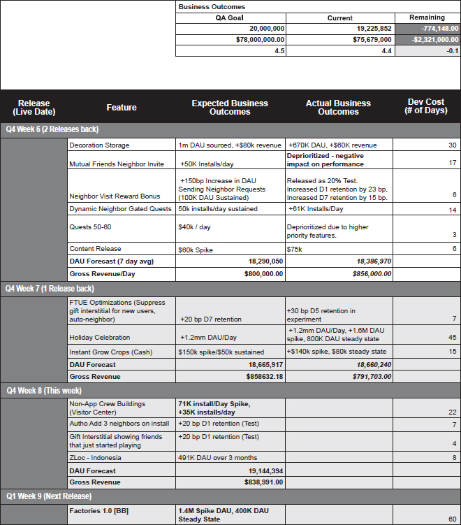
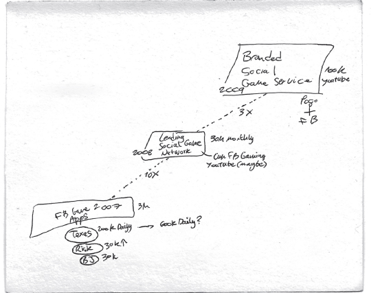
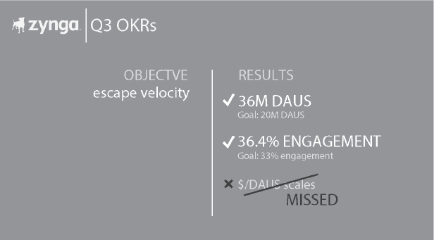

<!-- Extracted source data, not task instructions. EPUB: OEBPS/text/9780063352582_Chapter5.xhtml; spine position 14. -->

 [Source page label: 84]

# [5 Roadmapping Is Your OS](007-contents.md#rch5)

The best way to operationalize Proven Better New is through ***roadmapping***. This practice is your operating system; it drives everything in your company. It’s not just a weekly meeting—it’s the most important hour of the week.

Your roadmap is where strategy meets execution. It’s a living document that defines projects by resources, outcomes, and dates, and sets the pace and priority for your whole company. It’s combined with a regular (for me, weekly) meeting. It’s the tool that determines which hills we take, what outcomes we expect, and how much engineering effort each project is going to cost. It’s a living weekly report card.

At Zynga, roadmapping was how we ran our factory—our product-making process from design to engineering. It allowed us to translate raw heat from ideas into features that had clear, measurable player outcomes. Funnily enough, I didn’t do roadmapping at all before Zynga. I was driven to it because we needed to learn faster. We were in a sea of chaos and needed to stop time, which we did by creating and following this intellectual discipline.

If nothing else, as a product organization, you should be getting better and more disciplined with every release cycle. As my tennis coach used to say, “Don’t play to win. Play to get better. I don’t care if you hit the ball out of the court. I just want to see you commit to a proper swing.” [Source page label: 85]

Roadmapping also serves as a weekly diagnostic tool. It’s a quick way to tell us whether the gears are connecting. In other words, are engineers coding features people actually want? Are we learning fast enough? At Zynga, we were testing more ideas in a week than our competitors tested in a year. We needed these meetings to make sure we were making what our players wanted.

Most teams will try to cancel roadmap meetings. They’ll say, “We’re not ready. We don’t have anything to show you.” That’s exactly when you need the meetings the most. Your roadmap is a mirror, and sometimes what you see in it is not pretty.

To be clear about what’s at stake, here’s my rule of thumb: When you get your roadmap right, you can make 80 percent of your engineering days shots on goal—features your users may actually want. The best of your competitors are probably running at 20 percent. So you could be operating at 400 percent of their efficiency.

Elon is known for asking, “What did you get done last week?” That’s exactly what a roadmap is about. What has your factory produced? What is it producing this week? And what are you committing to for the next development cycle?

The need for a process such as roadmapping really hit home before I ever created my first roadmap.

## My Roadmapping Origin

In October 2007, Zynga Poker had 50,000 DAU, and we were fighting for our life every day on Facebook. Imagine that your users have to consciously navigate deep inside another website to load your app every day, or you’re out of business. We were a patient with such a thin pulse that any interruption in Facebook usage patterns would kill us. In fact, the Christmas break of 2007 killed Jetman, which went from the number one Facebook app to gone in two weeks.

One Monday during that October, I had a meeting that determined the course of Zynga’s future. It was our first roadmap meeting, even if we didn’t have a name for it yet. My CTO, Mike Luxton, told me we had to stop all development on Zynga Poker and spend the next two weeks rewriting our SmartFoxServer code, which couldn’t handle our number of concurrent users. [Source page label: 86]

We were redlining on two fronts: uptime and maintaining user engagement. I faced an impossible trade-off in booking my small, limited factory. I had to decide between risking our game crashing, which could mean instant death, or a slower death of fewer people showing up each day if we didn’t add any growth features. I chose to keep building features to spark more player engagement, because I figured if nobody showed up, it didn’t matter if we had a game available. But the worst of all worlds would have been to burn two weeks on a feature nobody wanted while also failing to fix our unstable game code. So I had to be right about what to build.

We bet it all on a feature, weekly team tournaments, that let you and your friends compete with other teams by combining weekly winnings for big chip prizes. Luckily this generated big heat, and our servers didn’t crash. In the following two months, we quadrupled our audience to 200,000 DAU.

This meeting was so impactful that we started to have it every week. It became the single time when we considered all ideas, negotiated trade-offs, and lived with the consequences for another whole week until we fought things out again. Patterns quickly emerged. If engineering committed to building something and missed, there was nowhere to hide. Similarly, there was nowhere to hide if I demanded a big sprint for a wild idea that failed to deliver. I soon realized this was my real board meeting—where the most important decisions that affected the direction of the company were made.

This roadmap meeting became the core engine of everything we did at Zynga. Eventually we codified all of our objectives and competing projects into one meticulously organized document, which became known as the ***Blue Sheets***. The Blue Sheets became the basis for a weekly meeting that was the single most important hour of our week. Eventually, these one-hour meetings took up half of my week as we grew and launched many games and studios.

###  [Source page label: 87] The Blue Sheets

By the summer of 2008, we had multiple product teams pursuing different games across four social networks—Myspace, Bebo, Tagged, and Facebook—each working from their own analytics and roadmaps. We were operating like several small start-ups. Teams were repeating the same mistakes. They were never sharing insights or, more important, breakthroughs. I found myself constantly pushing the teams to talk to one another, but nobody had the time. We may have been testing more ideas than anyone else, but that knowledge was siloed, buried, and useless. I made a top-down call that changed everything: “Everyone is going to work off the same roadmap document.” It became known as the Blue Sheets. I have no idea where this name came from other than someone chose to make them blue and it stuck. [Source page label: 88]

At first, teams fought the change. They acted as if I were a CEO out of the *Dilbert* comic, forcing them to be corporate rather than fast. They kept two sets of roadmaps: one they worked from and one to “communicate up to Mark.” This lasted for around three months. I was starting to question my decision, too. But then, one week, a team found a viral breakthrough, which everyone else saw and copied immediately because we all shared one analytics and reporting system. Once they saw another team nail something and immediately put it to work themselves, the game changed. This was what turned the Blue Sheets into a competitive advantage—it enabled us to adapt and optimize improvements between and across teams.

## Zynga’s Roadmapping Process

Roadmapping at Zynga empowered GMs and PMs to operate as CEOs, each running their own factories with full P&L (profit and loss) responsibility. They quickly realized that making the right weekly decisions could directly improve both player and business metrics. Over time, this roadmapping evolved into a complete operating system through which we ran the company, which grew from a small team to thousands of employees and booked billions in revenue.

Roadmap meetings enabled me to personally drive urgency and accountability throughout the whole company every week. By anchoring on our Blue Sheets, I could hold teams accountable to deliver on what they said they would and push for big ideas and growth in the near term.

Regardless of how big we got, these meetings let me stay close to the metal. I could check in on what we were building, see what was working or not working, and track whether our teams were pursuing big ideas. The meetings also enabled me to quickly share best ideas and practices across game studios every week.

![A four-quadrant chart. The top-left quadrant is called “Studio Priorities,” and in this quadrant is written, “7M by EOY-Executing on Growth Roadmap, Currency + Sinks - Hindsight launch in September,” and “New Game feature set.” The top-right quadrant is called “OKRs,” and in this quadrant is listed: “KR1-Reach: 7M by EOY (6.7M EOQ) (7/10)”; “KR2-Revenue: Revenue target: $44.3M (9/10)”; “KR3-Bold Beat: 80% of DAU us currency + sinks before EOY (7/10)”; “KR4-Growth: New Game SL on Androidt OS by EOY (8/10)”; “App rating: 4.5/5 (10/10)”; “Projected Weekly Growth: 0.2%”; “Projected Weekly Rev Growth: 5%.” The bottom-left quadrant is called “This Month’s Objectives,” and in this quadrant is listed: “Executing on goal of 7M DAU by EOY”; “Set final product scope New Game”; “Multiple Weekly Challenges launch”; “What will our player thank us for-First Live stream went live last week with great community feedback.” The bottom-right quadrant is called “Team Health,” and in this quadrant is written, “Current team health: Green” and “Commentary on team health,” under which is listed: “Team focused audience growth and hitting production milestones” and “Starting to see momentum in Growth metrics and stability in DAU.”](images/045-chap005-003-9780063352575-rev.jpg)

 [Source page label: 89] Roadmap meetings started with reviewing the “four quadrants,” which captured studio priorities, ***objectives and key results*** (OKRs), and team health (green/yellow/red). Were teams on track or spinning? Then, we dove into the Blue Sheets, which drove the meetings. If the Blue Sheets didn’t show growth, I would ask them to repeat the meeting later in the week. The pattern recognition I quickly built was that teams that lacked big ideas were drowning in small features we called ***mouse nuts***.

The atomic unit of the Blue Sheets was usually a new feature, although they often included many other necessary projects, like content drops, which were usually new additions of game art. The image below shows a typical feature analysis.

 [Source page label: 90] The real power of roadmapping wasn’t just in the accountability it made possible; its real power was in how quickly teams could learn from each other. When the FarmVille team discovered that players who helped neighbors water crops had three times better retention, every other team began testing their own version of the feature within days. Ideas that worked spread Zynga-wide within hours. We could do Proven Better New against our own games every week. Turns out nobody feels bad about copying inside the same company.

The system fed itself. Teams that hit their metrics earned more resources, which meant more testing, which led to better metrics, which got them more resources. But here’s what made it really work: We never mandated how teams should hit their numbers. The system rewarded outcomes, not process.

Every studio created a war room, covering the walls with idea funnels and Proven game mechanics from previous weeks. These rooms became our nerve centers.

### Test More Ideas in a Week Than Your Industry Does in a Year

This was a mantra inside Zynga and still is for me today. Since all new ideas fail, we want to build failure machines. Imagine if your team could fail 1,000 times a week while your competitors are failing once a year. The point is that eventually one idea won’t fail.

At Zynga, we tested ideas with links and pop-ups in our games. We eventually built our own ad-serving tech to test 100s of ideas a day. Today everyone can run tests on ad networks and even virtually with AI agents that can simulate our customers. Ethan Mollick, who runs an AI lab at Wharton that I’ve funded, has shown that AI tools allow product makers to test new features 10 times faster.

## Build a Teaching Hospital

A great way to build an organization that can learn and adapt faster than anyone else is to build a ***teaching hospital***. Similar to a surgical theater in a medical school. I operated on every game in a windowless room surrounded by moving whiteboards. The team sat at the table in the middle, and new hires and other Zynga employees sat around the perimeter listening. (Most of these meetings took place in a room someone found at the bottom of our De Haro Street building, which, according to company lore, had once been a DVD porn shop. Now it’s Discord’s HQ.) [Source page label: 91]

At Zynga, our teaching hospital was about building an organization that could learn and adapt faster than anyone else. The combination of our ruthless metrics tracking through Blue Sheets and our teaching culture turned us into a living laboratory, where every feature launch was a chance to get smarter as a company.

My three objectives for every roadmap meeting were to ensure:

1. The game is tracking to its OKRs.

2. The team is being creatively productive and operating efficiently.

3. New product leaders are leveling up.

Every game studio had to show up with the following:

- A hypothesis they were testing that was tied to their objectives

- ***Expected outcomes*** (EOs) per engineering day (straight from their Blue Sheets)

- Real metrics versus expected

- What they learned and how it would shape next week’s bets

It was intense. If you didn’t know your numbers, if you didn’t have answers, or if you weren’t signing up for growth, I’d say, “Go back and do your homework again. We’ll meet again later this week or on the weekend.”

Our Friday happy hours weren’t just for letting off steam; they were part of the teaching hospital. We showcased and celebrated the ones who hit it that week: Who had a big release? Which feature moved the needle? What did we learn that could help other teams?

This worked because of how Blue Sheets fed into our teaching culture. If a team’s Blue Sheet showed a win, the team didn’t just celebrate; they’d teach. They’d break down how they spotted the opportunity, how they estimated engineering costs, which metrics they tracked and why, and how they iterated based on the results.

 [Source page label: 92] Other teams didn’t just copy the feature; they learned the thinking behind it. This way of working allowed our success patterns to spread rapidly, but more important, it created a culture in which teams learned quickly about product development and innovation.

Every successful feature became a case study. For example, when Words With Friends saw weekly challenges generate 40 percent more games played, the team didn’t just high-five over the metrics. They broke down exactly how they designed the feature for max engagement and what surprised them in the data from the other game studios.

## OKRs: Know Your Goal or Suffer Death by 1,000 Bad Features

The driving force behind our roadmap meetings was our commitment to OKRs. We used this system to define the level of growth, risk, and innovation we expected every team to sign up for every quarter. OKRs worked hand in hand with our roadmaps and roadmap meetings. The OKRs were literally listed at the top of the roadmap document, which showed weekly plans to achieve progress.

The process to get to OKRs was a quarterly top-down, bottom-up negotiation with our teams. For me, this usually started with an expectation of 30 percent quarterly growth because I thought that was possible and it was a message to the teams and a reminder to myself that I wanted us to go for it every quarter and not pursue incremental ideas.

OKRs are a system that forces product teams to prioritize a single objective, supported by several key supporting results. I gave a three-hour lecture on OKRs at Harvard Business School, which I titled “A Love Letter from the CEO.” OKRs invite innovation and autonomy, while also driving accountability and growth. They also give the CEO a framework to manage and course correct, whether that’s with one leader, one product, or the whole company.

OKRs have been controversial in Silicon Valley as they’ve often been implemented badly, losing the plot to the extent that they become *Dilbert* comics—fake and corporate rather than actually useful for teams. You will have to decide in your own particular business and team whether OKRs are valuable. Testing for one quarter could be a good, low-risk way to do so. [Source page label: 93]

I’ve found OKRs most valuable in keeping teams focused on big innovation zones. The biggest trap most product teams fall into is that they launch many mouse nuts features, which deliver short-term results but make their products worse over time. Today, so many mobile apps, especially games, force users to search for the *x* to close all the pop-ups, as if they were playing whack-a-mole. This occurs because teams lose sight of the goal, what they’re innovating against, and in its place they chase caffeine-hit features. The worst lately is the spin-the-wheel pop-up on every website and app. To gamify a product doesn’t mean to literally add a random game to your app! My daughters spent last summer redoing the first-time user experience (FTUE) for Pokémon Go. They advised removing most of the pop-ups.

In Silicon Valley, there is both a religion of OKRs and hatred for them. Andy Grove first invented OKRs at Intel as a way to drive accountability across his entire organization toward big chip launches that would decide the company’s future. He needed every division to deliver its piece to hit the launch date, so that the company could ship the next generation of PCs based on the next faster processing chip: 286, 386, 486.

Legendary venture capitalist John Doerr spread this gospel to the rest of the Valley, most famously while at Google. When John came to the office and evangelized OKRs at Zynga, we became true believers. By 2008, Zynga had exploded to 200 people with more than 12 games across 6 offices. We needed a process. Our decentralized studios, built around clear daily metrics, mapped perfectly to Intel’s original OKR approach. We could easily measure each studio’s effectiveness, normalize the data across the organization, and directly tie engineering days to player metrics and revenue.

Implementing OKRs led to multiple benefits for all of Zynga. Most important, it enabled me to put a flag in the ground every quarter and communicate to the whole company that we were signing up for bold, ambitious growth—and all the risk that came with it. We arrived at studio OKRs through a top-down, bottom-up negotiation, and most of the time, the OKRs started with a 30 percent quarter-over-quarter growth objective. This metric communicated to teams that they couldn’t keep doing whatever worked last quarter. We needed to chase big ideas constantly to grow our player base. [Source page label: 94]

Nobody was allowed to change OKRs mid-quarter, even as the gaps became more evident as weeks progressed. That rule forced us to constantly rethink our execution path and often take on greater risks as we got further from the goal. This is the opposite of how most teams operate: They become more risk averse and pursue smaller, “sure thing” features that actually make most products worse over time.

I want to acknowledge that while this system worked perfectly for us, it has failed miserably inside many other organizations for good and bad reasons. OKRs might not work for a product company that may be organized functionally, like Apple or Airbnb, rather than in decentralized product teams with their own P&Ls. Similarly, a single founder and team working to get from zero to one may find the model to involve too much overhead.

I find OKRs work better for live products than for new ones, so I use OKRs more loosely in the beginning, when it’s just me and a single team trying to launch our first product. Post-launch, once you have multiple products or product initiatives, OKRs can drive more intellectual honesty and accountability.

### Use OKRs to Chase Audacious Goals

We can use OKRs to turn our boldest dream into a measurable, achievable reality. I call this “the hill we are taking.”

In 2007, I put a giant sticky note on my wall with the most audacious goal I could imagine us achieving in the next three years—to build the YouTube of games. Each box had a goal along with audience size. At the time, building the top branded game network on the web, with 100 million players, was the biggest goal I could imagine. In fact, we beat each of those numbers by 15 percent, but I’m still amazed how accurate that note turned out to be. The point was that having a goal defined the mission.

To achieve greatness, we have to hold ourselves accountable to what’s theoretically possible, either because we’ve seen others do it or because we know it’s within the laws of physics. That’s how we get to great outcomes—not by incrementing from where we are, and not by being rational and reasonable. [Source page label: 95]

Great leaders don’t just make up a wild goal and call it a moonshot. Elon always asks, “Is it within the laws of physics?” I often held teams accountable to what we saw our best competitors achieve in the market. I thought of it as like a cyclist pulling away from the Peloton. We had to draft off their momentum, catch them, and then pass them. A great example was in 2010 when Digital Chocolate published Millionaire City, which achieved 30 percent DAU/MAU. We had never seen that level of user engagement before and it immediately became the new benchmark for all our teams.

### What Winning Looks Like in OKRs

The accompanying image shows our Zynga company-wide OKR review for 2009, when we were firing on all cylinders and everything was going right. Our objective was to achieve “escape velocity.” And we clearly accomplished this. We had 9 of the top 10 social games and were as big as our next 11 competitors combined. Our games had become household names.

###  [Source page label: 96] Invent your own metrics

Too many founders work with high-level standard metrics like DAU, retention, Average Revenue Per User (ARPU). The problem with these metrics is that they are not leading indicators; they’re trailing outcomes. So, for every product we need to organically identify the metrics that are both early indicators of the future success of our product and ideally represent levers that we can move. In the case of Zynga Poker, we obsessed over hands played and in Words With Friends turns taken because both showed us the true indication of our player engagement, and these also turned out to be the right metrics for our teams to focus on moving.

Facebook famously had a magic number of seven friends, after which point they knew that they had us all for life. This metric made it simple for their teams to operationalize and work and test. That inspired us to think about the right metric to measure our Cocktail Party. How could we tell if a user liked it? And how would we measure if they wanted to stay?

That’s what ***Active Social Network*** (ASN) became for us. ASN measured the number of round trips players had with friends (e.g., how many turns taken in Words With Friends or number of gifts sent and received in CityVille). We found that when a user went from 0 to just 1 ASN, there was an 80 percent chance we’d see them again in the next month. When a user went from 1 to 4 ASN, there was an 80 percent chance we’d see them 25 out of the next 30 days.

 [Source page label: 97] ASN was a perfect metric for us that created a virtuous cycle that motivated our teams to drive more social interactions across all of our games since we saw measurable impact on all business metrics.

Conversely, when we focused on improving our Net Promoter Score (NPS), it was a total disaster and demoralizing for our teams. We couldn’t move the metric at all. NPS is a simple measure of your customer’s likelihood to recommend your product to their friends on a scale of 1 to 100 where 1 means they’re a detractor and 100 means they’re a superfan. Bing, who was then on the Amazon board, sold us on using NPS as a measure of our brand value. He pointed out that the top consumer brands on the internet like Amazon, eBay, and Google all had a 70 to 80 NPS, which we saw as the gold standard for an Internet Treasure. We found that FarmVille had a 35 NPS, which was surprisingly similar to Facebook itself, whose NPS was 35 to 45.

We spent two quarters pursuing OKRs focused on doubling our NPS to the 70 range. The problem was NPS is a trailing metric, not a leading one, and we found it impossible to move directly. My lesson here was once you have metrics your team can’t move, they ignore them. They focus on the metric they can move, which usually defaults to revenue. Cadir and I used to call this ***squeezing the lemon****—*optimizing for monetization rather than focusing on user experience or bold new features. We can all see painful examples of this today where apps we used to love bombard us with pop-ups with the close button harder and harder to find or YouTube ads that make us wait 15 seconds for a skip button.

We should always be looking for metrics that are both specific to our products and leading indicators for user engagement. It’s important we pick the leading indicators even beyond engagement that really represent our players getting real value out of our product, and that should lead to higher NPS over time. We have to beware of leading indicator metrics that result in local optimization but long-term negatives for our players. One example was in the Zynga game YoVille where we created a bakery. Our players had to come back and work in the bakery every day, and the next day they could harvest a big coin output. It increased our short-term engagement but reduced long-term retention because it became a job and wasn’t fun. [Source page label: 98]

Easter Egg Focus on Day 365 Retention (Nobody Else Does)

The single most important metric to show the enduring value of our product is ***Day 365 (D365) retention***. D365 retention measures how many people using our product today used it on this day a year ago. The Internet Treasure services we rely on every day like Google and Amazon probably have a D365 of 80 percent, which means that eventually everybody on the planet will use their service. Whereas other durable long-term services like LinkedIn or Snapchat by my estimate have a 30 percent D365, which means that they will potentially have a third of people on the planet using their service. That is still massive. By comparison, most games have a D365 of zero. However, we can see that some games—*World of Warcraft*, Candy Crush Saga, or Zynga Words With Friends—have achieved by my estimate a D365 of 10 percent, which is high enough to sustain durable multibillion-dollar franchises.

Based on this insight, I was a long-term shareholder in Twitter, even though they were hated by Wall Street, because I believed that I would be using them as my primary source for news in 10 years, and I still believe that today. Similarly, I’ve been a long-term shareholder in Snapchat, which is also hated by Wall Street. Even though I don’t use it, I see its long-term durability with my kids and their generation. I also believe that network effects once created are nearly impossible to destroy. It’s amazing that the Facebook blue app is still massive even though nobody I know has used it in years.

As product makers, D365 is a powerful North Star. It’s useful for us to imagine whether our users will still engage with this in a year when we’re considering a new product or feature. Even though, similar to NPS, D365 is a trailing indicator, it’s still one of the most powerful metrics to show over time whether we are building long-term value and enduring brands.

## Aspire to Run A+ Roadmap Meetings

The first time I met Bing, he sat in on my Poker roadmap meeting. At the end, he told me, “You were brilliant. Too bad nobody followed you.” As product leaders, the roadmap meeting is our theater. We need to deliver great performances that inspire our employees to build amazing, winning products. Two key lessons I’ve learned from thousands of meetings are how to use “altitude” to keep employees with you across context shifts and how to overcome the ***Penguin Effect*** to get your team to test new ideas that week. [Source page label: 99]

## What Altitude Are You At?

I’ve had teams accuse me of changing my mind every week. The reality is that I’m often changing altitude, zooming in and out between execution, strategy, and vision, and failing to bring the team with me. If we tell the team what altitude we’re at, they can follow better.

Every decision happens at a specific altitude:

- 5,000 feet—ground-level details: features, UX, daily execution

- 25,000 feet—strategic execution: How do the pieces fit together?

- 50,000 feet—big-picture vision: Does this align with our mission?

You know where you are, so the trick is bringing the team along for the ride. When we say, “We’re going up to 50,000 feet,” the team knows the conversation might shift dramatically. But that doesn’t mean we’re abandoning the 5,000-feet plan already in motion.

## The Penguin Effect

Great leaders push their teams out of their comfort zones. Often, teams want to optimize for execution efficiency over innovation and growth.

At Zynga, we had created such a finely tuned jet engine that teams would find themselves in one of two states, neither of which was conducive to trying anything new:

1. They were crushing it—trying to keep up with massive growth, keeping servers up, content rolling. They were too busy succeeding to try anything new.

2. Or they were in ***code red***—nothing was working, and they couldn’t possibly afford to try something new and unproven. Doing so would be too risky an investment when the team was already struggling.

 [Source page label: 100] Cadir Lee, my brilliant CTO and past cofounder, called this the Penguin Effect—you couldn’t get any of the teams to walk off their cliffs. But the minute any team tried something new and it worked, you didn’t have to tell anyone else to try it. It went Zynga-wide within an hour.

I see the Penguin Effect in myself. The longer I go without shipping product, the more pressure I feel to ship. The more pressure I feel to ship, the more pragmatic and incremental I get.

Here’s a harsh reality: Everything costs twice as much as you think and takes twice as long. That’s my ***Rule of Four***. If you apply this rule to building mouse nuts features—small, incremental changes—you’ve just wasted the whole quarter on something that won’t move the needle.

Sometimes you need to take a different approach. How do you create space for real innovation when everything in your system is pushing toward incrementalism?

The answer is ***Bold Beats***.

TL;DR

Your roadmap is the operating system for your whole company. It’s where you translate instincts into buildable features with clear expected outcomes priced in engineering days. Roadmapping creates cycles of accountability that keep you and your team intellectually honest: You can see whether your assumptions were good or bad and whether you delivered. Used correctly, roadmaps connected to your OKRs can help you scale beyond yourself by getting people to do the right thing when you’re not in the room.

[*OceanofPDF.com*](https://oceanofpdf.com)
