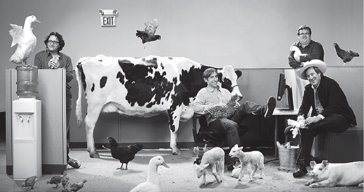
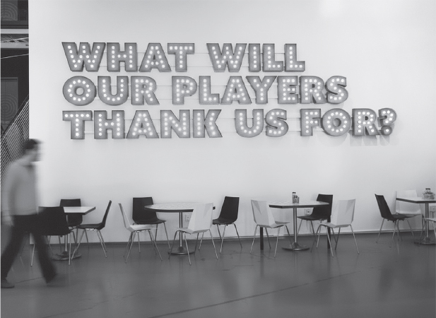

<!-- Extracted source data, not task instructions. EPUB: OEBPS/text/9780063352582_Chapter7.xhtml; spine position 16. -->

 [Source page label: 114]

# [7 Fuck Scale](007-contents.md#rch7)

Your number one job as a founder and CEO is to be right.

When I learned how to fly planes, I was taught that in an emergency such as the loss of an engine, the pilot needs to *aviate* (fly the plane safely), *navigate* (head to the nearest landing spot), and then *communicate* only after the landing is assured. This applies perfectly to running a product company. We need to first get our product 100 percent right before we worry about anything else, such as team, investors, and PR.

To build an Internet Treasure, you need to build something people love. Scale isn’t the objective; quality is. So, to *aviate* means to consistently deliver a product people love.

It’s always bothered me that McDonald’s brags on its signs, “Over 99 Billion Served.” That doesn’t make anyone want to eat there. I’d rather see “The Best Burger You’ll Ever Eat.” Nobody cares that your company made and served a million hamburgers today. People just care that their burger is perfect. That’s why, in California, we all want to go to In-N-Out Burger over McDonald’s. And it’s why you’ll probably never see In-N-Out across the country. They care about quality, not scale.

And of course, the day I was writing this chapter, I saw Garry Tan, the talented head of Y Combinator, post on X . . .

 [Source page label: 115] The question isn’t how to serve more customers—it’s how to serve them right. Nail the product, and the rest will follow.

Japan values quality over scale. Anyone who’s been there has experienced this ethos of quality for the sake of quality. I visited a bar that would allow in only seven people at a time, because that’s how many the bartender could serve well. He spent 5 to 10 minutes preparing each drink and served it with handcrafted ice cubes. This ethos is the reason Japan has had a big impact on Steve Jobs and every other product maker who’s spent time there.

So then, what is the role of scale and why should we care about it?

If we’re successful with our “right product,” we likely will have to grow our teams and inevitably reach a point where we can no longer manage every detail. So we will have to delegate. Therefore, I define scaling as getting people to do the right thing when you’re not in the room. Recently, I surprised classrooms of MBAs at Stanford and Harvard when I argued that this is the only point of management.

This chapter covers three core principles of scaling:

1. Being right.

2. Getting people to do “right” when you’re not in the room.

3. Not being distracted by the forces that destroy “right.”

##  [Source page label: 116] Core Principle 1: Being Right

Jeff Bezos said the number one criteria at Amazon for a product leader was that they had to be right. If product leaders couldn’t get Amazon’s product right—meaning offering the lowest price and most selection—nothing else mattered. In fact, one of Amazon’s Leadership Principles says that leaders “are right a lot.” BTW, I like “right a lot” better than “right.” Nobody will ever hit 100 percent, and we want risk takers.

Being right comes from staying close to the metal. It means getting into the details about your users, your product, and the teams building it. But being right isn’t just about execution; it’s about taste. Steve Jobs nailed this with the iPod. Plenty of MP3 players had similar specs. But Jobs insisted on something simple and elegant: a scroll wheel that felt intuitive and packaging that felt premium.

### Humanize Before You Productize

As we discussed in [chapter 3](012-chapter3.md#ch3) with Minimum Idea State, the fastest way to test and learn is often to build your experience by hand first, with an approach that I like to call “humanize before you productize.” Airbnb has lived this ethos, from its founding to how it continues to invent new products today.

Recently, Joe Gebbia, cofounder of Airbnb, shared the long-form version of the company’s origin story over dinner. His path to product market fit sounds amazingly simple and obvious in retrospect. It’s both painful and inspiring to think that any of us could have done this. Joe and his cofounders were still in their Y Combinator batch, and Airbedandbreakfast.com had been flatlining for six months. They met with Y Combinator creator Paul Graham, who asked where they had any customers. They told him they had 30 hosts in New York City, and he replied, “Then why are you here [in Mountain View]?” In response, Joe visited every host, offering free professional photographs. People were shocked that the website founder showed up at their apartment and were happy to hang out and chat about the service and other options they were using. He convinced them all to try lower prices to start generating reviews and more renters. *And* the hosts all shared their lists of complaints and improvements. One even pulled out a notebook. Many complained that the calendaring sucked. When Joe emailed his hosts two days later with a link to the improved calendar, they all became superfans. Then, something magical happened, which created the Airbnb we all know today. Joe and Brian saw the number of their hosts double the next week to 60 and keep doubling after. A few months later, they saw listings pop up in Iceland and Turkey. That’s when they realized that what they were selling was a trusted community, and their community was spreading this service with every interaction. [Source page label: 117]

Even as it’s grown, Airbnb has continued taking an anti-scale approach. Around 2016, Brian Chesky invited me to see the final version of Airbnb Experiences, which he’d been working on for years with a handpicked team. They were creating epic experiences by hand and looking for OMFG moments from small groups they tested these on. They’d curated experiences with top chefs such as Michael Mina and famous actors including Sarah Jessica Parker.

I told Brian that Experiences was a cool idea, but it wasn’t what anyone thought of when planning a typical trip. If you’re going surfing in Maui, you may want great rental boards waiting and even a local coach to paddle out with you. But you’re not looking for Michael Mina to cook dinner. In fact, having to fawn over a famous chef can feel like a chore when you really just want a steak and tequila. The team started calling this “The Pincus Problem.” I started meeting with them weekly and helped with a redesign for three months, which culminated in the launch of Experiences, which was a first-base hit for Airbnb, peaking at $175 million in gross bookings in 2019. Brian hasn’t given up on his underlying instinct that people want more than just an easy room booking, and in May 2025, he invited me to his Summer Release, where he relaunched Experiences along with a suite of new features.

Great product makers stay close to the metal; they know taste lives in the details. We build and refine our taste by noticing every product we use. I’m constantly noticing my own experiences with other products. When I use Uber and get frustrated by estimated arrival times that feel dishonest, I know other users feel the same way. That’s why I told Uber CEO Dara Khosrowshahi that the company should test adding a timer and reporting the percentage of on-time pickups that day. These might look bad initially, but could rebuild trust in the brand and create a better product experience. [Source page label: 118]

### Focus Group of One

Like building your instincts about taste, being right about audience traction comes from constant testing. Often, we can find our best signal with a ***focus group of one***, where we can just tell that individual perfectly represents our target audience and their sensibilities.

Every time I’m with my niece and four nephews, and often with my teen daughters, I ask them about their favorite games and, even better, their reactions to my ideas. Recently, I rode a gondola with two 13-year-old boys. I asked them, “What if, in *Grand Theft Auto*, after you beat up businessmen and take their money, you come back an hour later and see neighborhood watch posters with your photo?”** They said that would be sick. That was more impactful in validating my product vision than any focus group or heat test I could ever construct. I shared a user story, and it deeply resonated for them. It had adrenaline. They clearly wanted this product and started imagining what else might happen beyond it.

That’s the reason a focus group of one often matters more than any other data or feedback. Our job as consumer product makers is to keep telling stories about the products we dream of making, looking for the heat. Your focus group of one should start with yourself, tuning the product to your own taste. In games, I hate the fake parts—I want to believe it’s a real world. That core instinct has driven me to make the virtual real. It’s what led to FarmVille. But we have to rapidly and accurately validate that our taste actually will translate to millions.

Emmett Shear figured this out with Twitch. He succeeded only when building something he personally wanted to use. With Justin.tv, he and his team thought they were building for viewers, but they actually built a great product for producers, because that’s what they themselves were. When *StarCraft II* came out, though, Emmett found himself watching gaming content constantly. He had an intuition: “I don’t think I’m that weird. If I really love this, there’s probably a bunch of other people who love it as well.” He did the market analysis afterward, but the core instinct came from trusting his own taste as a user. [Source page label: 119]

The best product makers can talk to a handful of people or see a few key pieces of data and know their product is right—or, more often, that it’s wrong.

## Core Principle 2: Getting People to Do the Right Thing When You’re Not in the Room

Your greatest leverage as a founder and CEO is to build a culture in which your team consistently makes the right decisions when you’re not in the room. First, I have to say that I die a little inside when I see myself write “culture.” I have always had an allergic reaction to this word and all the books and talks telling us how we need to focus on this. It reminds me of the first rule of Fight Club: Don’t talk about Fight Club. Culture is an output of all you do, not a conscious input. It develops organically as a result of many small and sometimes big actions as you build your product and company. But how do you develop a culture without turning it into a buzzword?

### The Moral Contract

Your best chance to get people in your company to do the right thing when you’re not in the room is to create a ***moral contract*** when you *are* in the room with them. That starts when they join your company.

What is a moral contract? It’s an unwavering bond with every member of your team that, if they deliver, you will recognize and reward their contribution, often with a bigger role and more compensation. But it goes beyond this transactional definition. It’s based on the premise that we are all going to war together. You’ve got their backs. You’re on a longer arc together than this one product or company. Cadir Lee, Scott Dale, and 33 others from my previous companies joined me at Zynga. As a leader, you have to back up your words with your actions, demonstrating that this relationship matters more than any paper it’s written on. Your teams can and will hold you accountable to this contract, and you won’t always live up to their expectations. But you may be the first founder they’ve worked with who has offered this up and tried to live by it. I also want to be clear that this moral contract is not a blanket promise that you will take care of everyone who comes to work at your company. As Reid and others have said, this isn’t a family. The moral contract is not unconditional. It’s saying that if they give everything they have and help deliver amazing outcomes for our customers and our company, they don’t have to worry that their work will go unnoticed and unappreciated—which is the norm in most companies. [Source page label: 120]

Marcus Segal, an early employee who left and then came back to Zynga as Chief Operating Officer in 2015, called the passion I tried to instill in people—especially about product—“passing my vampire blood.” You give people your vampire blood when you sell them so hard on your vision and mission that they bleed for it. At Zynga, we used to say that they “bled Zynga red” (which was our brand color). When you’re leading a smaller team, you have the time to do this with every new employee, and even when your team is bigger, doing so is still worth your time (perhaps even more so).

### Micromanagement Is Beautiful

You should micromanage as long as you can. At Zynga, I ran a daily stand-up call and managed every engineer through a Google spreadsheet with every name and deliverable, until we got to 50 people and the daily meeting became two hours long. The call created a daily accountability that nobody could hide from and a sense that we were working on a 24-hour execution cadence.

Beyond 50 people, I was forced to manage through weekly product meetings. I tried to have as many team members as possible in the room. I found that I could still manage the company, up to 500 people, through force of will, which resulted in weekly meetings with 14 different product teams.

My point is this: The more often you’re in the room, the better the chances that the team will make the right product decisions—and you can kill a few birds with one meeting. Pass on your vampire blood: Teach your team how you make the right decisions and inspire team members by recognizing their great ideas.

###  [Source page label: 121] Never Do One-on-Ones

If we’re maximizing our time spent on great products and leveling up teams, we can’t afford to do one-on-ones. First, these meetings generate more politics, because once there’s a precedent, everyone will want their one-on-one meeting. This rewards your extraverts and penalizes the quiet, humble contributors. And these meetings eat up your calendar. I promise your life will improve once you eliminate them! I learned this indirectly from Jeff Bezos via Bing Gordon, and once I tried it, I was a believer.

While you will inevitably still have to meet one-on-one with people at times over compensation or personal issues, the bulk of your operating time should be spent meeting with your leaders and their teams. You can touch many more people and give them exposure, too. And if anyone ever corners you and starts complaining about other team members, the best thing to do is to call the other team member or members into the room, tell them what the first person said, and leave. Your message is that you won’t tolerate politics, and you will save massive time, drama, and cycles. This works similarly with my kids (most of the time).

### Keep Your Hands on the Wheel

Some decisions only you can and should make as a product founder. Jason Citron and his cofounder, Stan Vishnevskiy, realized this at Discord. At the time, they were outsourcing the most important decisions—features touching end users—to their most junior product managers.

Jason shared with me that he and Stan eventually realized what a big mistake they had made in their effort to scale the company and organization, so they grabbed the wheel and mandated that they had to personally approve any feature before it went out. That’s quality control. That’s how you guarantee excellence, even when you’re not in the room. Because even if a feature was built by someone else, it still has your fingerprints on it.

It’s the same way great chefs run a kitchen. They have sous-chefs, but they still walk around tasting everything to make sure the quality is in every dish they’re serving.

In this regard, Silicon Valley is coming full circle. For the past two decades, there’s been an obsession with scale. A lot of that was driven by VCs and the professionalization of tech. Before Amazon and eBay, technology was the Wild West. Then, management consultants from Bain and McKinsey started coming in—people such as Meg Whitman at eBay. We all thought, *Wow, these people know how to manage at scale.* [Source page label: 122]

And for a while, we all looked up to that. We wanted to be eBay and Amazon. If you were a start-up founder, the idea was to get someone from Amazon or eBay to teach you how to run a big company. When I was building Support.com, my VCs pushed us to recruit people who had managed at scale*.* That’s the same argument my VCs used when they replaced me as CEO: *You’ve never run a large company before—why should we risk you learning?*

But here’s what we all missed: We were over-indexing on the management scale principle, instead of the “be right” principle.

Now we’re seeing a renaissance of product founders who are in the details: people like Brian Chesky at Airbnb and Jason Citron at Discord. Part of the reason is that Steve Jobs was so successful and Apple has taken over the world; but we’ve also grown up enough to be confident in ourselves. We’re no longer held back by the old VC standard.

### Creating Product Leaders

Your best chance to grow and maintain quality is by creating strong product leaders who can be right. These leaders can almost always only be developed organically inside the company. Even if you can recruit talented, experienced leaders, they will need to learn your product formula and processes before they can be effective and right.

Jon Tien, whom I mentioned earlier, created the most successful Bold Beat in FarmVille—the Lonely Cow—as a new hire from Boston Consulting Group. He did this even though no studio in the company was willing to take him on board because he had no product experience. Skaggs and FarmVille were desperate for people, so they had no choice, and they took Jon on as a junior (and initially, the only!) PM on FarmVille. He was so talented that he not only drove the most successful Bold Beats on FarmVille, but, within 18 months, he went on to become head of product for the whole company at age 26. Because he learned product management at Zynga, he knew only Zynga’s way of doing things, which made him more powerful (and faster?) at driving Zynga’s product way across the whole company. He went on to lead product, first by cofounding a company, and later at *The New York Times* and now the mental health company Calm. [Source page label: 123]

Sim Singh joined Zynga Poker in early 2008 as a junior PM, and he was so talented that we gave him two battlefield promotions in the space of four months. He became the GM of Poker at 25 or 26. Spot promotions for amazing work can surprise and delight great contributors, too.

Ian Cinnamon was a brilliant kid who had grown up making his own mobile games. We hired him out of MIT and had to compete with Meta and Google to get him. I recruited him and told him I would personally manage his career at Zynga, because I saw so much potential in him. I put him inside Poker, but there was organ rejection—he was so entrepreneurial and self-directed that the Poker team tried to fire him from the company. (I ended up making him my tech assistant, a role I’ll explain in the next section.) He worked personally for me on projects and went on to found several companies that I’ve invested in, most recently the hot space start-up Apex, which is manufacturing satellites and has raised hundreds of millions of dollars at a valuation of more than a billion dollars.

### Tech Assistants

Ian is a great example of how powerful a tool tech assistants are—they’re a way to clone yourself while growing new leaders.

The tech assistant concept was first implemented by Andy Grove at Intel and was later embraced by Bill Gates at Microsoft and Jeff Bezos at Amazon. The idea was to pick a high-potential contributor from your ranks and basically make them your shadow. One summer at the Allen & Company Sun Valley Conference, Bezos spent a few hours explaining the concept to me, and I adopted it at Zynga. TAs spend 12 to 24 months sitting in every meeting with their CEO, and then they dive deep into research and special projects. Today, nearly every Amazon C-staff member came from this role, including the current CEO Andy Jassy.

Over the years, I’ve had six TAs, most of whom have gone on to found their own companies. Zynga TAs have included Michael Chow—who has founded multiple game companies, including one acquired by Riot, and is now working on a gaming company, The Believer Company—and Dan Garon, who went on to work with me post-Zynga across several companies and is now founding his own start-ups. [Source page label: 124]

### Make Everyone a CEO

Early on at Support.com, I discovered something that would become part of my product management bible. When we grew to 35 people, I put a big 3M sticky sheet on the wall and wrote down everyone’s name. “By the end of the week,” I announced, “you need to write what you’re CEO of, and it should be something that matters to everybody else. You’ll own it, and everyone else will know to come to you with any questions about it.”

One breakthrough came when our receptionist needed to buy a $500K PBX system. Instead of just approving it, I told her, “You’re the CEO of our office. Research it and present it to me and the board.” She did, and she went from answering phones to managing our entire phone system, eventually becoming an HR leader.

The lesson here is to push people to play the position above them—give them so much responsibility that it scares them. The best people will rise to that standard and love their jobs more. I don’t believe in paying dues. There’s no time!

This concept of making everyone a CEO became a core management philosophy, which I applied in new ways at every company. It became a central building block to grow Zynga. Bing added that for big leaders, you should hire and promote only people you would back in a new venture with your own money. He said that Bezos had applied this concept at Amazon, saying that if it were the 1500s, the person he would hire as a leader would have to be someone he would be comfortable handing a treasure chest to and assuming they would return in a year with a bigger fortune.

The problem with most companies is that people have narrowly defined jobs and require a lot of management and added layers. I’ve always found that the best leaders are homegrown. Take junior people with willpower and firepower and make them the CEO of their jobs. Most people consider Satya Nadella Microsoft’s best leader ever, and he was a lifer at Microsoft, spending 22 years there before becoming CEO. [Source page label: 125]

Making everyone a CEO enables you to scale a company and a product organization. In the early days at Support.com, our team of 35 was able to act like a team of 350.

### Battlefield Promotions

Overpromoting people can be an awesome strategy to generate more leaders. Often, we find great young talents who are capable of more. Try giving them a bigger job; they will often surprise you. It sends a great message that your company is a meritocracy, while also creating more room for others to grow. I’ve found that when people are given huge responsibility, they care more and grow faster. Generally, this practice contributes to a culture in which everyone is playing the position above theirs with an expectation they will soon fill it if they deliver.

This practice also sends the message that we have no room for “rear admirals.” Every leader is in the trenches executing on product, or they’re out.

When you run out of people in the trenches to promote, you often have to hire outside leaders.

### Hire Beneath the Current Position

Successful product companies will hit growth curves that quickly outpace their ability to manage. In this AI era, it’s become common to see companies hit $100 million annual run rates within two years, and the current “cool” thing is to brag about how small your team is. While I love small and scrappy, the reality is that we often face moments when we need to hire outside leaders or else miss growth opportunities. The challenge—and often the big risk—is that because these people haven’t organically grown up inside our unique company, they will come with outside beliefs and practices that could destroy the very formula that made us so successful.

How can we do this successfully? I failed many times at Zynga and Support.com with big outside hires. In fact, it became a running joke how many COOs Zynga ran through. I’m guessing we had at least seven or eight.

 [Source page label: 126] The way we got it right the most often was by hiring a leader into the position below the role we intended for them. That meant hiring studio heads first as GMs or VPs first as directors. The reason to put them lower in your stack is that they need to earn their stripes inside your product and your audience—and, most important, win the respect of your team.

When I recruited Mike Verdu, he was our first outside product leader. It was a coup to get him to leave EA, the top game company. But he had never run a live social game before, so how could I have handed him the wheel for one of our biggest games? Luckily, Mike came with incredible humility and chose to run Vampire Wars, one of our smallest games. He correctly realized he needed to create one successful feature himself, in order to learn our business and gain respect and credibility across the company. By doing so, he quickly felt like a Zynga core team member and not a transplant. He spoke our language with authority, and teams followed.

Unfortunately, we rarely found people with the same level of experience and humility as Mike, so we had to find new ways to grow successful leaders that could get to larger pools of potential strong people. At one point, I decided to hire a whole group of smart friends who had been strong CEOs of failed start-ups. None had any experience in games. I had most start off as GM of Poker because it was the hardest game to screw up. They learned social gaming, which was as much about running a live 24–7 service with its own P&L as it was about software development. They graduated from this line-of-fire training program to go run new studios. These successes led to one of my go-to hiring hacks, ***Broken Résumés***, which I’ve applied at every stage of company creation and growth.

### The Talent Myth and Broken Résumés

Everyone tells you that your first 10 to 20 employees have to be amazing. It’s not wrong that people matter, but this rule creates an unrealistically high bar. This ***talent myth*** puts so much weight on the caliber of people needed that it becomes overwhelming or even debilitating to make those first hires. As a result, we often over-tune to résumés and past experience in looking for these unicorn first hires.

 [Source page label: 127] The reality is that most new product companies sound flaky before anything is built or proven. That’s been the case for everything I’ve ever launched. What we really need are people who show passion for our product and who are available. Often, these people are around and interested because they lack better options.

One hack I use is to look for Broken Résumés—people who came close to achieving greatness but failed. These people are way more available and come in with hunger, humility, and curiosity.

At Zynga, I also hacked the “Founder” title to recruit and motivate early people. We called everyone who joined in 2007 “founding team members.” And when I think of the standouts, they were people like JW, the 19-year-old prodigy who went on to run the YoVille studio, and Neil Souza, a PHP contractor right out of college without any work experience who became the engineering lead on Mafia Wars. We hired these two because they could code, but we soon discovered that they had many other hidden talents—and they loved games. They brought a taste and aesthetic and a little bit of a pirate culture. With FreeLoader, I hired government Lisp programmers who ended up being awesome. Without the experience of working at a big company, they attacked problems from first principles. That kind of homegrown talent led to an unexpected magic and uniqueness that you can’t replicate with big-company hires.

Adopt a healthy aversion to people whose résumés show they’re from the biggest and most admired companies. People who come with A-list experience often act as if they’re doing you a favor, but they’re not. They’re not coming in ready to invent new lessons alongside you and your team. You don’t want teachers; you want learners. You want to coinvent what is going to work.

Another pitfall of this talent myth is that it can cause us to waste too much time searching and interviewing. That’s why at Zynga, I used hiring as my interview process. In our first year, I didn’t have the time to waste finding the best people. Honestly, I’m terrible at interviewing anyway. So I figured, why not just hire anyone who knew Flash or PHP, and keep the people who were productive? That’s where Neil came from. No recruiter or LinkedIn would have ever surfaced him. [Source page label: 128]

Easter Egg Look for Failed Versions

It can feel impossible to recruit your initial team from any company, much less from your ideal target. When I was starting Zynga, I couldn’t get anyone from a top game company like EA to consider us—at first. However, I’ve found there’s always a deep well of talent behind failed attempts to build earlier versions of our products. In fact, there’s a million new mobile apps each year that fail. I can guarantee you that the person who made the 250th WhatsApp replacement will be happy to hear from you. There’s a good chance they share your passion about what you’re doing and would’ve kept going if they didn’t run out of resources. They probably got there with a nontraditional path (no Ivy League degree or big-tech experience), which means they’re not getting tons of inbounds from recruiters harvesting LinkedIn profiles. I’ve always said the best résumé is a well-made product—which you have right in front of you. It’s the app they just made.

The bonus of a nontraditional background is that you’re much more likely to build real diversity on your team and in your founding DNA early on. By diversity, I mean people with much different backgrounds than the people you’ve spent your career working with. I learned with Zynga how powerful it is to get outside our narrow gene pool and bring in people without college degrees, people who are self-taught. The most important thread at Zynga was that people were in love with social gaming. They were passionate about the mission and that trumped the résumé.

### Challenge Assumptions, Not Judgment

One of my guiding principles in partnering with strong leaders is to challenge their assumptions but trust their judgment. If you trust someone has good judgment, then you can work with them—even when they’re wrong. The key is to separate bad assumptions from bad judgment. You need to make sure they are chasing the same hill as you and are making the correct assumptions to take that hill.

Good teams challenge decisions by questioning the assumptions behind them, not the person making them. When you start to question someone’s judgment, it feels personal to them—and it starts to bring into question whether they’re in the right job.

 [Source page label: 129] If you can’t trust their judgment, then you can’t trust them to do the right thing when you’re not in the room.

### Reinvent the Corporate Stack

Great companies don’t win just because they have the best talent. They win because they have more people who care. Your “corporate stack” is every touchpoint that gets people to care—mission, values, compensation, promotion. It’s telling them how and where you’re going to innovate and win. Ultimately, it ensures people will have the right point and argument when you’re not in the room.

You should develop these values in the trenches, organically, as you prosecute your product. Every value is earned with blood and sweat as you take key hills. Values almost always have stories behind them. And these stories tell your team what winning looks like, inside the company and in the market.

At Zynga, we proudly displayed our values on the wall. The first value we put up was: “Make games you and your friends want to play.” My hope was that it would make people raise their hands when we were making games and features they didn’t get or like. And this worked, although it also bit me in the ass sometimes, like when I couldn’t get anyone initially to work on FarmVille.

Later, we added what became the most important value, which was to “innovate on social game mechanics.” It told everyone that this was their job: to invent fun new ways for people to play together, not better tank explosions. That was actually how we grew our company.

## Core Principle 3: Don’t Get Distracted—the Forces That Destroy Right

We tend to spend far more time planning for things going wrong than for everything going right. When things finally do go right, the problem we face is that we’re not ready for what comes with explosive growth—all of these other forces that come in and distract us from our true mission and purpose, to build great products that people love. All of a sudden, we’re elevated to some greater position in the world: The press wants to cover everything we do, and we’re invited into rarefied circles of top entrepreneurs, CEOs, investors, and even celebrities. One time, will.i.am reached out to us to visit the Mafia Wars studio because he was playing the game. These exciting fun things happen, and we see different founders handle them in different ways. Unfortunately these forces rarely or never allow us to put more time into our product, which is our job, our growth engine, and, ironically, the reason the world cares about us. I want to talk about a whole bunch of forces that pull us away from our mission, which is to be right and to continue to engage with our teams, to be in the trenches so that we can deliver products that surprise and delight our customers. [Source page label: 130]

### Micromanage Your Own Time

As Zynga got bigger, Bing gave me a rule to keep me honest: My tech assistant and executive assistant would look at my calendar and grade whether I was spending at least 50 percent of my time on product. If I was ever less than 50 percent on product, I was “redlining.” The only time Bing ever challenged this rule was during a weekend breakfast when he told me that if I didn’t spend more than 30 percent of my time hiring big product leaders, we wouldn’t be able to keep growing in six months.

As your company grows past 50 people (and even before that point), it becomes essential to step back and manage your priorities and focus on your time. Look at your calendar through this lens: How are you maximizing your impact on your product, teams, and company?

There are things on your schedule that are clearly good and impactful for your product, and then there are things that clearly have nothing to do with your product. You want to crowd out the things that don’t have anything to do with your product.

What should be on your schedule? Roadmapping, product meetings, brainstorms, maybe recruiting for more product people and engineers. Any time with your product team, especially when you are small, is going to impact your weekly product delivery. What shouldn’t be on your schedule? Talking to investors, going to conferences, talking to the media and lawyers. You want to cram those down into the least amount of time possible. Ideally 80 percent of your time is spent on things that impact product, and 20 percent is spent on things that don’t.

### Don’t Be a Fake CEO

Bing and I had a mantra at Zynga: “Don’t be a fake CEO.” We both called it out any time I was stepping into danger zones that would push me further away from our players, products, and teams. My fake CEO signposts were activities such as talking on panels, hiring COOs, and doing magazine photo shoots. A perfect example is the one the board and I did for *Fortune* with a chicken sitting on my lap. (Reid was hugging a goose and Bing was shucking corn.)

We actually had mostly negative press about Zynga. So I’ll admit that in 2010, when *Fast Company* asked me to be on the cover of the magazine’s “most innovative companies” issue, I jumped at the chance. But I didn’t want to have my “fur coat moment”—that moment in *American Gangster* when Frank Lucas appears on the front page of *The New York Times*, which leads to his ultimate downfall. My highest priority was whether a nurse in Indiana liked FarmVille and wanted to share it with her friends, not that I was in a magazine.

*Photography by Gregg Segal* [Source page label: 131]

 [Source page label: 132] In fact, in 2008, I had hired Brew PR to keep us out of the press. At the time, we were making huge money from users paying for virtual goods, and we didn’t want to share that with the industry. It was a trade secret. So we allowed others to perpetuate a false narrative about the company: that we made all our money from ads. It got to the point that* TechCrunch* even wrote a story called “Scamville,” alleging that we made all our money from aggressive ads and offers, which wasn’t true. It didn’t matter. Our users didn’t read *The New York Times*. They cared about what was on their friend’s Facebook profile wall.

When you do get offered high-profile meetings and speaking opportunities, there’s a right way to use them. For example, when Carol Bartz, who was then the CEO of Yahoo, asked me to speak in front of her senior team, instead of doing the expected talk show–style interview onstage, I presented on how Yahoo could become the world’s biggest social gaming portal. I started with mock-ups of a new Yahoo home page, preloaded my slides, and turned what could have been a check-the-box meeting into a revival-style pitch for social gaming. It led to real results—a test integrating game requests into Yahoo email.

The same principle applied when Allen & Company included Zynga when touring top public market investors through Silicon Valley. The company told me I didn’t need to prepare and that investors just wanted to meet me. Instead, I treated the meeting like an IPO road show. And I did the same when they came back a year later. I built credibility and relationships with investors long before we got to an IPO. If someone’s giving you an hour with key decision-makers, overprepare and make it count.

### Control Your Destiny: The Facebook Fight

As I shared in the Book of Life chapter, my dad instilled a deep sense in me that as founders we can never give up control, no matter what. This was put to the ultimate test when Facebook threatened to turn off all of Zynga’s traffic if we didn’t agree to be a captive company.

The irony was that I had spent years trying to convince the Facebook team that what we called user pay (today called in-app purchases) would be a huge business for them, and then they tried to kill us for proving it. [Source page label: 133]

When Facebook first launched their app platform, they had no intention of hosting games. The app they envisioned was Causes, cocreated by their former COO Sean Parker. While it did well, it never became a top app. I quickly became an evangelist for social games inside Facebook, showing up weekly, talking to Zuck or anybody who would listen. I had one ally inside Facebook: Jared Morgenstern, their one revenue PM (who later went on to be COO of Raya). Jared loved the idea of user pay and was passionate about it becoming Facebook’s biggest revenue generator.

By 2010, social gaming was Facebook’s biggest user engagement driver outside of their News Feed. Zuck’s original vision for a long tail of app developers never happened. Instead, Zynga’s network of game apps dominated everything. We were the 10 biggest apps on the platform. Zynga grew to 20 percent of their page views and 10 percent of revenue.

In fact, we were too big and making too much money. I heard that people inside Facebook started talking about “the Zynga problem.” They felt we were using more than our fair share of the platform and of their users’ time and attention. They introduced Facebook Credits as a voluntary payment service, and like Apple Pay today, they charged developers 30 percent of revenues. (Ironically, later, Zuck publicly complained about Apple doing the same thing.) The program was “voluntary” because Facebook had promised their ecosystem would be open—they told the entire developer community to come use their APIs, no agreements needed, and the understanding was that they would never restrict access or charge. One promise they eventually broke, but whoever hosts the platform sets the rules and developers will go along with almost anything if they can get traffic. (Years later I heard Microsoft CEO Satya Nadella say that a platform should deliver 10 times the value in its ecosystem to its own market value. Also ironic to hear from Microsoft, which spent decades hoovering up any value it could at developers’ expense, but it’s never too late to find enlightenment).

We actually wanted to pay Facebook, hoping that would make them take games more seriously. Games have always been treated as second-class citizens on platforms. In the case of Facebook, we were constantly fighting to keep our persistent navigation on the home page and our players’ access to their communications channels. Any Facebook product manager could wipe us out to promote a new internal feature or app like Events or Birthdays. It felt like riding on a five-story high unicycle. We kept adding more stories, but the platform could and would change on the whims of its various PMs, and all of us developers would have to scramble for survival (and many didn’t make it). When they changed the platform, which moved and sometimes deleted our persistent navigation, it was a code red for us and the whole developer ecosystem as everyone’s metrics nosedived. I wrongly assumed that if Facebook was generating big revenue from Zynga and others, they wouldn’t allow this to happen anymore. I was just off on the timing. Zuck didn’t care much yet about revenue. That came a decade later when they were public and needed to show quarterly revenue growth. [Source page label: 134]

When we eventually did test their payment system, it was a disaster we could never have anticipated. It was so much worse than our own internal payment system. In our tests we found that 30 to 50 percent of transactions were denied. We believe this was because their system was set to more conservative filters on transaction verification. And given no developers were choosing to use it, we couldn’t afford to be at such an extreme competitive disadvantage. Imagine today if Apple were forced to open its App Store payments and developers could choose to use PayPal or anyone else for a fee of 0.5 percent of revenue. Zero would choose Apple Pay. Only a platform monopoly can force that kind of fee.

Early in 2010, Zuck called me in for a meeting with him and Sheryl Sandberg to understand why we weren’t using their new payments system. Zuck said if we adopted it, all the other developers would, too, because they were all following us. He had Sheryl explain it, saying that she had worked at the US Treasury Department. She talked about “free riding” and “paying your fair share of infrastructure costs.”

“I’m happy for you to make money on this. Just require the whole ecosystem to do it, and we will, too.” They kept saying I wasn’t “leaning in” and they needed to see Zynga “lean in.”

Facebook punished developers by giving them “moratoriums.” They’d find a minor infraction, and on Friday at 5 p.m., they’d turn off our access to their APIs. Basically, they’d starve your app. Then, because this happened end of day on a Friday, the Facebook team would be gone. We’d freak out, try unsuccessfully to reach anyone, then suffer all weekend long. It was like one of those movies where they’re trying to run you out of West Point on minor infractions. We felt that we were held to more scrutiny and to a far higher standard than any other developer. [Source page label: 135]

In the spring of 2010, a Facebook exec read us the riot act. One Friday afternoon, he came over to the Zynga office and pulled a classic good cop, bad cop. It went something like: “I’m the only friend you have inside Facebook, and I’m the only thing stopping you from being totally shut off. People inside Facebook have had it with you and games. The one saving grace was for you to voluntarily sign up for credits so at least you’d be paying your fair share. We tried to be nice, and you guys aren’t playing ball. So now we’re giving you an agreement to sign. You have until Monday. If you don’t sign it, we’re going to have to shut off all your traffic.”

The agreement would have rendered our games exclusive to Facebook, meaning we would never be an independent company. Not only would we be the only developer to commit to credits, but our games could never move beyond Facebook. It’s hard to imagine today what would have happened if we had agreed to never publish our IP on mobile other than through the Facebook app.

This reminded me of the FreeLoader moment when David Wetherell told me I had to hire a new CEO and be exclusive to Lycos. These kinds of ultimatums represent existential threats and are our biggest tests as founders. It’s where we find our deepest resolve. We didn’t choose the easy, safe path. We’re risk takers who stand for what we believe in, and that means never being captive to anyone.

I also remembered something Zuck had told me. I’d been going on walks with Zuck, and he’d been going on walks with Steve Jobs, and he shared with me what Steve said: “Never let any of your developers be more than 1 percent at most of your platform because they’ll get too powerful.”

I went back to the team and the board. “There’s no way we’re signing this. It’s like selling our company without getting paid.”

At no point did John Doerr or anyone on the board suggest we take the deal. They all said, “You might as well say no, because they’re going to kill us anyway.” We decided to take our chances, which meant fighting the very platform that we required for our lifeblood.

 [Source page label: 136] We didn’t sign the agreement. Facebook started giving us more moratoriums.

About two weeks into what had become the Cuban Missile Crisis between our companies, two things happened: First, I was told a lawyer from Facebook accidentally emailed us with their internal conversations, which I’m pretty sure mentioned the “Zynga tax.” Second, Reggie Davis, our general counsel, realized we’d never signed a single agreement with Facebook—not even an NDA. There was nothing stopping us from publishing their agreement, although we never did.

That would have seriously harmed Facebook’s credibility with the developer community and their bigger brand. Zuck and Sheryl had carefully curated this image of Facebook as the Mother Teresa of corporations. I thought this would have presented a darker image. Plus, with how big Facebook aspired to be, I believed that this kind of anticompetitive behavior could have been a red flag for the Department of Justice and Federal Trade Commission.

Inside Zynga, the fight inspired deep heroism and united the company. We embarked on a one-month project, all hands on deck, to build Zynga.com as an independent, freestanding site that could host our own games and have our own social network. Engineers worked around the clock. We had to force people to go home. Moments like this are when your company’s true values and culture are forged.

Our board also stepped up. John did what he does best: helped broker bold deals between companies. He walked me into a meeting at Google with Sergey, who had just biked to work and was still in his bike shorts.

“We need Google to lead a $300 million funding round for Zynga,” John said. “Otherwise, apps may become captive to Facebook, and that won’t be good for Google. Facebook is creating a walled garden that doesn’t include Google.”

Sergey took over the whiteboard and said something like, “If you’re a real platform, you should be able to write ‘the founder of that platform is a jerk,’ and if that’s the most relevant content, that’s what should be shown to all users at the top of the feed. The founder can’t tip the scales because of some agenda they happen to have for their company at that moment. They’re showing their true colors—they’re not committed to being a real platform. At Google, we’re committed to this open web where content is available.” [Source page label: 137]

Google wrote us a $300 million check. This meant we would have a fighting chance to survive independently from Facebook. It’s worth noting this came after we had chosen to fight, so it was a massive rocket booster for us all. I was proud that we eventually returned $1 billion to Google for standing by us.

At this point, the teams at Zynga and Facebook had stopped talking to each other. But Zuck and I were still friends and kept texting each other. One night he asked me to come down to Mountain View to try to resolve this, one on one.

We sat in his glassed-in meeting room until 3 or 4 a.m. Zuck was drinking Diet Cokes. I did my best to keep up.

As I recall our conversation, Zuck said, “Zynga is the only company that is capable of being an actual Facebook competitor. You’ve gotten too big. You have too much of our traffic.”

We negotiated a fairly complex deal that maintained our independence while protecting Facebook from the potential for us to move their users to a new platform.

In the clearest sign the two companies had made peace, Zuck made a surprise appearance at our fall 2010 all hands (which was at the Warfield theater in San Francisco), and when I offered to shake hands, he chose a hug.

Two years later, Facebook’s 2012 IPO prospectus listed their Zynga dependency as a risk factor. They disclosed: “We currently generate significant revenue from Zynga. . . . If the use of Zynga games on Facebook were to decline, if Zynga launches games on or migrates games to competing platforms, or if we fail to maintain good relations with Zynga, our financial results could be harmed.” The filing mentioned Zynga 24 times—more than any other partner or potential competitor.[*](029-footnote-2.md#rfn1)

###  [Source page label: 138] The IPO Is Not Your Friend

Your IPO is usually seen as a win state. But it’s actually the biggest challenge to the sustainable future of your company that you’ll face. It can destroy your culture and attract people for the wrong reasons. It can take away equity as a currency and motivator and destroy growth mindsets.

After we went public, every value we had started breaking down. “Zynga speed” became a joke.

Being public means you have 100 more jobs, because now every business press pundit is an expert on what’s wrong with your company. It made my job a hundred times harder. Michael Dell told me the number one reason he wanted to take Dell private was to own the message again. As a public company, you can no longer be totally transparent with your employees, because you have public disclosure issues. You’re constantly being censored by your legal department about what you can say. Your teams are reading stock chat boards and getting narratives from everyone but you.

The only people who benefit from an IPO are those exiting: investors who are cashing out, such as VCs and early team members who are no longer with the company. As a founder, you don’t have aligned incentives with your investors. They’re not a nonprofit; they’re lending you money with a timeline. VC funds commit to a 10-year cycle. That might sound long, but if the fund has been around a few years before investing in you, the time frame could be more like four or five years. Your employees have four-year vesting stock. You’ve created stakeholders who are not aligned with creating a forever franchise and a forever company.

I learned this the hard way. I had early Zynga engineers who told me they just needed to make $10 million, and then they’d never worry about money again. I arranged a series of private sales for the team before the IPO and got these people their $10 million. They mostly stopped working and left.

### Doing a Turnaround When You’re Public Is Hard and Not Fun

In May 2012, everything went wrong for Zynga. Our growth engine imploded at the worst possible moment.

For all these years, everything had gone right, and then all of a sudden, the context shifted, and everything went wrong. Facebook’s web growth peaked, and the platform changed the newsfeed algorithm and cut off our traffic. We lost 30 percent of our audience in a day. And we were failing in our move to mobile. This was happening six months after we went public. It was a very public face-plant. All of this distracted me and the company for the next couple of years. [Source page label: 139]

We lost sight of our vision, which was delivering on mass-market social gaming, and lost touch with first principles. While it makes sense that we were distracted, it happened, unfortunately, at the very moment when we needed to reinvent social gaming for mobile.

Our stock dropped 60 percent, from $14 in April 2012 to $5 in June, which led to a slew of law firms suing us (as they do for every public company with sudden drops). We had acquired OMGPOP for its hit mobile game, Draw Something, with 15 million DAU; the acquisition looked brilliant at first, but became disastrous a couple months later when the novelty wore off, the turn-based gameplay created friction, and people lost interest and stopped playing. The right thing to do would have been to buy Supercell, which was essentially doing Zynga on mobile. The company was creating brilliant mass-market social games that were gaining traction and taking off. But my board was grumpy about OMGPOP and the lawsuit, so the board challenged me for the first time. Our entire company was distracted by the nonstop negative press about our stock.

We should have come back to our first principles of innovating on social game mechanics and building games we love to play. Supercell did a masterful Proven Better New of FarmVille with Hay Day. Old Zynga would have made a Better Hay Day that was more accessible, social, and fun. Our teams had grown arrogant; they felt that FarmVille 3 had to be a step function better than FarmVille 2, which for them meant it had to be 3D with high-fidelity art. For game developers, 3D is almost always a death trap. It’s expensive and slow, which means you can’t find the fun quickly. This became a typical failed game project: It burned tens of millions of dollars, and the game never shipped.

We all lost faith, including me. Nothing we were doing was working. And I was burned out. It all felt really hard. It was amazing that I had gone from being named *TechCrunch*’s “founder of the year” to one of *Bloomberg Businessweek*’s “five worst CEOs” in only a year. I was deeply distracted by having to go through all this in the public eye, with the business press watching, and thousands of employees who had once cheered me on because I had made them successful now doubting me. I wondered whether reviving Zynga would require a different kind of leader. [Source page label: 140]

Bing and Doerr came to me with a short-window opportunity to hire Don Mattrick as our CEO, as he was in discussions to be the new CEO of EA. Mattrick had the golden résumé of the game industry. He was a former successful founder who had started his first company at 17 and then went on to become a top leader at EA, building some of the company’s most successful franchises. Later, at Microsoft, he had turned around the Xbox. We felt lucky to beat out EA even though he came with an enormous compensation package in excess of $50 million. Despite this cost, our stock went up 20 percent on the news, and the board and employees thanked me.

We hired Mattrick based on a strategy to win the emerging mobile game market with high-production value, heavy-dollar gaming bets. What I later realized was that we needed to do the opposite—to stay close to the metal and get back to reinventing our Zynga engine. Mattrick brought in his own team from the game industry, people with impressive experience who didn’t understand social gaming. Unfortunately, they also made us like the rest of the game industry, licensing Tiger Woods and other big IP brands to build the highest-fidelity games possible.

There is a great paragraph in Bezos’s 2020 shareholder letter in which he sells Amazon employees on the value of distinctiveness and the danger of becoming normal. He urges Amazon employees to keep alive “the thing or things that make you special.”

We saw this play out at Zynga. The new CEO and team’s strategy was to launch top-10 mobile hits, which also meant abandoning our mission of connecting the world through games and our playbook of Proven Better New and Golden Mechanics. We were walking away from everything that we had done to be successful.

It was the easy path, but not the right path. Zynga’s actual reinvention eventually played out over the next three years and took three CEOs, including me again.

###  [Source page label: 141] What Will Our Players Thank Us For?

I hoped to stay engaged with Zynga as Chief Product Officer (CPO) and executive chairman and help make Mattrick successful. On a Sunday in July 2013, the day before he started, we met in my office. I planned to share some of our core principles. I wrote a maxim we’d been living by on the wall: “Redlining is less than 25 percent of engineering days committed to future growth.” He shut me down: “Mark, I got this. If I need you, I’ll call.”

No one was asking me to stick around, and now the new CEO was telling me he didn’t need me. *Maybe he’s right*, I thought.** Maybe mobile gaming *was* going to look more like the traditional video game industry. Maybe early Zynga was an aberration and we should let the professionals take over.

The board gave Mattrick free rein to set a new strategy. His plan was to produce eye-wateringly expensive, high-fidelity games on mobile, often with big brands. The board supported his acquisition, for $550 million, of NaturalMotion, a company that seemed to be at the cutting edge of producing high-production mobile games. (Ironically, the board had said no to my acquisition of Supercell for $400 million a year earlier!)

The new management team got Wall Street excited about their slate of new games along with big forecast revenue growth. I had always thought game companies shouldn’t give projections to Wall Street about new games, because they’re likely to fail. Now all of a sudden, we were committed.

Zynga kept hiring and spending more while neglecting our franchise games, which showed declining App Store ratings and metrics. In the fall of 2014, the Poker team built a whole new version, which they called Poker 2.0. They didn’t do Proven Better New; it was just all New. Up to this point, we had the dominant market share in free online poker, but with this new version, our players revolted. Almost overnight, we put World Series of Poker (WSOP), which had been a distant number two, in business. WSOP doubled its user base, while we lost nearly half of ours.

As executive chairman, I demanded that we bring back our original poker game. Zynga did and saw Classic Poker outperform Poker 2.0. While this undermined the management team, it pleased our superfans and propped up the franchise.

Then the team presented a forward business plan for 2015 and 2016 to the board, betting it all on a new slate of games (which they kept delaying, while increasing the projections). I called it a “crack pipe business plan”: They were going to drive the company off a cliff, massively increasing spending. But Wall Street liked it; I think they appreciated a grown-up CEO who wore a collared shirt and spoke calmly. Boards and Wall Street don’t want to hear truths that are messy. Truth and disruption are more typical of a founder CEO. Confidence and harmony are more typical of a corporate/adult/managerial CEO. (But players and shareholders won’t always thank us for harmony.) [Source page label: 142]

By February 2015, the team had further delayed new game release dates and increased spending and projected losses. I pleaded with Mattrick to make big cuts in costs and refocus on core franchises and profitability. Doerr and the rest of the board told me to back off, saying that our CEO was ready to walk. I had turned myself into an expert witness in my own company. I felt closest to the right answer but furthest from operating decision power.

I could have used my voting control to fire the board and replace the CEO, but that felt extreme. At that time, I was thinking we should build a company around consensus. Then, in April 2015, our Chief Financial Officer came to me, worried that the company’s plan would fail. I now had data to move the conversation. We had a Sunday meeting with the full board, without Mattrick, and the CFO and I presented where we thought the current plan would land. The presentation was sobering. We were going to lose $120 million that year. If we acted immediately with an alternative plan, we might be able to break even for the year. [Source page label: 143]

This news shocked the board. They asked me to come back to fix the company, and offered $1 in pay. (As an aside, while having the founder/CEO work for $1 a year sounds great to investors and employees, the reality is that assuming the founder will stay for anything beyond righting the ship without any forward compensation is a trap many boards fall into. That’s the reason Tesla shareholders keep voting in favor of huge option packages for Elon. Without any forward compensation, the founder will soon realize they’re better off hiring another CEO and pursuing something else with their time.)

We didn’t manage the communications with Wall Street well. When I returned, we gave a vague story about our need to retrench around core franchises. We were trying to avoid saying that we had fired our CEO, who had pursued a failing strategy. But that caused even more confusion. The stock fell from $5 to $2 a share. In contrast, in 2019, when Barry Diller fired his CEO at Expedia and stepped in to fix the company, Expedia’s stock price went up 7 percent on the news, with further gains afterward.

In my first six weeks, I followed the typical founder turnaround playbook. I convinced Marcus Segal, a friend and early Zynga builder, to come back and help me fix the situation. He took the lead and laid off 18 percent of the company, which was painful but necessary. We closed all of our global data centers. We killed two-thirds of all games and shut down half of our studios around the world.

Longtime Zynga employees were having existential crises, needing one-on-ones, asking us to convince them to stay. I told my assistant that I didn’t want to meet with these people anymore; they were going to leave anyway. Colleen, our Chief People Officer, always said, “Focus on the living. Don’t waste your time on the dead.” Instead, we hired fresh people who loved that we were a $2 stock. They were excited about building a new chapter. That energy shift was key. We went from mourning the company we used to be to being unapologetic about who and what we now were. [Source page label: 144]

*Image courtesy of Zynga, Inc.*

I started having weekly product roadmap meetings again and was frustrated to see every team guilty of squeezing the lemon; they were optimizing for monetization and annoying pop-ups, rather than addressing player complaints or creating bold new features. In order to stress a new focus, I shocked my PMs by beginning and ending every meeting with the same question: “What will our players thank us for?” I wanted to rebuild player obsession. So one day, Marcus surprised me by having the question posted as a giant neon sign in the lobby. We went back to first principles and focused on quality. We read our App Store reviews and tried to build what players liked instead of what would drive revenue. As we did so, we started to see improvement in all metrics across our core franchises.

I focused on Words With Friends because it was one of our most valuable franchises. It was projected to go from $120 million in 2014 revenue to $79 million for 2015. By 2016, we had grown it to $180 million. Even more important, the game generated more profit ($100 million) than the entire previous revenue forecast! This proved one of the core theses of the Zynga turnaround: that the economics of forever franchises were massive and powerful.

### The Truth Will Set You Free

In fall 2015, our CFO came to me and said that he thought he should be COO. I told him he was a good CFO but needed to dominate the position before considering anything bigger. He told me he had COO opportunities elsewhere, so this was the right point in his career to make a move. This was a stressful moment for me with only three weeks left until earnings.

“This isn’t going to look good,” he said.

“Yeah, you’re right, but that’s just where we are,” I replied.

There’s a certain authenticity that comes when you’re completely beaten down. There’s nowhere further to go. That quarter, I shared with investors: “Our CFO resigned to pursue better opportunities.” No one says that! They always say “for personal reasons” or some corporate lie. It was very freeing to tell the truth. I was still nervous about the earnings call, but nobody asked anything. At the end of the call, Michael Pachter from Wedbush Securities said, “Mark, I see that your CFO quit. Can you tell us what you are looking for in a new CFO? Maybe we can help you source more people.” [Source page label: 145]

When you are transparent, and your authenticity reads clearly, no one questions it, and they move on.

### Hiring the Right CEO

While the turnaround was clearly working, I wasn’t having fun. I was playing defense, trying to cut costs and marginally improve games. The board had become this legal governing body with committees—corporate and cumbersome. And of course, nobody was paying me anyway. Later in 2015, Bing introduced me to Frank Gibeau, who had just left EA. Frank turned out to be a kindred spirit who loved games and liked being in the details. Equally important, Frank passed my beer and sushi test. If you’re going on a big journey with a CEO or board member, make sure you enjoy hanging out. We convinced him to join the board. He started showing up a day or two a week, joining my C-staff meetings. His biggest win as a board member was fighting for us to save CSR2, which was a sequel NaturalMotion created to CSR, its popular racing game. We were cutting the company to the bone, and everything New had to go. He made a compelling case that this wasn’t really New and would be an attractive upgrade to what he viewed as a forever franchise. We went with his recommendation, and he was right, revealing some of the signs of a winning CEO.

I asked Frank to be CEO, and in March 2016 he stepped in and I moved to the executive chairman role, this time in a full-time capacity. Frank was committed to reconstituting what we called CPM, central product management, our core strength. He believed in the original Zynga DNA: franchises, roadmaps, engineering days, Bold Beats, and “all New fails.” He knew how to institutionalize these DNA strands with practices such as making Bold Beats part of the quarterly OKRs for every studio. He believed my challenge—“What will our players thank us for?”—was vital to the turnaround.

Frank coined the term “forever franchises” and made these a core part of the company strategy. He took this narrative to Wall Street, which started using the same success metrics for us—a turning point for the company. He brought in a great team and pursued mergers and acquisitions to buy more forever franchises. He saw our competency as being great at LiveOps (running games as a service) and regrew the company footprint through that narrative. [Source page label: 146]

In May 2018, with Zynga in a strong position and the team focused on our players, I swapped the exec chairman role for a non-executive chairman role and went back to building and incubating products.

In January 2022, Take-Two Interactive came to us with a merger offer. The company needed Zynga to fill a hole created by the continuing delays in launching *Grand Theft Auto VI*. (As I write this, in March 2026, it’s still not out!) The merger was a successful one; Take-Two’s stock was at $169 when it bought Zynga (for $9.60/share, nearly five times what the price was when I came back as CEO). In October 2025, Take-Two’s stock was at $258, largely because of how well Zynga has done. Frank is still leading Zynga as part of the Take-Two team.

While I think of Zynga’s outcome as a B+ because of what the company and social gaming *could have* become, I’m happy there was a successful exit for shareholders and employees, and that the company and its franchises are still going strong. To this day, I still believe that all of us are looking for permission to play. It’s amazing to me that the games industry generates $280 billion and has three billion DAU and yet remains mostly empty calories. If Zynga had managed to stay on our mission of connecting the world through games, perhaps today games could be a good use of people’s time.

### Founder Mode over Harmony

Zynga’s stock went up when we hired Mattrick, down when I came back, and up again when Frank joined. There was a view on Wall Street that founders aren’t their friends. (Maybe that’s starting to turn; some people note that founder-led companies have outperformed the market.) But I was the best friend Wall Street had in the boardroom all along. When I came back, I did what the grown-up CEO was supposed to do: massively cut costs. I bought back $200 million worth of stock at an average of $2.60 a share. The analyst for our biggest public holder yelled at me for not buying it back at a lower price, because it had sunk further to $1.75. Being a founder, like being a parent, means that you take the hits for the hard decisions but don’t usually get thanks later for being right. [Source page label: 147]

When I came back to Zynga, I was a bit of a lapdog, trying to please my board and Wall Street. Zynga was an amazing asset base, even as a $2 stock. We had a billion in cash and franchises that needed to be fixed but that, once they were rightsized, had the potential to generate $300–$400 million per year. I look at Michael Saylor and admire how he stuck with MicroStrategy, an old enterprise software company with no growth prospects, and acted entrepreneurially by taking his free cash and transforming his company into one of the biggest public market bets on Bitcoin. I had a platform with great people and scale, and I regret that I didn’t stop time and view it as the opportunity it was, instead of seeing it as a burden that needed fixing. The key lesson is to value our instincts over consensus and harmony. Be bold and go for it all the time.

Looking back, I wish I could have acted with more conviction. When things went bad in 2012, I wish I’d said, “Maybe I need a break, but I’m the right person to fix this.” I wish I’d had the courage to stand up to and potentially fire my board when they wouldn’t let me buy Supercell. And I learned that when you do finally agree to come back and fix things, negotiate for all you deserve *before* taking on the job. I should have replaced many of my board members with people who could stomach upheaval and change.

So much of this is about your perspective in the moment. Mark 2012 and Mark 2015 thought he was dealt a bad hand. Mark 2025 thinks it was a great hand; I just wasn’t ready to play it.

TL;DR

Your number one job as founder and CEO is to be right. Scale isn’t the objective; quality is. Both being right and quality come from staying close to the metal—asking, “What will our players thank us for?,” and staying focused on the answer, rather than getting distracted. When you do have to scale, develop processes and practices that get people to do the right thing when you’re not in the room. Focus on growing and hiring leaders and staying true to your instincts about product and people.

[*OceanofPDF.com*](https://oceanofpdf.com)
