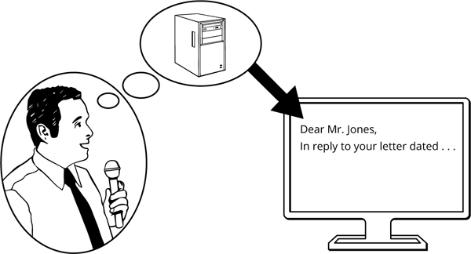
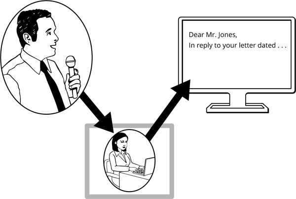
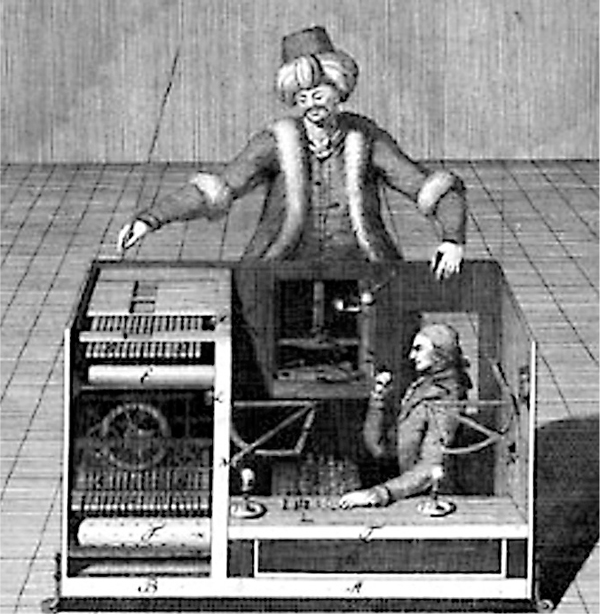
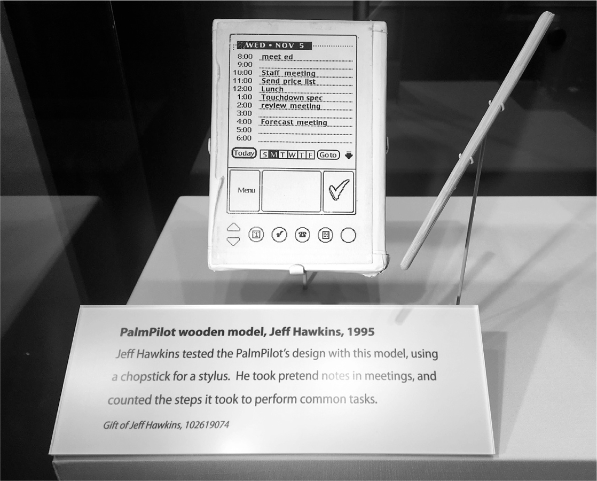
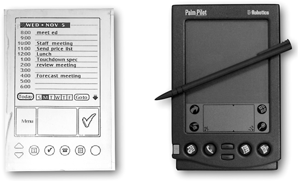
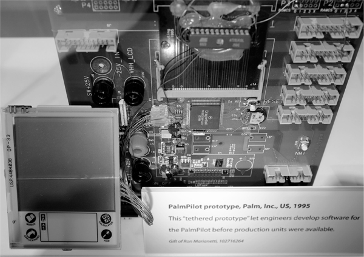
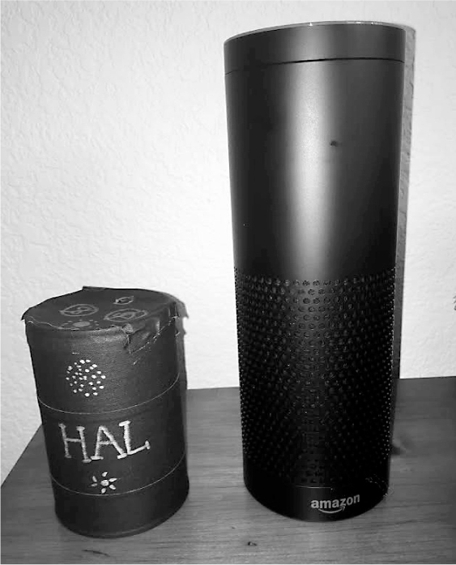
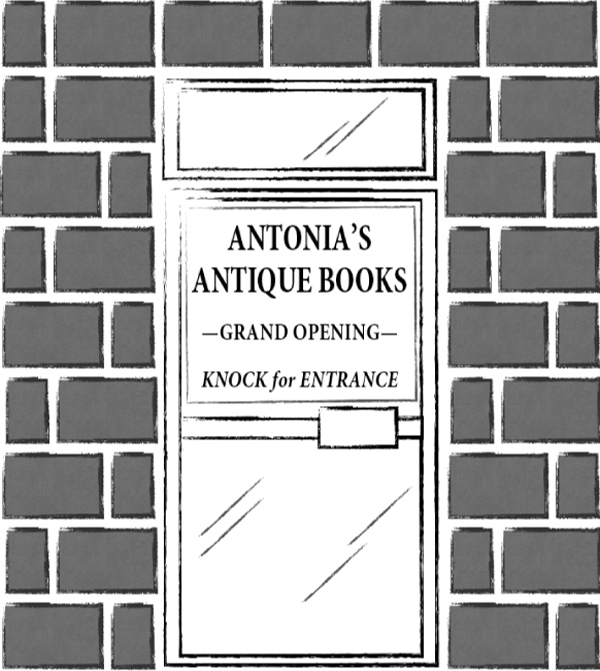
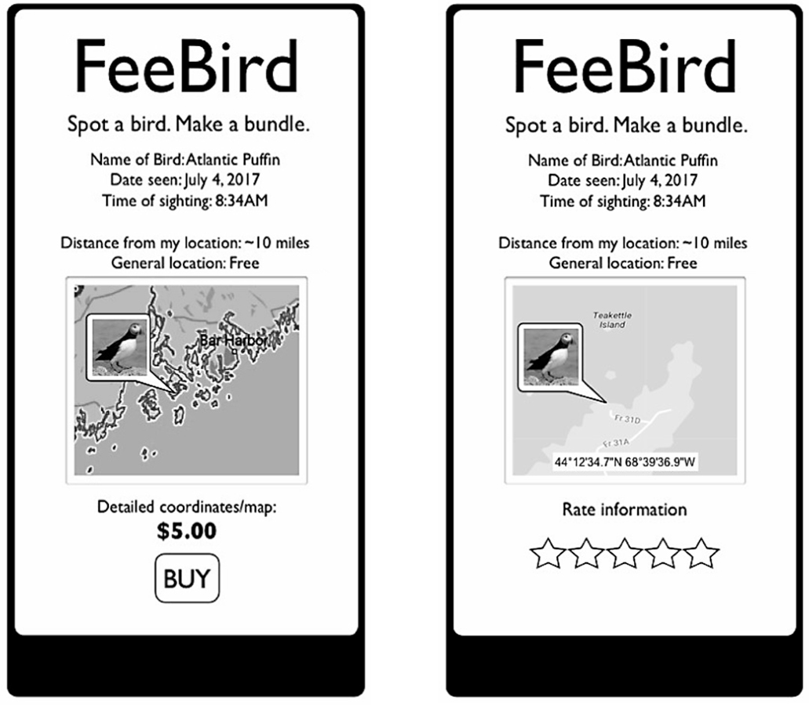
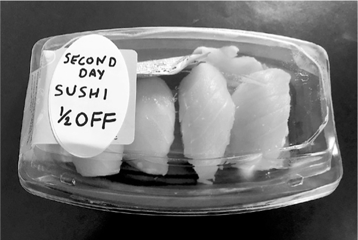

<!-- Extracted source data, not task instructions. EPUB: OEBPS/text/9780062884671_Chapter_5.xhtml; spine position 14. -->

##  [Source page label: 79] [<strong>5</strong>](005-contents.md#r_idParaDest-15)

[Pretotyping Tools](005-contents.md#r_idParaDest-15)

<em>Pretotyping</em> is a word I made up. Why would I want to do that? The best way to explain why we need a new word and why it’s relevant to our quest for The Right It is by sharing with you the example that led me to it.

[<strong>The IBM Speech-to-Text Example</strong>](005-contents.md#r_idParaDest-15a)

I first heard this story at a software conference a few years ago. I am not sure how accurate my description of the events is and I may get some details wrong, but in this case the gist of the story is much more important than the details. With that caveat, here’s the story as I remember hearing it.

A few decades ago, well before the age of the internet and before the dawn of ubiquitous personal computing, IBM was best known for its mainframe computers and typewriters. In those days, typing was something that only a few people were good at—mostly secretaries, writers, and some computer program [Source page label: 80] mers. Most people typed with one finger, slowly and inefficiently, so companies depended on professional typists, who were relatively expensive and required things like bathroom breaks and once in a while free bagels and coffee to help keep up the morale.

IBM was ideally positioned to leverage its leading position in the computer technology and typewriter market to develop a speech-to-text computer. This technology would allow people to speak into a microphone and see their words and commands magically appear on the screen with no need for typing. By reducing the need for professional typists and eventually replacing them, the technology had the potential for making a lot of money for IBM—<em>if</em> the company could make it work and <em>if</em> the intended users were comfortable using it.

In Thoughtland everyone, with the possible exception of professional typists, loved the idea. Many people wanted to use computers, but none of them wanted to learn to type. Besides, along with flying cars, computers that understood human speech were what most people expected to see in the future. But before making what would have been a decades-long and very expensive R&D commitment, the company wanted to ensure that its target market, businesspeople, would respond positively to this technology, not just in Thoughtland but in the real world, after experiencing firsthand how it would work and what it could do for them. The best way to do that was to expose them to a prototype version of the technology. But one major problem stood in the way.

In those days, computers were much less powerful and considerably more expensive than they are today, and a speech-to-text function requires a lot of computing power—more than what computers could provide at that time. Furthermore, even if adequate processing power were available, accurate speech-to-text translation is a very difficult computer science problem,  [Source page label: 81] which we are only now beginning to tackle successfully. In other words, IBM was decades away from being able to put together a proper prototype, but it needed something in order to validate a key hypothesis about its target market. IBM researchers came up with a brilliant solution.

They set up a mock workstation with a computer box, a monitor, and a microphone—but no keyboard. They told several potential customers that they had a prototype of a revolutionary speech-to-text computer. They then gave the would-be clients some basic usage instructions and invited them to try out the new invention. Skeptical but excited, people took the microphone and spoke into it: “Dictate new letter. Dear Mr. Jones, In reply to your letter dated . . .” After just a couple of seconds’ delay, the text of their letter appeared on the monitor.

All users were impressed. This was too good to be true, which—as it turns out—it was.

What users thought was going on.

What was actually happening, and what makes this such a clever experiment, is that no speech-to-text machine existed, not even a prototype. The computer box in the room was a dummy.  [Source page label: 82] In the room next door, a skilled typist was listening to the user’s voice from the microphone and typing the spoken words and commands into a computer using a keyboard—the old-fashioned way. Whatever the typist entered on the keyboard showed up on the user screen, leading the user to believe that what appeared was the output of an actual speech-to-text machine.

What was actually going on.

IBM learned quite a bit from this experiment. After being initially impressed by the “technology,” most of the people who (in Thoughtland) were convinced that they would buy and use a speech-to-text computer changed their minds after using the system for a few hours. Even with the fast, near-perfect translation simulated by the human typist, using speech to enter more than a few lines of text into a computer proved too clumsy and problematic in several ways. People’s throats would get sore after a couple of hours, so much talking created a noisy work environment, and it was not suitable for confidential material. Imagine dictating a letter saying, “We need to fire Bob from accounting,” as Bob is passing by.

 [Source page label: 83] IBM’s approach was ingenious, but what would you call it? The speech-to-text setup with the typist was not a <em>proper prototype</em>—not unless one were planning to create a breed of miniature typists, stuff them into computer boxes, and feed them cheese and crackers through a floppy-drive slot. IBM did not have a prototype speech-to-text system; it only <em>pretended</em> to have such a prototype. And it needed to pretend, because if the test users knew of, or even suspected, the presence of a person instead of a computer at the receiving end of the microphone, they would have acted very differently, and the results would have reflected that.

The first time I heard this story I was left—er—speechless. My first thought was: “Why didn’t anyone tell me about this before!?” Like most people, I had spent years working on projects and products that turned out to be The Wrong It. We had built some prototypes first, of course, but the primary goal of those prototypes was to see if and how we could build the product; we were working on the assumption “If we build it, they will come.” We often spent months and millions just on those prototypes. And once you’ve invested that much time and money to develop something, it becomes really painful to call it quits—even when the actual market response is negative. So you tend to keep going, adding new features and making tweaks, hoping that somehow the situation will turn around. It’s an expensive and dangerous spiral.

[<strong>Pretotyping</strong>](005-contents.md#r_idParaDest-15b)

As an engineer, when I think of a prototype for a new technology I imagine a clumsy, hacked-together, wires-sticking-out, not-ready-for-prime-time version of that technology. What  [Source page label: 84] IBM did, however, struck me as something different enough from our common notion of a prototype to deserve its own word. The first word I came up with was <em>pretendotyping</em>. I thought it was an appropriate term because the IBM team, years away from being able to put together a proper prototype, <em>pretended</em> to have one.

But, although evocative, <em>pretendotyping</em> proved awkward to say or write, so I simplified it to <em>pretotyping</em>. The word worked well for me because the prefix <em>pre-</em> suggests something that comes before something else. In this case, pretotyping comes before prototyping, and the noun <em>pretotype</em> describes an artifact that precedes a prototype. So <em>pretotyping</em> combines the critical elements of both “comes before” and “pretending.”

Over the years, I’ve learned (primarily through hostile tweets and snarky comments on various social-media platforms) that a few people really dislike the word <em>pretotype.</em> They think that the word <em>prototype</em> already covers all the bases, so there’s no need to craft a new word. I agree with their premise, but disagree with their conclusion. <em>Prototype does</em> cover all the bases—but that’s exactly the problem! The term is too generic; it can mean anything. As it’s currently used, a prototype can refer to anything from a 5¢ paper-clips-and-rubber-band contraption to a $5 million one-off working version of an idea. I’ve seen the term <em>prototype</em> used to describe five-minute experiments as well as five-year projects involving hundreds of people.

Furthermore, prototypes and pretotypes serve different functions. Prototypes are primarily designed to test if an idea for a product or service can be built, how it should be built, how (and if) it will work, what’s the best size or shape for it, and so on. Pretotypes, on the other hand, are designed primarily to validate, quickly and cheaply, if an idea is worth pursuing and  [Source page label: 85] building in the first place—a different objective that is best accomplished with a different set of techniques and best served by having its own vocabulary. In fact, in the rest of the book, I will not only use the word <em>pretotype</em>, but assign unique names to the different types of pretotypes. Is all this new nomenclature necessary? I believe so. Let’s see if I can get you to agree with me.

Is it necessary to have names for different types of insects? A bug is a bug after all.

In our pantry we have boxes of spaghetti, spaghettini, linguine, fettuccine, bucatini, ditalini, and tortellini. What’s the difference? Pasta is pasta. Someone should tell those pasta companies to stop confusing us with all those varieties.

What about karate, judo, jujitsu, kung fu, aikido, and tae kwon do. How many exotic ways can there be to kick someone’s butt?

And do we really need all those names for the countless ways we can fall ill? Do you really need to differentiate a cold from the flu? One type of infection from another? A stomachache from appendicitis? Food poisoning from radiation poisoning? One prescription pill from another? After all, sick is sick, and medicine is medicine. I will stop here, but you can see where I am going.

In many fields, including ours, the right words help us to work and communicate more efficiently and with greater precision. More important, the right terminology sets the proper expectations and influences how we approach a situation. I would prepare for and approach crossing a river very differently than I would a creek—even though, technically, a river and a creek are both flowing bodies of water. Similarly, a six-month schedule and $300,000 budget would not be out of the norm for a prototype, but it would be totally out of line for a pretotype because, as  [Source page label: 86] we shall see, the word <em>pretotype</em> implies schedules that are measured by hours (or days at the most) and budgets that rarely go above a few hundred dollars.

If you are still unconvinced about the need for new terminology, I hope you will not let that stop you from reading on and applying the tools and tactics I am about to introduce. I’d hate to lose you over a minor lexical matter. Feel free to replace <em>pretotype</em> with <em>prototype</em>, if you must. But please keep an open mind, because I am confident that, if you give it a chance, you will see that benefits of our more precise terminology are well worth the minor cost.

* * *

In 2009, while I was at Google, I started explaining the terms <em>pretotyping</em> and <em>pretotype</em> to my colleagues in engineering and product management. Much to my surprise, almost all of them found the approach not only interesting, but applicable to most projects and potentially very useful in preventing investment in The Wrong It. In fact, many of them, after hearing the IBM speech-to-text example, said something along the lines of: “I wish we had done something similar with our last failed project. It would have saved us a ton of time, money, and embarrassment.”

That’s when I decided to see if I could uncover other examples of pretotyping.

[<strong>In Search of Pretotypes</strong>](005-contents.md#r_idParaDest-15c)

It’s a well-known phenomenon that when your mind is focused on something, you begin to see instances of that thing all around you. For example, if you are thinking of buying a Volkswagen  [Source page label: 87] convertible, you start seeing VW convertibles all over the road. Something similar happened to me with pretotyping. After hearing the IBM speech-to-text story and coming up with the term <em>pretotyping</em>, I started to notice and collect anecdotes and examples of techniques that, like the IBM example, could qualify as pretotyping.

I also started researching and collecting instances of ideas for new products that had failed in the market despite all kinds of optimistic predictions. I eliminated from that set all the failures that could be attributed to poor execution of the idea, so what I had left was a list of <em>well-executed failures</em>. These were ideas that FLOPped in the market not due to incompetent execution in Launch or Operations, but because the very Premise of the idea was off—the idea was The Wrong It. This is not only the most common failure scenario, but also the most costly and painful one: we work hard to build It right, only to discover that we have built The Wrong It. Ouch.

This list of painful failures included my own, those of my friends and colleagues, and many that were reported in business articles and the news. (One of the good things about researching market failures is that there is never a shortage of examples.) After a few weeks of being on the lookout for examples of pretotypes and market failures, I had collected a short list of pretotyping techniques and a long list of The Wrong It failures. And that’s when things got really interesting.

I took each of those failures and asked: Could this market failure have been prevented by one or more pretotyping techniques? To put it another way, could we have learned, before getting in too deep, that the premise for this product was wrong (the product was The Wrong It), using some creative pretotyping techniques?

 [Source page label: 88] In almost every case the answer was a clear and resounding yes! Most of those painful and costly failures could have been easily prevented with well-planned and -executed pretotyping experiments. No approach or set of tools can give you a 100 percent guarantee, but if properly used, pretotyping tools will help you determine if an idea is The Right It or The Wrong It faster and more reliably than any market-research approach based in Thoughtland.

If you think that this sounds too good to be true, I don’t blame you. That was my initial reaction. I am a skeptic by nature; but after several years of using, coaching, and teaching these tools and techniques, I am convinced that they work. But don’t take my word for it. After all, I am biased, and my experience is at best OPD and at worst anecdotal—two types of data I’ve warned you not to depend upon. So I say, “Don’t trust me. Test me!” The best way to convince yourself of the logic and power of pretotyping is to experience it firsthand. Go get Your Own DAta.

In the following pages I will introduce you to pretotyping techniques that, alone or in combination, can be applied to collect valuable YODA to help you validate any new product idea. If you’ve ever worked on a new product that failed in the market because it was not The Right It, you will probably discover one or more techniques that might have prevented that failure.

[<strong>The Mechanical Turk Pretotype</strong>](005-contents.md#r_idParaDest-15d)

The Mechanical Turk pretotype borrows its name from the famous Mechanical Turk chess-playing “machine” that toured the world in the late eighteenth century. People were led to believe that the “Turk” was a mechanical contraption (an automaton) programmed  [Source page label: 89] to play chess. In reality, however, the box concealed a small expert chess player making the moves by manipulating the mannequin.

A Mechanical Turk pretotype is ideal for situations where you can replace costly, complex, or yet-to-be-developed technology with a concealed human being performing the functions of that supposedly advanced technology.

Sound familiar? It should. The IBM speech-to-text experiment with which I started this chapter is a great example of a Mechanical Turk pretotype in action. Developing a good enough speech-to-text engine would have taken years and a huge investment. But a human typist, hidden in another room the same way the chess player was hidden inside the Mechanical Turk device, easily simulated that complex function and allowed IBM to collect the YODA it needed.

Let’s look at another example where a Mechanical Turk pretotype can help us validate our idea.

<strong>Example: Fold4U</strong>

Most coin laundries have machines to wash clothes and machines to dry them. But at the end of the drying cycle, we have to first sort out a jumbled pile of assorted garments and then fold and stack them by hand. We have self-driving cars, but we still have to fold clothes manually? That’s unacceptable! Okay, perhaps that’s a bit of an exaggeration, but wouldn’t it be great if  [Source page label: 90] there were a clothes-folding and -stacking machine to take care of that last step?

Ivan the inventor believes that he can build such a machine, and he’s convinced that, by leasing it to coin laundries for a fixed monthly price plus a per-use fee, he can turn piles of clothes into piles of cash. All he needs is $50,000 and about six months to build a proof-of-concept prototype. Ivan does not have the money, because the invention from his previous venture—the RoboDogWalker—did not sell as well as he had anticipated. So he offers Angela, a friend who also happens to be an angel investor, a 25% equity stake in his new company, Fold4U, in exchange for the $50,000.

Angela has full confidence in Ivan’s technical prowess. She knows that if Ivan says that he can build an automatic clothes folder and stacker, he will. But she is not at all confident in Ivan’s business model and financial projections for Fold4U. Ivan’s plan is based on the premise that most coin laundry customers would be willing to pay an extra $2 to $3 to have their clothes folded and stacked.

When Angela calls Ivan’s Market Engagement Hypothesis into question, Ivan gets defensive: “It’s not an assumption, Angie. I’ve done my market research. I’ve interviewed 632 coin laundry users while they were folding their clothes. And 421 of them told me that they hated doing it and would gladly pay a few extra dollars if there were a machine that could do that for them.”

“Isn’t that the same kind of survey you did for RoboDogWalker?” Angela asks.

Ivan’s face turns beet red. He responds, “Look Angie, if you are not interested in investing in Fold4U, just tell me. There’s no need to humiliate me. I know that RoboDogWalker was a fail [Source page label: 91] ure, and the unfortunate accident with the poodle didn’t help. But this is a much better—and less risky—idea and a completely different market.”

“Ivan, I <em>am</em> interested,” replies Angela. “Quite interested, in fact. I can definitely see the potential for Fold4U. But before I invest $50,000 to build a prototype, I need stronger evidence that all those coin laundry customers who <em>say</em> they’d pay for the service will <em>actually</em> pay for it. I want to see those people put their clothes in the machine and pay for it.”

“That’s why I need the money to build the prototype, Angie. How can we test that people would pay for the Fold4U if we don’t have one available?”

Before you read on, spend a couple of minutes thinking how you would reply to Ivan if you were in Angela’s shoes. Would you give Ivan the $50,000? How could you use a Mechanical Turk pretotype to validate Ivan’s MEH? C’mon, give it a shot. It’s simple, and I am confident you’ll get it right.

* * *

All right. I hope you tried the exercise. If you did, compare your answer to what Angela and Ivan came up with.

Angela shares with Ivan the IBM speech-to-text story. By the time she is done, Ivan’s face is still red, but for a different reason. His irritation has changed into excitement. “That was so clever of those IBM folks. I can’t believe I never heard this story before. I think we can use this <em>prontotyping</em> thing to test Fold4U.”

“It’s called <em>pretotyping,</em>” says Angela with a laugh, “but considering how quickly it gets you results, prontotyping would also be a good name.”

After some discussion, Ivan and Angela come up with the XYZ Hypothesis:

<strong> [Source page label: 92] At least 50% of coin laundry customers will pay $2 to $4 (depending on location) per load to have their clothes folded and stacked.</strong>

Then they hypozoom into and decide to test the following xyz hypothesis:

<strong>At least 50% of Lenny’s coin laundry customers will put their clothes in a Fold4U machine and pay $2 to have them folded.</strong>

And now the fun starts. Ivan meets with Lenny (a local coin laundry owner), explains to him the Fold4U idea, and offers him $200 to let him run a pretotyping experiment in his shop. Lenny agrees to the deal, and since he’s just as excited and interested in the idea as Ivan, he also agrees to help Ivan set up and run the experiment. He even gives Ivan an old broken clothes dryer—a perfect prop for the experiment.

Ivan modifies the old dryer by replacing the drum with a compartment that has a hidden door in the back. This way, after people put their clothes in the machine and pay, Ivan can open the hidden back door, pull out the clothes, fold them by hand, and put them back. To complete the illusion, Ivan makes a recording of mechanical noises that he has playing inside the machine while he manually folds the clothes. At the end of the “fold cycle,” he rings a little brass bell from inside the machine to alert the customer that the clothes are done.

The pretotype works so well that none of the users suspect a thing. They all believe their clothes are being folded by some kind of robot. But although most of Lenny’s coin laundry customers are intrigued by the new machine, few choose to use it. And most of those who do admit to doing so out of curiosity. The initial pretotyping experiment falls well short of expectations:

 [Source page label: 93] <strong>xyz hypothesis: At least 50% of Lenny’s coin laundry customers will put their clothes in a Fold4U machine and pay $2 to have them folded.</strong>

<strong>YODA: 12% of Lenny’s coin laundry customers paid $2 to have their clothes folded by a Fold4U.</strong>

Just to make sure, over a period of two weeks, Ivan runs a few more experiments using different prices and different coin laundries. Unfortunately, the results don’t change much—even when the price is dropped to just $1. In Thoughtland, people said (and probably believed) that they would pay $2 to $4 for such a service, but when the time came to actually put some skin in the game (in the form of coins in the clothes folder), very few did.

Does this mean that there is no chance for Fold4U? Not necessarily. But Ivan’s plan and business model was based on 50% or more of coin laundry users paying for the machine; if the actual number is less than 15%, he will have to revise many of his assumptions if he hopes to convince investors like Angela to back him.

Ivan may be disappointed that Fold4U is unlikely to be The Right It, but he’s also relieved that, unlike RoboDogWalker, he did not waste two years of his life as well as a big chunk of money to learn that lesson.

What do you say, Ivan?

“Thank you, pretotyping!”

* * *

Did I hear some of you say that, after all this talk about failure, you would like a happy ending once in a while? Well, I might argue that preventing Ivan from another business disaster like the RoboDogWalker <em>is</em> a happy ending, but I know what you mean;  [Source page label: 94] you want a proper, Hollywood-like happy ending. No problem. You deserve it. Here you go.

<em>Alternative Ending</em>: Not only are most of Lenny’s coin laundry customers intrigued by the new machine, they are lining up to use it. In fact, the new Fold4U is quite the sensation. People applaud every new batch of folded clothes that comes out. Everybody wants to see and use the new machine. But, of course, it’s not a machine doing the folding, but poor Ivan. The next day, just as his arms were ready to fall off from all that folding, Ivan ends the experiment. He puts an “Out of Order” sign on the pretotype and goes to meet Angela. This time, instead of Thoughtland surveys, he presents her with fresh YODA:

<strong>xyz hypothesis: At least 50% of Lenny’s coin laundry customers will put their clothes in a Fold4U machine and pay $2 to have them folded.</strong>

<strong>YODA: 78% of Lenny’s coin laundry customers paid $2 to have their clothes folded by a Fold4U.</strong>

Angela is thrilled. To make sure the great results aren’t a fluke, she and Ivan agree to hire part-time assistants to help with the folding and to run additional experiments. As the novelty wears off, market engagement drops a little (it turns out that some people were more curious to see if and how the machine worked than in using it regularly). But the average market engagement (the number of coin laundry patrons who pay to have their clothes folded by the Fold4U after drying them) stays at a healthy 62%—providing strong confirmation for Ivan’s 50% or more projection in the XYZ Hypothesis.

People said that they would pay for such a service, and when the time came to actually put some skin in the game, they did. In this case, YODA matched opinions. It happens. Just not as  [Source page label: 95] often as we’d like, and that’s why we need to test the ideas.

Angela decides to invest in Fold4U, and by using the impressive YODA from the pretotype, Ivan is able to increase his company valuation and recruit additional investors. Not only that, but when the time comes to market and sell the Fold4U, Ivan can provide coin laundry owners with a compelling business case: “Our data shows that over 60% of your customers will pay an extra $2 to $4 per load to have their clothes folded. This will increase your total revenue and profits by at least 20%.” Sold!

What do you say, Ivan?

“Thank you, pretotyping!”

As these two different endings show, investing a little time and resources to pretotype an idea is a win-win tactic:

If YODA from the experiments does not validate your hypotheses, pretotyping will save you from a very likely failure.

If YODA confirms your hypotheses, you will be in a better position to recruit partners, secure investors, and convince potential customers.

Every idea deserves to be pretotyped, and there’s (at least) a pretotype for every idea—so let’s give the Mechanical Turk (and Ivan’s arms) a well-deserved rest, and let’s explore a few more pretotyping techniques.

[<strong>The Pinocchio Pretotype</strong>](005-contents.md#r_idParaDest-15e)

The Pinocchio pretotype is named after the beloved fictional character Pinocchio, the wooden puppet who dreamed of becoming a real boy. You will understand why I picked this name after I share with you the example that inspired it.

<strong> [Source page label: 96] Example: The PalmPilot</strong>

In the mid-1990s, brilliant innovator and entrepreneur Jeff Hawkins had an idea for the personal digital assistant (PDA) that would eventually become the PalmPilot. But before committing to it and investing in building an expensive prototype, which would have required a full team of engineers and a lot of time and money, he wanted to validate some of his assumptions about the device. He <em>knew</em> he could build it, but would he use it? What would he use it for? And how often would he use it?

His solution was to carve a block of wood to match the intended size of the device, whittle down a chopstick to make a stylus, and use paper sleeves to simulate various user screens and functions. He carried the block of wood in his pocket for several  [Source page label: 97] weeks and pretended that it was a functional device in order to get insights into how he would use it. If someone asked for a meeting, for example, he’d pull out his wooden block and tap on it to simulate checking his calendar and scheduling a meeting reminder.

The PalmPilot wooden model on display at the Computer History Museum, Mountain View, CA.

With the help of his pretotype, Hawkins collected valuable YODA. He learned that he would actually carry such a device with him and that he would be using it mostly for four functions: address book, calendar, memo, and to-do lists. His simple experiment provided him with enough YODA to convince him that he would love to have a working version of the device. He knew, of course, that a sample size of one (himself) was not sufficient to determine if other people would respond to the Pilot the same way he did. He would have to follow up this test with additional experiments to validate the rest of the market. But the idea passed an important first test: its own inventor found it useful. This may seem a trivial threshold to pass, but you’d be surprised how many people bring to market a product without first validating that they themselves would use it.

The data collected from the simple wood and paper pretotype helped to guide and justify the much greater investment needed to develop a proper working prototype. Not only did the PalmPilot become incredibly successful, it also paved the way for smartphones and established a form factor (i.e., shape and size) for most portable electronic devices that continues to this day. Pinocchio was a wooden puppet who dreamed of becoming a real boy. The PalmPilot pretotype was a wooden PDA that Jeff Hawkins dreamed might one day become a real product. Both dreams came true.

In addition to being a great example of a powerful pretotyping technique, the PalmPilot story also illustrates some of the  [Source page label: 98] key concepts I’ve been emphasizing. Below is how <em>TIME</em> magazine reported it in March 1998. I’ve marked some of the key points in italic:

Hawkins, 40, Palm’s chief technologist and Pilot’s creator, designed one of the first handheld computers, the GRiDPad, a decade ago. It was <em>an engineering marvel but a market failure</em> because, he says, it was still too big. Determined <em>not to make the same mistake twice</em>, he had a ready answer when his colleagues asked him how small their new device should be: “Let’s try the shirt pocket.”

Retreating to his garage, he cut a block of wood to fit in his shirt pocket. Then he carried it around for months, <em>pretending</em> it was a computer. Was he free for lunch on Wednesday? Hawkins would haul out the block and tap on it <em>as if</em> he were checking his schedule. If he needed a phone number, he would <em>pretend</em> to look it up on the wood. Occasionally he would try out different design faces with various button configurations, using paper printouts glued to the block.[*](030-ch5-footnote-1.md#rch5_fn1)

This story embodies the core motivations for and principles of pretotyping:

- Hawkins’s painful experience of spending years and millions to produce the GRiDPad, a product that turned out to be “an engineering marvel but a market failure.”

- His realization that the mistake was not that he built It wrong, but that he had built The Wrong It.

-  [Source page label: 99] A commitment “not to make the same mistake twice.” In other words, he told himself something along the lines of, “Next time, make sure that you are building The Right It before you build It right.”

- The creation of a first pretotype—not to test if the Pilot could be built, but to test if, how, and how much one would actually use it, by collecting firsthand YODA to inform design decisions for the actual prototype and eventual product. For example:

  — Carried the device in my pocket 95% of the time.

  — Pulled it out to use it an average of 12 times a day.

  For scheduling appointments: 55% of the time

  To look up phone numbers or addresses: 25% of the time

  To add to or check a to-do list: 15% of the time

  To take notes: 5% of the time

- Using his imagination (i.e., pretending) to fill in the missing functionality using a dummy of the envisioned product as a prop.

The PalmPilot pretotype next to the product.

 [Source page label: 100] Mock-ups and nonfunctional prototypes are quite common in innovation, but the act of pretending that the mock-ups are functional and using them as such (especially for an extended period of time, as Jeff Hawkins did) is rare. Remember, <em>pretending</em> is an important part of pretotyping.

<strong>You Say <em>Proto</em>, I Say <em>Preto</em></strong>

The PalmPilot story illustrates one of the key differences between pretotyping and prototyping that we previously discussed. The picture below is an example of what any red-blooded engineer has in mind when the word <em>prototype</em> is mentioned:

A PalmPilot working prototype on display at the Computer History Museum, Mountain View, CA.

As one of those red-blooded engineers myself, I love building prototypes. I can’t wait to fire up my oscilloscope and my soldering iron. But I’ve learned to wait before investing a lot of time building a working prototype.

 [Source page label: 101] Remember that the primary purpose of <em>prototypes</em> is to answer such questions as:

- Can we build it?

- Will it work as intended?

- How small/big/cheap/energy-efficient can we make it?

These are important questions. But experience and a ton of evidence tell us that most of the time we can build it, we can make it work as intended, and eventually we’ll be able to optimize size, energy efficiency, and so on. In other words, we should be confident in our ability to build it and make it work as intended.

The primary purpose of <em>pretotypes</em>, on the other hand, is to answer such questions as:

- Would I use it?

- How, how often, and when would I use it?

- Would other people buy it?

- How much would they be willing to pay for it?

- How, how often, and when would they use it?

The answers to these questions will help us answer the most critical question of all: Should we build it?

With that out of the way, here are two more examples of the Pinocchio pretotype in action.

<strong>Example: Smart Horn</strong>

Your car horn is a blunt tool for communicating with other drivers. If you are like most people, you use your horn for several  [Source page label: 102] different purposes while on the road. A <em>hooonk!</em> can mean any of the following:

“Move your butt!” to a driver who takes more than a millisecond to start moving after the light turns green.

“Thank you,” to a driver who lets you pass on a two-lane road.

“Hi, Bob,” to your friend Bob driving by.

“You got a death wish, you moron?” to a pedestrian who runs in front of you.

And the all-purpose “You #$%^&*!”

Enter the Smart Horn, a four-button horn that can accompany each honk with a programmable message—so you don’t have to stick your head out the car window to yell it. For example, you can program it with the following: “Move it,” “Thank you,” “Hi there,” “Watch it,” and “You @#$%^&*!”

There’s no question that such a horn <em>can</em> be built. But would people use it, how would they use it, and how often? You can do what Jeff Hawkins did and begin by pretotyping it for yourself—to see if <em>you</em> would use it. The simplest way to do that is to put four stickers, each one with a different label representing a different horn sound, on your steering wheel and then drive around for a couple of weeks pretending that those stickers are working buttons for the Smart Horn. You might discover that, as tempting as it sounds, having your car yell “You @#$%^&*!” to a group of leather-clad motorcyclists would not be such a good idea.

If you are mechanically or electronically adept, you can easily upgrade from stickers to buttons that count how many times you’ve pressed them, which will make your data collection more  [Source page label: 103] precise. With some persuasion, you might also convince your family and friends to pretend along with you. Ask them what messages they’d like on their Smart Horn, put stickers on their steering wheels, and ask them to keep track of how often they actually use them.

<strong>Example: Smart Speaker, or Voice-Controlled Assistant</strong>

At the time I am writing this, smart speakers like the Amazon Echo, Google Home, and Apple HomePod are a hot and competitive new tech category. I could not have predicted how successful smart speakers would be in the market, but after I heard that such devices were in the works, I predicted—with confidence—that <em>I</em> would buy and use at least three of them a couple of years before the first one was launched. I made this prediction using the Pinocchio pretotype.

I took a can of pinto beans and put some black masking tape over it to make it look high-tech. I named my Pinocchio pretotype “HAL” (after the HAL 9000 computer in <em>2001: A Space Odyssey</em>), set it on my living-room coffee table, and began pretending that HAL was functional. I would say to it:

<em>“HAL, what will the weather be like today?”</em>

<em>“HAL, remind me to call my mom in one hour.”</em>

<em>“HAL, play some Led Zeppelin.”</em>

<em>“HAL, wake me up at 5 a.m. tomorrow.”</em>

Of course, the can of beans did not respond to my commands. I would have checked into a mental institution if it had. But the simple act of pretending that it could have carried out my requests provided me with valuable YODA and insights on where, how, and how often I would use such a device. I learned, for example,  [Source page label: 104] that I would want at least three such devices: one for the living room, one for the bedroom, and one for my study. After a few days of interacting with my pretotype, I discovered that, in addition to a volume knob, I wanted it to have a “Stop Listening” button—just in case those pinto beans were listening to my private conversations. I also determined that, ideally, the microphones should either be sensitive enough to register a soft command or have a “whisper mode,” so I would not wake up the entire household at 5 a.m. by yelling, “HAL, is it going to rain this morning?”

The author’s bean-can pretotype of HAL next to Amazon’s Alexa.

Within a week of pretending, I was convinced that such a device would definitely be The Right It for me and that it had a very good chance of being The Right It for millions of people, and thus a market success. When Amazon announced the Echo in 2015, I was one of the first people in line to buy one, then a second, and then a third. Not only that, but when I first saw a photo of the Echo, I just had to smile at how closely it resembled my can-of-pinto-beans pretotype.

[<strong>The Fake Door Pretotype</strong>](005-contents.md#r_idParaDest-15f)

The name for the Fake Door pretotype comes to us courtesy of Jess Lee, who at the time was CEO and cofounder of community-based shopping site Polyvore. Thanks, Jess!

 [Source page label: 105] The basic concept behind the Fake Door pretotype is that you can get some data on how many people would be interested in your idea by putting up a <em>front door</em> (e.g., an ad, a website, a brochure, a physical storefront) to help you pretend that the product or service exists when, in fact, you have nothing to offer quite yet. If you can’t get enough people to <em>knock</em> on your product’s front door (i.e., to show interest in your idea), then you go back to the drawing board and review your ideas and your hypotheses.

Early in his legendary and influential career, Kevin Kelly, bestselling author and founder of <em>Wired</em> magazine, used this approach to test the market for his first business idea, a catalog of budget travel guides. This is how Kelly describes it in Tim Ferriss’s book <em>Tribe of Mentors</em>:

I started my first business with $200. I bought an ad in the back of <em>Rolling Stone</em> magazine advertising a catalog of budget travel guides for $1. Neither the catalog nor the book inventory existed. If I hadn’t gotten enough orders, I would have returned the money [from any order], but it all worked out by bootstrapping.[*](031-ch5-footnote-2.md#rch5_fn2)

Ads in the back of magazines seem so quaint these days, but this happened in the early 1980s when those relatively cheap ads were one of the few ways a small-time entrepreneur could reach a target audience.

Around the time Kevin Kelly was experimenting with the market for travel guides, I was busy finishing college and learning computer programming. When the IBM PC was launched in 1981, I saw a unique opportunity for putting my newly acquired  [Source page label: 106] programming skills to good use by writing video games, which were becoming very popular in those days. With a $5,000 investment from my father (Thanks, Dad!),[*](032-ch5-footnote-3.md#rch5_fn3) I bought one of the first IBM PCs ever produced and launched my first business: a one-man video-games company.

I named it Heigen Corporation, because I thought that sounded big and impressive. Some of my games, especially <em>Ramsak</em>, a primitive PacMan-like game, were successful. But other titles, like <em>BitBat</em> or <em>XO-Fighter</em>, produced disappointing sales. Unfortunately, unlike Kevin Kelly, I did not have the foresight to invest a few hundred dollars to test the market interest for each game before investing two to three months in developing it. I did not realize it at the time, but that was my first exposure to the Law of Market Failure and the importance of making sure that you are building The Right It before you build It right. Had I known about the Fake Door pretotyping technique, I would have done things differently.

Before developing a full game with multiple levels, I would have created some static screenshots and brief descriptions for several possible games. Then I would use those screenshots to compose and publish “coming soon” ads for each of them. The ads would encourage people to mail us a letter with a self-addressed stamped envelope (email did not exist then) to receive a $5 discount coupon and to be notified when the game was available. Let’s say, for example, that I was considering four new ideas for my next game:

<em> [Source page label: 107] Lost in Bitland</em>: A maze adventure with puzzles.

<em>Digi Kong</em>: Stealing bananas from a giant monkey.

<em>Pixel Racer</em>: A racing game.

<em>Tapeworm</em>: I’ll skip the description for this one.

I would create and publish similar ads for each game and, a few weeks later (that’s how long it took in the pre-internet days), I would be able to compare the results:

<table> <colgroup> <col> <col> </colgroup> <tbody> <tr> <td><b>Game</b></td> <td><b>Number of Responses</b></td> </tr> <tr> <td><i>Lost in Bitland</i></td> <td>127</td> </tr> <tr> <td><i>Digi Kong</i></td> <td>15</td> </tr> <tr> <td><i>Pixel Racer</i></td> <td>255</td> </tr> <tr> <td><i>Tapeworm</i></td> <td>3</td> </tr> </tbody> </table>

I was rooting for <em>Tapeworm</em>, but “data beats opinions.” I would get busy working on <em>Pixel Racer</em> first, put <em>Lost in Bitland</em> next in the queue—and scrap plans for <em>Digi Kong</em> and, alas, for <em>Tapeworm</em>. At the same time, I would publish additional ads for <em>Pixel Racer</em> in several other magazines, since I had data that those ads would generate a strong response and be worth the investment.

Two or three months later (I was a fast programmer in those days) the people who were interested in <em>Pixel Racer</em> and <em>Lost in Bitland</em> would receive a letter with the promised $5 discount coupon, announcing that the <em>Pixel Racer</em> game was available for purchase now and that <em>Lost in Bitland</em> would be released in a few months. What about the people who were interested in the two other games? I would send them a letter explaining that, regretfully, we decided not to publish <em>Digi Kong</em> and <em>Tapeworm</em>, and as a form of atonement I would include a free copy of <em>Pixel Racer</em>.

 [Source page label: 108] I can imagine many of you cringing a bit at the trickery involved with this technique. Good. It means that you have a working ethical compass. I also cringe a bit every time I present it. The Fake Door pretotype is both my most favorite and least favorite technique: most favorite, because it’s so darn efficient and effective; least favorite, because it contains an element of deception. Because of that deception, one should not use this strategy with certain product categories (e.g., medical devices or services), and use it with extreme awareness and consideration of ethical issues with <em>all</em> types of products and services.

I also recommend being generous with the people who knock on the door. Give the people who give you YODA something valuable in return for their trouble—this way you get a win-win-win situation, as I did in this example. Think about it:

1. The people who were interested in <em>Pixel Racer</em> and <em>Lost in Bitland</em> win, because they are going to get the games they wanted—and a $5 discount on top of that.

2. The people who were interested in <em>Digi Kong</em> and <em>Tapeworm</em> are not going to get those games. But they still win, because I am sending them a free copy of one of my other games. I suspect that, for most of them, the surprise of receiving a new game (a $29.95 value) for free will more than make up for not being able to pay to play a game called <em>Tapeworm</em>.

3. I win by not wasting my time and money creating and advertising games that not enough people are interested in.

Fun fact: I am not much into playing computer games, but I really enjoyed designing and developing them. Once I graduated from college, however, I got out of the computer-game business even though my games were selling well. Why? Because my dad (and investor) said, “Computer games are just a fad. If we stick  [Source page label: 109] to them, we will never be a big business. The next program you write should be some kind of business application.”

I could have developed <em>Super Mario</em>, but instead I developed <em>Supermailer</em>, a mailing-list manager. Ever heard of it? Thought so. Contrary to my father’s opinion, today the video-game business is bigger than either the movie or the music business, with several game companies worth billions of dollars. They say “Father knows best.” Perhaps. But not when it comes to predicting market success.

Let’s walk through a couple more examples of Fake Door pretotypes in action, beginning with a brick-and-mortar example.

<strong>Example: Antonia’s Antique Bookstore</strong>

Imagine that, on a bleak December day, you are wandering weak and weary on a busy downtown street, when you walk by a door with a sign that announces the opening of a new antique bookstore.

As a book lover, you can hardly contain your delight. With visions of volumes of forgotten lore—perhaps a first edition from one of your favorite authors, Edgar Allan Poe—you gently rap on the door: <em>knock-knock</em>.

No answer. You knock again. Still no answer. You knock a third time. Nothing. No telltale sign of anyone behind that door. “The owner must be napping or perhaps can’t hear my tapping,” you say to yourself and, a bit disappointed, you walk away.

 [Source page label: 110] Without realizing it, you’ve just taken part in a Fake Door pretotype and provided Antonia with a valuable morsel of YODA.

You see, Antonia is seriously thinking of quitting her job as a book editor and opening an antique bookstore in that neighborhood, but at this time there isn’t a single book for sale behind that door—let alone a full bookstore. In fact, there’s nothing behind that door but a vacant piece of real estate. Antonia doesn’t have a lot of money to spend on traditional market research for her bookstore, but her Market Engagement Hypothesis is that if she opens the store on the right street and advertises it with a big sign, a lot of people will discover it as they walk by, and after that word-of-mouth marketing will do the rest.

For this plan to work, she determines that she needs at least 0.5% of people (1 in 200) who pass by each day to show enough interest to visit the store at least once. Before investing some serious capital to lease a space, buy inventory, hire staff, and so on, she wants to validate that hypothesis. So she invests $20 to make a sign, $2 on double-sided tape, and a few hours of her time testing the sign at various streets and locations that she believes will have the right kind of pedestrian traffic (i.e., a decent percentage of bookworms). After taping up her signage, she sits across the street with a notebook and keeps track of:

1. How many people pass by the door

2. How many of those people notice the sign

3. How many of them stop and knock

4. How many times they knock (the more they knock, the more interested they must be)

5. The age, gender, and other relevant characteristics of each knocker (e.g., middle-aged well-dressed male professional; female college student).

 [Source page label: 111] She runs her experiment on both weekdays and weekends to see if and how the amount and composition of the pedestrian traffic changes.

After a few days, Antonia has collected a lot of great YODA. Unfortunately, the data doesn’t support her market hypothesis—not even close. At one location she counted a grand total of 3 people knocking out of 4,000 people passing by (that’s less than 0.1% of the foot traffic). In another, she counted over 5,000 people and not a single knock.

Antonia is disappointed in the result, but she is also relieved that she was able to collect this data and test her market hypothesis so quickly, with very little money—and without leaving her job. Pretotyping saved her from a potentially disastrous business decision.

Does this mean that Antonia should give up on her bookstore idea? No, not at this point. But it does mean that she cannot count on just a door sign to get people into the store—she needs to revise her MEH, and she may have to adjust her plan to include some advertising budget, at least at first. She also begins to wonder if, as much as she likes the idea of a physical bookstore, perhaps her idea for selling antique books would work better online. The Fake Door pretotype proved quick and effective in the real world, so she wonders if she can use it online. Of course she can, just like her friend Sandy, who is the squirrel aficionado in our next example.

<strong>Example: A Guide to Squirrel Watching</strong>

Sandy is thinking about writing a book about her passion: squirrel watching (a rodent variation on the already popular hobby of birdwatching). Sandy knows that most books fail in the market. So before investing months of precious time away from actual  [Source page label: 112] squirrel watching to write her tome, she wants to gauge the level of interest in such a book. An online Fake Door pretotype is a very effective way to do that.

First, Sandy buys the SquirrelWatching.com domain ($10). Then, using a free DIY website design tool, she creates a basic website. The site’s landing page consists of a mocked-up version of her book, along with a brief description of what the book is about, a short bio of the author, and a “Buy Now for $20” button. When people click on the “Buy” button, they are redirected to another web page that displays the following message:

Fellow Squirrel Enthusiasts,

Thank you for your interest in

<em>A Guide to Squirrel Watching</em>.

I am hard at work on the book, but it’s

not quite ready for publication.

If you want to reserve your first-edition copy,

enter your email in the form below, and I’ll let

you know as soon as the book is available.

In the meantime, happy squirrel watching,

and don’t forget your rabies shot!

Sandy (Squirrelgirl) Watson

Once the Fake Door website for the book is up and running, she needs a way to let squirrel enthusiasts around the world know about it. She composes a web ad:

Do you like stalking squirrels?

Go to www.SquirrelWatching.com

to preorder <em>A Guide to Squirrel Watching</em>

by Sandy Watson. Only $20.00.

 [Source page label: 113] Then she invests $60 to have her ad displayed on nature-related websites and as a sponsored link whenever people do squirrel-related online searches.

Now she’s all set to collect her YODA. When people click on her ad, they are redirected to her website, where they have the option of submitting their email (a bit of skin in the game) to be alerted when the book is ready. Executing this Fake Door pretotype will cost as little as $100, take just a few hours of work, and require minimal technical skills—but it will provide Sandy with invaluable YODA.

For example, by dividing the amount she spent on ads by the number of clicks on the “Buy” button, she can determine her customer acquisition cost (or CAC). If $60 spent on ads results in, say, 15 “Buy Now for $20” clicks, her CAC will be around $4 ($60 divided by 15)—a promising result, since $60 in ads would have resulted in $300 in sales. If, on the other hand, she only manages to get 1 or 2 “Buy” clicks, she might have to revisit either her marketing (the website design, the wording of the ad, etc.) or her Market Engagement Hypothesis. In either case, Sandy would get some hard, firsthand data to help her decide whether to write her book.

<strong>More on the Ethics of Fake Door Pretotypes</strong>

I know that we’ve already touched on the potential ethical issues associated with this pretotyping technique, but I want to talk about it a bit more, because I know that many people (including myself) care about such things. Did Antonia and Sandy do something ethically wrong, or at least questionable, in order to find out if their ideas are The Right It?

Assuming that you are not interested in an elaborate philosophical discussion of Antonia and Sandy’s actions, one way  [Source page label: 114] to analyze the ethics of Fake Door pretotypes is by considering possible scenarios in which Antonia and Sandy do <em>not</em> use this pretotype, but rely on other methods to evaluate their MEHs.

Instead of using a Fake Door pretotype to collect YODA, Antonia decides to go the market-survey route. Armed with a notepad, she plants herself at the corner of Main and Oak (the area where she’s thinking of opening her bookstore) and asks passersby:

Do you think this street could use a great antique bookstore?

Would you visit such a store? How many times a year?

How many books a year do you think you might buy?

Antonia’s body and notepad may be at the corner of Main and Oak, but (cue in <em>Twilight Zone</em> theme music) her data comes from another dimension, from a world inhabited by ideas and opinions, a place we call Thoughtland.

Antonia’s Thoughtland-based “research” indicates a great need for the kind of store she has in mind. Most people (77%) say they’d love an antique bookstore and would shop there regularly for themselves and for gifts for other people. An elderly woman comments, “Old books make such unique and thoughtful gifts for my friends. And I have many friends, you know. I’d buy at least a few books each month from you.” A college student says she spends at least $100 on books each month and would love a local bookstore. But not everyone is so enthusiastic and optimistic; a few people warn her that, given that other local bookstores closed due to a lack of customers, she is unlikely to succeed. But Antonia subconsciously ignores those naysayers (confirmation bias) as she crunches her numbers and makes her plans.

 [Source page label: 115] Eventually, she comes up with sales projections of over $14,000 per month. Empowered by this projection, she quits her job, gets a $100,000 loan, signs a three-year lease on a space, buys a bunch of old books, and holds a grand opening. Six months later she has a not-so-grand closing. She’s more than $100,000 in debt and jobless. Pretty painful for Antonia, wouldn’t you say?

Similarly, instead of enjoying time outdoors watching squirrels chase each other’s tails, Sandy makes the decision to go ahead with her book based solely on the opinions of her family, her friends, and a retired park ranger who says, “Everyone I know loves squirrels and is super interested in them.” She spends two years at her desk and several thousand dollars to write and self-publish her book. And now she avoids going into her garage because she can’t bear to see those fifty boxes of unsold books.

In both of these scenarios, by depending on opinions instead of data Antonia and Sandy fall victim to the Law of Market Failure and Thoughtland’s false positives. They commiserate over a couple of bottles of Chardonnay and wonder where they went wrong.

“Most of the people I interviewed seemed so positive and excited about the bookstore. Where did they all go?” asks Antonia before taking a big gulp of wine. “Doesn’t anyone buy books anymore?”

“Well, they ain’t buying mine for sure,” answers Sandy, refilling her glass. “I spent so much damn time and money on that squirrel book . . . I don’t think I can bear to look at another one of those rodents again.”

Now think again about the original scenarios in which Antonia and Sandy used the Fake Door pretotype, described above. Antonia was out $22 and a few hours of her time. The few people who actually knocked on the Fake Door were initially disap [Source page label: 116] pointed, but they forgot all about it a minute later. No real harm done.

In Sandy’s case, the time spent and inconvenience caused to the few people who clicked on her Fake Door online ad for the squirrel book are negligible compared to the time, money, and effort she was about to put into writing and publishing a book too few people would be interested in.

I hope you would agree that, in both Antonia’s and Sandy’s cases, the second scenario causes more pain and waste than the first one. The few minutes of people’s time wasted knocking or clicking on the fake doors are negligible compared to Antonia’s and Sandy’s potential losses.

Each year, millions of people just like Antonia and Sandy launch products, services, and businesses that fail in the market. Think of the cost to society for all the failed businesses and products that nobody wants. Think of the millions of unsold products that, after a huge investment in development, production, advertising, and shipping, end up in the garbage. Unless you are in the bankruptcy or landfill business, wouldn’t you prefer to have people like Antonia and Sandy either gainfully employed or running a successful business—and not in debt or collecting unemployment?

Not only that, but people who are not interested in the Fake Door offer are not going to knock on the door or click on the ads—so they suffer no inconvenience. And by knocking or clicking on the Fake Door offer, the people who are interested in the idea and might actually want the bookstore or the squirrel book to exist are, in a sense, “voting” for it and thus increasing the probability that the idea will become a reality.

Even with these rationalizations, you can probably understand why the Fake Door is, as I mentioned, both my favorite and my least favorite technique. I love the fact that it can be exe [Source page label: 117] cuted so quickly and inexpensively, making it possible to collect real-world data in a matter of hours. But I am still somewhat bothered by the minor deception involved. If that bothers you too, I offer two solutions.

The first solution is to be up front with and reward the people who knock on your fake door or click on your “Buy” button. For example, after a person knocks on the bookstore’s fake door, Antonia can walk up to them, admit that she was just running a test, apologize, and perhaps even give the person a $10 Amazon gift certificate to buy a book. Sandy can do something similar with her Fake Door website; perhaps give all people who click the “Buy” button a free one-page guide to squirrel identification or some other inexpensive squirrel-related gift. If you decide to use a Fake Door pretotype, I encourage you to do something similar—turn it into a win-win: potential customers get a free gift, and you get your YODA without a guilt trip.

The second solution is to use a variation of the Fake Door pretotype, the Facade pretotype, which I share with you next.

[<strong>The Facade Pretotype</strong>](005-contents.md#r_idParaDest-15g)

The Facade pretotype differs from the Fake Door in one important respect—when potential customers knock on that door or click that “Buy” button, someone answers and something happens. They may even get precisely what they were looking for. Let me illustrate this technique with a great example.

<strong>Example: CarsDirect</strong>

At the dawn of the internet age, IdeaLabs CEO and world-class innovator Bill Gross envisioned an online car-selling service.  [Source page label: 118] Such a website is something we take for granted these days, but at the time it was a very novel idea and market success was far from certain. Before making a major investment, before even having a single car in inventory, Bill Gross validated the idea using what we will call a Facade pretotype. Here’s how he explains it:

In 1999, we started CarsDirect. Back then people worried about putting credit cards online; here I wanted to sell a car online! We put a site up on a Wednesday night; by Thursday morning, we had four orders. We quickly shut the site down (we’d have to buy four cars at retail and deliver them to these four customers at a loss), but proved the thesis. Only then did we start building the real site and company.[*](033-ch5-footnote-4.md#rch5_fn4)

Even though CarsDirect had zero cars to sell, the website that it put up that Wednesday night is considered a Facade pretotype and not a Fake Door. Had it been a Fake Door, when people clicked “Buy” next to a photo and description of a car, they would have received a message along the lines of, “Sorry, the car you wanted is no longer available.”

But instead of getting an apology and an excuse in exchange for their involuntary participation in a market-research experiment, the first few people who clicked “Buy” on that CarsDirect website soon had the car they wanted sitting in their driveway. And what did Bill Gross and his team get? The best form of validation for the idea: YODA with lots of skin in the game. And the very best type of skin in the game: four checks for a few thousand dollars each.

 [Source page label: 119] A Facade pretotype requires more investment and commitment than a Fake Door, so why would you choose it over the faster, cheaper Fake Door? Well, depending on the idea and situation, the added investment might be worth it. First, as I’ve already mentioned, for some categories of products and services, using a Fake Door pretotype might be unethical or downright illegal, for example, if you pretend that you have a cure for some disease.

Second, you can learn a lot more about your potential business with a Facade than you can with just a Fake Door. In the CarsDirect example, Bill Gross and his team not only validated the demand for the service (i.e., people’s willingness to buy cars online), but in the process of delivering actual cars to their initial set of customers, they also learned firsthand about the necessary financial and legal paperwork required and about the back-end process associated with each sale. Not to mention that checks for a few thousand dollars each from several customers are more compelling and convincing evidence for potential investors than a spreadsheet showing how many people knocked on a door or clicked on a “Buy” button.

<strong>Example: Antonia’s Antique Bookstore Revisited</strong>

We’ve already seen how Antonia pretotyped her bookstore using a Fake Door with a minimal investment of time and money. Had she been willing to invest a bit more in exchange for learning a bit more about her market and customers, a Facade pretotype would have served her well. She could pretotype her brick-and-mortar business doing something similar to what CarsDirect did online.

Instead of simply putting a sign on the door of some vacant building or store, she could make arrangements to rent the space  [Source page label: 120] behind that door for just a few days and put a desk in front of a couple of bookcases filled with books she already owns. When people knock and come in the store, she explains that she’s still working on her book inventory. But if the customers already have an idea of the kind of books they are interested in, she’d be happy to help them find those books. Here’s how such an interaction might go.

A potential customer opens the door expecting rows of bookshelves stuffed with thousands of books and is surprised to see just a couple of bookcases and a desk where Antonia is working on a computer.

“Oops, sorry. I thought this was a bookstore,” says the customer.

“Oh, but it is,” answers Antonia with a beaming smile. “Or it will be, once all my inventory arrives.”

After getting out from behind her desk and shaking hands with the still slightly confused potential customer, she explains: “My name is Antonia. I’m just getting started, testing the waters and the neighborhood, so to speak. But I can already help you. Are you looking for any specific books?”

“Actually, I am very interested in Stoic philosophy and wanted to see if you had any interesting or unusual books on that subject for my collection.”

“Ah, yes, the Stoics. I believe a beautiful leather-bound nineteenth-century translation of Marcus Aurelius’s <em>Meditations</em> is available. It’s not cheap though, about $200. Would you like me to look it up and order it for you? Or are you looking for something a bit less expensive?”

“Sure, if it’s not too much trouble. I don’t mind spending that much if the book is worth it.”

“No trouble at all. By the way, while the computer searches  [Source page label: 121] for it, may I ask you—book lover to book lover—about your book collection . . .”

As you can see, with a Facade pretotype, Antonia will be able to capture much more data than just how many people knock on the door. She can get an idea of the type of people who would come into the bookstore, the kind of books they’d be looking for, and the price range with which they would be comfortable.

As you can probably tell from these examples, I love books. But I also love movies and videos—and not just for learning and entertainment, but also for pretotyping, as we shall see in this next section.

[<strong>The YouTube Pretotype</strong>](005-contents.md#r_idParaDest-15h)

Since their invention, movies and videos have helped us imagine and experience events, places, and devices that don’t yet exist (e.g., spaceships, time machines)—they’ve helped us<em> pretend</em>. This makes videos a natural tool for pretotyping. The YouTube pretotyping technique takes advantage of the “magic of movies” to bring to life product ideas that are not yet fully developed or widely available, so you can share them with your target market (using YouTube or any other video platform or device) in order to collect YODA about the market’s interest in your idea.

<strong>Example: Google Glass Explorer Edition</strong>

Google Glass is the name for an optical head-mounted display in the shape of a pair of eyeglasses. In addition to the ability to display information directly on the lenses, Glass contains a camera so the wearer can surreptitiously record or broadcast a video of what he or she is seeing. Well before Glass was ready for  [Source page label: 122] prime time, the team working on it made a video showing what the world would look like through Google Glass. It was a given that such a visionary (pun intended) concept—especially one coming from Google—would generate a lot of buzz and interest, but would that buzz and interest translate into commitment? Were enough people willing to invest real money to get their own pair of Google Glass? How would they use it? And, more important, would they keep using it after the initial geeky excitement wore off?

Sure enough, once the video introducing Glass was posted on YouTube, the buzz started big time. Everyone was talking about it; everyone had a prediction about how Glass would (or not) dramatically change the way we interact with the world. No surprises here, but also no data—just a bunch of Thoughtland opinions and speculations. How many people would actually be willing to part with some serious cash to buy a pair of Google Glass? And, even more important, how many of them would use it regularly? What would they use it for?

In order to turn a video of your yet-to-be-developed idea into a legitimate pretotype, you must use it to collect more than online views, thumbs-ups, or comments. You must find a way to turn that video into a YODA-generating experiment.

The Glass team accomplished that by following the video demonstration with an offer to join the Google Glass Explorer program. To qualify for the Explorer program, you had to put quite a bit of skin in the game. First, you had to express interest by posting a message on Twitter using the #IfIHadGlass hashtag and describe what you’d do with Glass if you had it (e.g., #IfIHadGlass I would use it for a cooking show).

Thousands of people posted tweets with their ideas for using Glass. After reviewing these tweets, the Glass team selected  [Source page label: 123] a few thousand tweet authors and notified them that they had been accepted into the Explorer program. All they had to do to join was to pay $1,500 for their Google Glass and travel (at their own expense) to a Google office in San Francisco, Los Angeles, or New York for fitting and training.

Now that’s quite an investment of money and time—lots of skin in the game. Nevertheless, many people paid the fee, made the trip, sat through the training, and returned home with their own pair of Google Glass. At first, the Explorers were enthusiastic, some of them perhaps a bit too enthusiastic. A well-known tech blogger, for example, was so taken with Glass that he posted a photo of himself wearing them in the shower.

Unfortunately, the initial wave of interest was soon followed by a wave of criticism and a major backlash. Perhaps out of envy, perhaps because of the fact that they could be secretly recording a video, Google Glass wearers quickly went from being the focus of attention to being called “glassholes.” Many bars and restaurants banned their use. And, worst of all, after the initial period of excitement, most Glass Explorers stopped wearing them.

Although Glass showed a lot of promise for some applications, the original set of expectations was not met, and the Glass project was canceled. The idea may be resurrected in some other form or for some other market, but—despite all the initial hype—this particular version of the technology at this particular time was not The Right It.

You might wonder if this is a case of pretotyping giving a false positive—just like those focus groups and other Thoughtland techniques I criticized. After all, initial interest was high, and many people were willing to pay $1,500 for Glass. Quite the contrary. Google Glass is a great example of how, for some products, initial levels of interest and commitment are necessary, but  [Source page label: 124] not sufficient to determine if a product is The Right It. The success of some products and services depends on <em>repeated</em> use and <em>continued</em> engagement.

It’s relatively easy, especially for companies like Google and Apple, to create a lot of buzz for a new idea. The real test is whether that initial buzz translates into ongoing interest and consistent usage. By combining the YouTube pretotype with the Explorer program, Google not only determined the initial level of interest in the product, but was also able to track how many of those initially enthusiastic Explorers remained enthusiastic after the initial excitement wore off.

Of course, the Google Glass team was disappointed, but they had never assumed success. If that were the case, they would have jumped ahead to manufacturing and tried to sell hundreds of thousands of units instead of validating the idea first.

Because in the movies anything is possible, the YouTube technique can be used to pretotype any idea. But remember that metrics like views or thumbs-ups don’t count as data. The key is to combine a video that shows your idea in action with a way to collect skin in the game.

The YouTube pretotype can often be combined with another pretotyping technique for even better results. Let me illustrate the power of this approach using some of my previous examples.

<strong>Example: The Smart Horn Revisited</strong>

A few pages earlier, we used the Pinocchio technique to pretotype the Smart Horn idea. We installed four dummy buttons for four different horn sounds in our car to see if, when, and how often we would use them. We can combine the Pinocchio with the YouTube pretotype by making a video that shows the various buttons and sounds in action. We begin by recording  [Source page label: 125] a video of someone driving around in a Smart Horn–equipped car, showing how it would be used in various situations. A driver distracted by being on the phone does not notice the light has turned green and is given a polite <em>beep-beep</em>. Someone cuts our driver off and hears a more assertive “You #$%^&*!”

Of course, no Smart Horn exists yet, so those buttons don’t do anything, but that’s where the magic of video comes in. With a little editing, you can add the appropriate horn sounds to the video soundtrack and create the illusion that the Smart Horn actually works. Once you have such a video, you can post it online and give people who watch it an opportunity to preorder it or give you their email to receive more information about it.

<strong>Example: The Portable Pollution Sensor Revisited</strong>

In addition to showing the product-to-be in action, the YouTube pretotype gives you a wonderful opportunity for testing various stories or scenarios for marketing your idea. Remember the portable pollution-sensor idea we introduced in a previous chapter? The team believed that their first target market should be parents of children who live in very polluted cities. To validate their market hypothesis, they can make a video that tells a story of how two concerned parents used the portable pollution monitor to keep their daughter healthy by not letting her spend too much time outside when pollution levels are too high. For pretotyping purposes, the pollution-sensor device shown in the video can be simulated by any nonfunctional object whose shape and dimensions are similar to the ones they are envisioning for the actual product.

<strong>Example: FeeBird</strong>

One product category that is ideally suited for the YouTube pretotype is software. By turning a PowerPoint (or Apple Key [Source page label: 126] note) presentation into a video, you can simulate the functionality of any program or app you can envision without writing a single line of code. Let me give you an example.

Let’s say you have an idea for a mobile app called FeeBird. Your app makes it possible for bird-watchers (let’s give squirrels a break for now) to earn money from their hobby by sharing the location of rare or elusive birds that they’ve spotted—for a fee. As the developer of FeeBird, you will make money by selling the app for $5 and by collecting 20% of each transaction.

If you are a software developer, like me, you can’t wait to fire up your computer and start coding. But let me ask you this: “Do you have any doubt that you can build such an app?” Of course not! It’s just a SMOP (Small Matter of Programming). And even if you are not a software developer, you can safely assume that you can easily hire one to develop FeeBird for you. In other words, there is zero risk or uncertainty about building the app. There is, however, a nonzero cost associated with it. An app like this would take at least several weeks of work to develop, test, and debug. Since we know that most apps don’t get many users or make much money, you should use pretotyping to make sure that FeeBird is The Right It before you make that investment.

So instead of running to your computer and firing up your software development tools, fire up your favorite presentation or graphics software and use its capabilities to simulate what your app would do. Let me show you what I mean.

Below are mock-ups of two FeeBird screens I put together on Apple Keynote in about ten minutes. The first screen shows the general location of an interesting bird near you, along with an option to buy a precise map/location for a fee of $5:

The second screen shows what happens if users decide to buy  [Source page label: 127] the detailed information: they get a detailed map, GPS coordinates, and a chance to rate the information.

In less than one hour, you can create several such slides, each with a mock-up screen showing the result of a user action (search for bird, report a bird, confirm a sighting). You can then combine them in an animated sequence to make them look like a functioning app. For example, when you click on the slide with the “Buy” button, the screen transitions to the next slide, which shows the detailed information on the bird location—and it would look to the viewer as if the click on the “Buy” button worked. Once you have put together an animated sequence, add some narration to complete the demo:

<em>After you’ve told FeeBird what kind of birds you are interested in, the Alert Screen will let you know whenever such a bird is spotted near you.</em>

<em> [Source page label: 128] Here, for example, you can see that there’s an Atlantic Puffin within a ten-mile radius of your current location. For $5 you can get the precise location of the bird.</em>

<em>You click on the “Buy” button and now you see a screen with detailed map, GPS coordinates, and directions.</em>

<em>You drive to the location, hike a few hundred feet, and . . . success, there’s a pair of Atlantic Puffins. Delighted, you give a five-star rating to your fellow bird-watcher.”</em>

At the end of this process, not only will you have a compelling and realistic-looking video demonstration of what your app will do, but you will have probably learned a lot about how you would design it and what features you would put into it.

But this is not a pretotype yet; it’s just a sophisticated, dynamic mock-up. To turn it into a pretotype you have to use this video to collect some data. You can do that in any number of ways. For example, you can create a dedicated website where you show the video and give people an opportunity to sign up to be notified when the app is released, or show the video at a bird-watching meeting and see if anyone is interested enough to give you some form of skin in the game (email address, money, etc.).

<strong>Return on Pretotyping Investment</strong>

This last example gives me an opportunity to introduce the concept of <em>return on pretotyping investment</em>: how a few dollars and hours invested in pretotyping an idea can save you from wasting a ton of money and time building The Wrong It.

Let’s assume that you’ve invested ten hours and $100 to create a polished YouTube pretotype of the FeeBird app in action,  [Source page label: 129] develop a simple website, and buy some online ads in order to collect some YODA. After one week, your video has collected two thousand views, a bunch of hostile comments (e.g., “No self-respecting bird-watcher would charge or pay money for this kind of information”), and—most important—not a single piece of skin in the game. You make some changes, run another ad campaign, and get similar results. You decide to try another tack, so you show your video at a meeting of bird-watchers—and you are booed off the stage. Ouch! Time to go back to the drawing board.

This outcome may be disappointing. But imagine how much more disappointed you would have been if, instead of ten hours, you had invested ten <em>weeks</em> (roughly four hundred hours of engineering time worth thousands of dollars) to develop a real app, only to find out exactly the same information about your market (i.e., zero sales and that most bird-watchers recoil at the premise of buying or selling such information). Ten hours and $100 versus four hundred hours and thousands of dollars to learn the same lesson—that’s a darn good return on your pretotyping investment, wouldn’t you say?

Test a little before you invest a lot. Don’t jump in bed with an idea until you’ve gotten to know it a bit better. And speaking of jumping in bed, let’s move on to the next pretotyping technique.

[<strong>The One-Night Stand Pretotype</strong>](005-contents.md#r_idParaDest-15i)

I named the One-Night Stand pretotype after the performing-art practice of holding a single performance of a play or show at a particular place—but go ahead and associate it with the more salacious use of the term if you prefer.

 [Source page label: 130] As the name suggests, the main characteristic of the One-Night Stand pretotype is the lack of a long-term commitment or investment. It does not necessarily have to be exactly one night or one shot, by the way; don’t take the name too literally. The duration of the pretotype experiment can be as brief as a couple of hours or as long as a couple of months; the point is that it’s a relatively short-term commitment—just the time you need to collect enough data to make an informed decision. If you want 100 data points and you can get them in one day or with a single experiment, then make it one day and one experiment. If it will take you a week and multiple experiments to get the necessary data, take a week. Having said that, two of my favorite examples of One-Night Stand pretotypes in action come from Virgin Airlines and Airbnb, both of which began with a one-shot/one-night offer.

<strong>Example: Virgin Airlines</strong>

In the early 1980s, legendary entrepreneur Richard Branson had booked a flight to the British Virgin Islands to meet his then girlfriend for a romantic vacation. When his flight was canceled, instead of moaning, groaning, and cursing the airline—as most of us would have done—he decided to create his own One-Night Stand Airline. He borrowed a blackboard, wrote on it “Virgin Airlines / $39 one-way ticket to BVI,” rounded up a bunch of the other passengers who had been bumped, and sold enough tickets to fill a chartered plane.

Encouraged by this successful experiment, he returned from his romantic vacation and decided to call Boeing: “Do you have any used 747s for sale?” They did. Branson grabbed one and stepped up from a one-flight pretotype to a one-plane airline pretotype. Eventually, Virgin Airlines went on to become one  [Source page label: 131] of the most successful and innovative airlines in the industry. Branson’s girlfriend must have also been quite impressed because she ended up marrying him.

<strong>Example: Airbnb</strong>

Sometime in 2007, two Airbnb cofounders, Joe Gebbia and Brian Chesky, could not pay the monthly rent for their San Francisco residence. To make some quick cash, they came up with the idea of renting out three air mattresses in one of their apartment’s rooms (hence the “air” in the Airbnb name) and, perhaps to make up for the somewhat uncomfortable sleeping conditions, included a home-cooked breakfast in the deal (hence the “bnb” in the name). They bought the airbed andbreakfast.com domain, created a simple one-page website with a map showing the location of their apartment, and advertised it on Craigslist. A few hours later, they had two men and one woman signed up for their one-night-plus-one-breakfast deal, paying $80 each.

That’s skin in the game—quite literally. Those three Airbnb pioneer customers risked their skin when they agreed to spend the night in a room with two strangers in the home of other strangers. I don’t know about you, but all kinds of horror-movie plots come to mind; I am not sure I would have slept very peacefully that night. In fact, if someone had described this as an idea for a business, my Thoughtland-based opinion would have been: “It will never work. I’d never pay to spend the night in a stranger’s home. What’s wrong with a hotel—or a proper bed-and-breakfast?” This is another great example of how wrong our initial reactions, opinions, and predictions can be, because when I’m traveling these days, Airbnb is the first website I check, and more often than not, I end up booking one of its homes.

 [Source page label: 132] After the first guests left, Joe and Brian realized that this could be a big idea: The Right It. A few years later, with lots done right and going right, Airbnb was worth over $10 billion. I suspect that Joe and Brian don’t worry about being able to pay their rent anymore.

<strong>Example: Tesla’s Pop-Up Showroom</strong>

Not only is opening up an auto dealership really expensive, it’s a long-term commitment to one particular location. What if that location doesn’t work out for some hard-to-foresee reason? How can you get some data to guide your decision? It sounds like a perfect job for the One-Night Stand pretotype.

To expose its cars to new markets and test the level of interest in those markets, Tesla designed and built a portable pop-up auto showroom consisting of two modified shipping containers that could be easily trucked to a location and then expanded into a 20- by 35-foot showcase in a matter of hours. Not only could potential customers experience the cars firsthand, they would also have an opportunity to make a $5,000 deposit and place an order online—lots of skin in the game. The pop-up store could provide Tesla with great firsthand data on how well its cars would sell in a particular location with minimal commitment—brilliant!

Let’s say that Tesla wants to open a new dealership in the greater Los Angeles area, but first it wants to figure out which LA location will result in the most sales. The presence and success of other luxury car dealerships in an area might be a good starting point, but it’s OPD (Other People’s Data), and you can’t automatically assume that the people who buy from traditional luxury or sports car makers, such as Bentley, Mercedes, Cadillac, Ferrari, or Lamborghini, are the same people who would buy a Tesla. Tesla knows that its stores attract a lot of interest wherever  [Source page label: 133] it puts them, but how many of the people who visit a particular store are tire kickers and how many are serious potential buyers?

Tesla can use existing data to narrow down its options to three possible locations within a 20-mile radius and then combine its pop-up showroom with a One-Night Stand pretotype and an xyz hypothesis (e.g., at least 0.5% of people who walk into the Beverly Hills showroom will place a deposit for a Tesla Model S) and get some valuable YODA—not “This is a good location for a luxury car dealership,” but “This is a good location for a <em>Tesla</em> dealership.”

<strong>Test a Little Before You Invest a Lot</strong>

As with most pretotyping techniques, the One-Night Stand seems obvious in retrospect; it’s a simple matter of applying the “test a little before you invest a lot” concept to the dimension of time: try it one time or for a few hours, days, or weeks. In other words, before making a long-term commitment, validate your long-term XYZ Hypothesis with a short-term xyz experiment.

But rational ideas, no matter how obvious they might be, don’t always translate into rational actions. When I look at how most people and organizations approach investing in a new idea, I see the exact opposite happening: organizations sign long-term commercial-space leases and make all kinds of long-term commitments without the data necessary to prove that their idea will work.

In the past, I’ve been as guilty of this as anyone. In the businesses I started, I regularly signed long-term leases for thousands of square feet of space (enough for dozens of employees in engineering, sales, marketing, operations, etc.), even though at the time we had just a few employees, we were at least one year away from having a product we could sell, and the only validation we had for our product was a bunch of opinions with no skin in the game.

 [Source page label: 134] [<strong>The Infiltrator Pretotype</strong>](005-contents.md#r_idParaDest-15j)

Sometimes creating or manufacturing a new product on a small scale requires minimal investment and little risk. The big risk is investing too much to build it right and manufacture that new product in quantity before you have enough data to confirm that there is sufficient interest or demand for it. Wouldn’t it be great if you could use a small batch—perhaps even just a single unit—of your idea and leverage someone else’s marketing and sales resources to see if anyone would buy it?

That’s where the Infiltrator pretotype comes in. As the name suggests, the Infiltrator technique involves sneaking your product into someone else’s existing sales environment (it could be physical stores or online) where similar products are normally purchased to see if people will be interested enough to put some skin in the game and buy it.

<strong>Example: Walhub</strong>

My inspiration for and favorite example of this pretotyping technique comes from Justin Porcano, who leads an independent design firm in San Francisco called Upwell Design. Justin had an idea for an innovative switch plate, that rectangular piece of plastic or metal that goes around a light switch to protect the wall from finger smudges. His switch-plate design, which he called the Walhub, has hooks and pockets that you can use to conveniently hang or store things like keys, umbrellas, or flashlights. You can put a Walhub, for example, on the switch near your front door to secure your keys and hold letters that you have to mail or near the cellar door to hold a flashlight in case the lights go out and you have to check the breakers in the basement.

Like all inventors, Justin thought that his idea was great and  [Source page label: 135] believed that other people would see its usefulness and buy it. He also thought that home improvement and furniture stores, like IKEA or Home Depot, would be a great place to sell it. However, unlike most inventors, Justin was wise enough to seek data to validate his beliefs (smart man!) and came up with a unique way to do that.

First, Justin went on eBay and bought a used IKEA employee shirt. Next, he created a few official-looking IKEA product labels and price tags and put them on a handful of early prototypes of the Walhub. As a final clever touch, since IKEA is famous for its quirky Nordic-sounding names, for the purposes of this experiment he changed the name of his product from Walhub to Wälhub to make it even more believable.

With a couple of accomplices, he infiltrated the local IKEA store wearing a yellow employee shirt and carrying a bagful of Wälhubs. After looking around to make sure no real IKEA employees were nearby, he proceeded to put a handful of Wälhubs on display in several areas of the store where IKEA shoppers had a chance to see them—and purchase them. Since he was wearing an official-looking IKEA shirt, other employees assumed he was one of their colleagues setting up a new display.

Then he stood back to observe how people reacted to his product. How many people would stop to check it out? How many, if any, would put a Wälhub in their big blue IKEA bag and buy it, thinking it was a bona fide IKEA product? Which location within the store (e.g., kitchen, living room, garage) resulted in the most interest and sales?

It turns out that people were interested in the Wälhub, and several shoppers put one in their shopping bag and headed for the checkout. As you can imagine, Justin’s fake IKEA price tags did not scan properly, and the cashiers did not recognize that product.  [Source page label: 136] Despite a bit of confusion at the checkout stand, in the end everyone who tried to buy a Wälhub was able to take it home for free. This was a win-win: customers got a freebie, and Upwell Design got valuable YODA. Justin and his team filmed the whole experiment and posted a short video on YouTube (search for “Upwell Walhub Ikea”). The video is well worth seeking out, because it’s quite inspiring to watch the technique in action, and it’s also quite funny.

What a brilliant way to validate an idea and to go from opinions to data. When it comes to skin in the game, customers putting a Wälhub in their bag expecting to pay for it is as good as it gets. Here’s an example of the kind of YODA Justin might have collected using the Infiltrator pretotype:

- Duration of experiment: one hour

- Number of people who walked by the display: 240

- Number of people who picked up a Wälhub to check it out: 12 (5%)

- Number of people who tried to buy a Wälhub: 3 (1.25%)

Of course, what Justin did took more than creativity; it took guts and it involved risk. I don’t know the penalty for infiltrating a major chain store pretending to be an employee of that store and using its retail space for your own market-research purposes. But I suspect that, if caught, you might get into some trouble—or get a lot of press and attention for your product (which is exactly what happened in this case).

The good news is that you can use the very same technique without having to risk being arrested. It’s not as exciting as infiltrating an IKEA store under false pretenses, but Justin could have offered several independent hardware store owners a bit of money (say $100) in exchange for putting his product on display  [Source page label: 137] in their store for a couple of weeks to see if anyone would buy it.

Let me end this example with a few words from the daring Justin Porcano about his IKEA experiment:

The results were better than I could’ve hoped for. The experiment helped to not only validate a consumer market for the product, but it revealed information about the effectiveness of the packaging, the price point, and ideal locations within a retail space. Beyond the research aspect of the experiment we used the video as a marketing tool. We received 75,000 YouTube views, an interview on national TV, and creative accolades from press outlets like Advertising Age. Upwell was able to stretch a $600 marketing budget about as far as it would go while receiving valuable sales and market research.[*](034-ch5-footnote-5.md#rch5_fn5)

It’s fun, exciting, and illuminating to run an Infiltrator pretotype in brick-and-mortar stores, because you can not only keep track of numbers, but also observe how people react to your product. If most people pick up your product, look at the price, let out a whistle, and put it back, you can safely deduce that they think it’s too expensive. However, since a significant—and growing—amount of shopping has migrated to online stores, you might wonder if you can run an Infiltrator pretotype on the internet. Of course you can! And you should. Taking advantage of an established website’s traffic is almost always a much cheaper and faster option that trying to attract traffic to a new website.

First, you need to identify an existing online retailer with an established client base that already buys products in the same category as yours. Next, you contact the retailer and work out a  [Source page label: 138] deal to display your product on a trial basis. In exchange for the data you will collect, for example, you can offer to let the retailer keep any of the revenue from the sales or throw in a few dollars to “rent” a bit of its online presence—it will be well worth it. As always, it’s easier to contact and work with smaller businesses than giant corporations to run this kind of trial.

[<strong>The Relabel Pretotype</strong>](005-contents.md#r_idParaDest-15k)

The Relabel pretotype takes advantage of the fact that with a minor change in external appearance, we can leverage an existing product or service to pretotype a new product or service. By putting a different label on a product, you can pretend that it’s something other than what it is—and see if people are interested in it.

Sounds fishy? Not really, but this pretotyping technique did have a fishy origin.

<strong>Example: Second-Day Sushi</strong>

A few years ago, while I was having lunch with a small group of Stanford undergraduates, a plastic box of prepackaged sushi pieces, the lunch choice of one of the students, triggered the following conversation:

<em>“How’s that sushi in a plastic box?” asked one of the students between chomps of a cheeseburger.</em>

<em>“Expensive! Almost ten bucks . . . but at least they gave me a free pair of chopsticks.”</em>

<em>“I think it’s a rip-off,” interjected a third student, who was eating a bowl of chili. “There’s no reason for it to be so expensive; it’s just a bunch of rice with a few little pieces of fish.”</em>

<em> [Source page label: 139] “Ah, but the fish has to be really fresh—and fresh fish is expensive,” replied Cheeseburger Guy.</em>

<em>“I bet that I could feed you not-so-fresh sushi, and with all that soy sauce and wasabi you couldn’t tell the difference,” said Chili Gal. “In fact, I bet you there would be a big market for cheap sushi.”</em>

<em>“Yeah, right. I can already see it. Second-Day Sushi. Better go grab that domain name right now,” said Cheeseburger Guy, laughing.</em>

<em>“Actually, I don’t think it’s such a bad idea,” said Sushi Man. “If it were reasonably tasty, safe to eat, and cheap enough, I’d consider Second-Day Sushi. Heck, I’d eat sushi every day if I could afford it.”</em>

<em>“I doubt it,” said Cheeseburger Guy. “And even if you were crazy enough to actually go for it, no sane person would risk food poisoning or worse just to save a few bucks.”</em>

Normally, I avoid work-related conversations when I am eating, but in this case I could not resist turning this Thoughtlandish exchange of opinions into a teachable moment: “You know, we could settle this matter with a pretotype . . .” Ten minutes later we had a plan.

First we came up with an XYZ Hypothesis:

<strong>At least 20% of packaged-sushi eaters will try Second-Day Sushi if it’s half the price of regular packaged sushi.</strong>

Then we hypozoomed to the Stanford campus:

<strong>At least 20% of students buying packaged sushi at Coupa Café today at lunch will choose Second-Day Sushi if it’s half the price of regular packaged sushi.</strong>

 [Source page label: 140] Finally, after a minute of <em>pretostorming</em>—brainstorming about ways to pretotype the idea—we came up with the Relabel technique. We would create some labels that said, “Second-Day Sushi: 1/2 Off!”, put those labels on half of the boxes available for sale at the café, and then count what percentage of people who buy sushi for lunch decided to risk food poisoning and intestinal parasites to save a few bucks.

As you can probably guess, the idea for Second-Day Sushi may have sounded plausible to some (in Thoughtland), but when tested in the real world it proved difficult to find anyone (let alone 20% of the market) willing to take the bait (sorry!). The Second-Day Sushi idea was dead in the water—ha!

As you may have noticed, this example combines a Relabel pretotype with an Infiltrator pretotype. We are leveraging not only an existing product and package, but also an existing customer base and infrastructure (i.e., the café and its lunchtime traffic). By combining multiple pretotyping techniques, you can dramatically reduce both the cost and the time it takes to run your experiments. In the pages that follow, you will see several additional examples of pretotyping combinations. And speaking of pages . . .

<strong>Example: Book Covers</strong>

You can’t judge a book by its cover, but you can get some market data from it. My friend Mike—not his real name, his real name is Steve—is an avid collector and disseminator of (mostly bad) computer-programming jokes. His collection includes such pearls as: “What do you call a programmer from Finland?  [Source page label: 141] Nerdic.” (And you thought my puns were lame.)

Since I’ve known him, Mike has been talking about putting together a book of such jokes. He’s convinced that many programmers would buy it: “Dude, I’d sell a ton of them. It would be the perfect gift for geeks.” He also thinks he has the perfect title for it: <em>100000000 Programming Jokes.</em> (100000000 is the number 256 written in binary code. Get it? If not, don’t worry. I can guarantee you’re not missing much.)

Once again, the idea sounds plausible, and I am sure he would sell some, but how many? Could he sell enough to justify the effort and expense to produce the book? With pretotyping, he could get some YODA to answer those questions, and a Relabel pretotype combined with an Infiltrator would work extremely well in this case.

First we have to translate his fuzzy Market Engagement Hypothesis into an XYZ Hypothesis. Time to “say it with numbers.” Mike thinks that “most programmers will buy the book,” but when we translate “most” into a number we get “at least 50%”—and even Mike realizes that that sounds a bit too optimistic. Eventually, he settles on a more realistic number, and we converge on the following XYZ Hypothesis:

<strong>At least 5% of programmers will buy <em>100000000 Programming Jokes</em> for themselves or their friends at $9.95.</strong>

Then we hypozoom to an xyz hypothesis we can test with the help of a local bookstore (yes, a few still exist):

<strong>At least 25% of programmers browsing for computer science and programming books at Books Inc. in Mountain View who see a book titled <em>100000000 Programming Jokes</em> on the shelf will pick it up and examine it.</strong>

 [Source page label: 142] If the XYZ Hypothesis is correct, then our xyz experiment should reflect it. In other words, if at least 25% of the people who see the book cover while browsing the computer programming section pick it up and check it out, it’s plausible that one out of five of them would buy it—if it were an actual book of jokes. We can test the hypothesis by relabeling an existing book with a realistic-looking <em>100000000 Programming Jokes</em> cover, putting that book on the shelf, and then counting how many people who see the title pick it up.

Once they open the book, of course, they will realize that you truly can’t judge a book by the cover. But at that point, Mike can swoop in, explain the experiment, apologize for the little trick, and give them a small gift to make up for it (perhaps a sample page from the book with ten of his jokes). Or he can explain that the book is not ready yet, but if they give him their email address (some skin in the game), he’d be happy to send them a copy. If the data from a few experiments like this confirms his hypothesis, Mike can begin working on a proper book.

Of course, you can do a similar test online (and you probably should do that to confirm the brick-and-mortar store results), but it’s so much fun to do some of these experiments in person. Just remember to keep it legal and ethical—and be generous with the people who provide you with YODA.

[<strong>Pretotyping Variations and Combinations</strong>](005-contents.md#r_idParaDest-15l)

I’ve had fun collecting and sharing what I believe are compelling examples of pretotyping techniques and assigning them memorable names. But I want to emphasize that the list of pretotypes I’ve shared with you is by no means exhaustive; think of it as just  [Source page label: 143] a few examples of the<em> pretotyping mindset</em> at work. Consider it a source of inspiration for coming up with <em>your own</em> pretotyping techniques, variations on the existing techniques, or combinations of two or more techniques. You’ve already seen me do this: the Second-Day Sushi example combined an Infiltrator pretotype with a Relabel pretotype. But let me share with you two more examples.

<strong>Example: The Live Demo Pretotype</strong>

Instead of using an online video to help the audience visualize and understand the potential of a not-yet-functional product in action (as you would with a YouTube pretotype), you put on a demonstration in front of a live audience—as they used to do in markets in the days before television and way before YouTube.

Let’s assume that you have an idea for an app to help students relax and focus, so they are in a better mental state for studying and for test taking. You have done enough research and experiments on yourself and your friends to convince you that such an app would work. But before you invest weeks or months in properly developing, testing, publishing, and marketing it, you want to know what percentage of people in your target market would be willing to pay $5 for it. You go through the steps with which you are familiar (i.e., Market Engagement Hypothesis→ XYZ Hypothesis→ . . .) until you have a neatly hypozoomed xyz hypothesis you can test right away, something like this:

<strong>10% of Stanford students going to the campus bookstore at lunchtime today who stop to watch a three-minute demonstration of the Relax, Focus & Study app will give us their stanford.edu email address to be notified when our app is launched.</strong>

 [Source page label: 144] You set up a table and chair near the bookstore and put on a little show:

<em>Come gather around to see the amazing power of our Relax, Focus & Study app. By using a combination of scientifically proven visual and audio cues, our app will turn your smartphone into an amazing tool to reduce anxiety and induce a state of relaxed focus, ideal for studying, in as little as two minutes. My partner Lisa, sitting here, is connected to a heart-rate and blood-pressure monitor. As you can see, right now Lisa’s high heart rate and blood pressure indicate that she’s in a state of mild stress—no surprise with all of you strangers staring at her. But watch what happens as Lisa puts on her earbuds, starts the Relax, Focus & Study app, and concentrates on the screen. Wait for it . . . Wait for it . . . There! Her heart rate has begun to drop along with her blood pressure. And it continues to drop . . .</em>

You get the idea.

At the end of the demonstration, you tell the students in the audience that the app is not yet ready for launch, but if they go to RelaxFocusAndStudyApp.com and enter their stanford.edu email address (not some throwaway email account like myantispamemail@hotmail.com), they will be able to buy the app for $1 instead of $5 when it launches. Or if you have enough chutzpah, you can try to collect the $1 at that time—even more skin in the game—provided you are prepared to refund the money if necessary. Of course, for the demonstration, you don’t need to have a working version of your Relax, Focus & Study app; just find a video with music that helps Lisa relax and use that for now.

<strong> [Source page label: 145] Example: The Morsel Pretotype</strong>

We’ve already used a Fake Door pretotype to validate the market interest for a nonfiction book on squirrel watching and a Relabel pretotype to test a novelty book of nerdy jokes. But let’s assume that you are thinking of writing something a bit more ambitious and literary in nature, like a novel. In addition to being written in good-enough prose, to be successful a work of fiction must engage the readers with an interesting story and great characters.

Most authors, like most entrepreneurs and inventors, believe that their idea for a story and their characters will be as captivating to the market as they are to them. Unfortunately, that’s not the case. The Beast of Failure has a taste for ink, and most books (especially novels) fail in the market. Even if you could persuade a literary agent or a publisher to read your masterpiece, their decision (which is usually a rejection) will be based on their expert opinion and understanding of the market—and we know how that plays out. Some of the most successful novels in history, from <em>Harry Potter</em> to <em>Moby Dick</em>, were originally rejected by scores of publishers.

So what are fiction authors or publishers to do to maximize the chances that a book will be successful? They should pretotype the book by writing a few sample chapters, expose those chapters to a subset of their target audience, and collect some YODA. In other words, give the market a few free morsels of your yet-to-be-completed work and then ask for some skin in the game in exchange for more.

There are many ways to do this, but my favorite example these days comes from Andy Weir, author of the novel <em>The Martian</em>, a story about an astronaut marooned on Mars. A software en [Source page label: 146] gineer by trade, Weir enjoyed writing science fiction as a hobby but, like most aspiring writers, he experienced nothing but rejection after rejection from literary agents and publishers. Frustrated, he decided to post chapters from <em>The Martian</em> as a free serial on his website. A growing number of people came back week after week to read what happened to the marooned astronaut. Eventually, he had thousands of online fans who not only read the chapters, but volunteered their time to edit, fact-check, and suggest ideas for the book—all examples of skin in the game and a great initial indicator of market engagement.

But the story gets even better. At the request of some of his fans, Weir published the novel on Amazon as a Kindle e-book. He wanted to make it available for free, but was forced to ask for a little bit of skin in the game since the minimum price Amazon would allow was 99¢. In three months, he sold over 30,000 copies—enough to qualify as a science-fiction bestseller on Amazon’s ranking. With that kind of YODA, you don’t need to knock on agents’ or publishers’ doors; they come knocking on yours. In a matter of weeks, Weir had an agent, a publisher, and an offer from a major studio to turn the book into a motion picture. Both the book and the movie were spectacularly successful. <em>The Martian</em> was The Right It.

[<strong>What Makes a Pretotype a Pretotype</strong>](005-contents.md#r_idParaDest-15m)

As you have seen, pretotypes can take many forms. But to be worthy of the name, a pretotype must satisfy three key requirements:

1. A pretotype must produce YODA with skin in the game.

2. A pretotype can be implemented quickly.

3. A pretotype can be implemented cheaply.

 [Source page label: 147] But even if you stick to these requirements, you will have a large number of pretotyping techniques and combinations to choose from. Which raises a few questions:

<em>How do you choose which pretotypes to use?</em>

<em>How many different experiments do you need to run?</em>

<em>How much data do you need to collect?</em>

<em>When can you stop testing?</em>

To help you answer those questions, you need a final set of tools, analysis tools, which are the focus of the next chapter.
