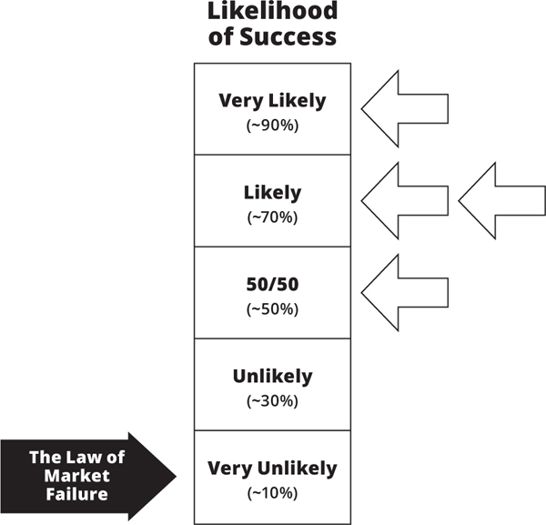
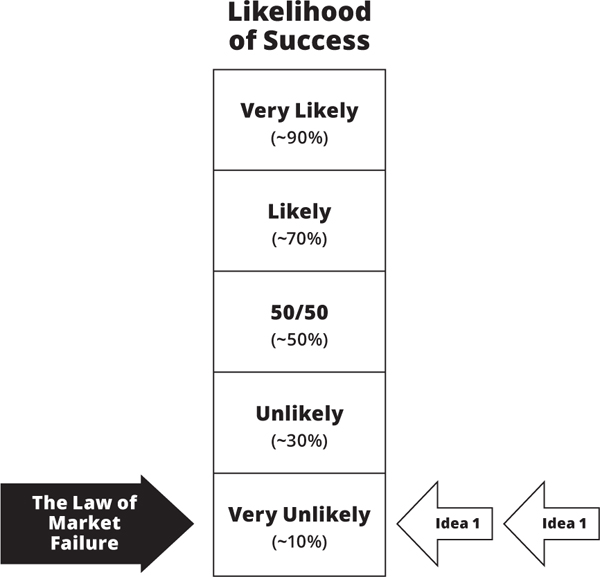
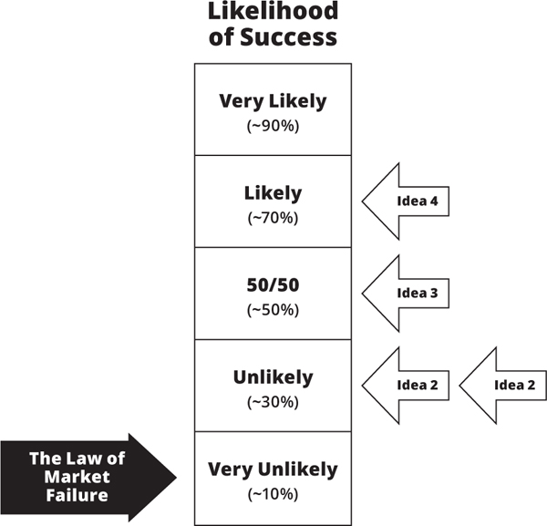
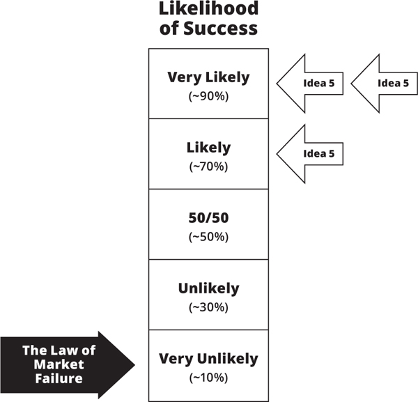
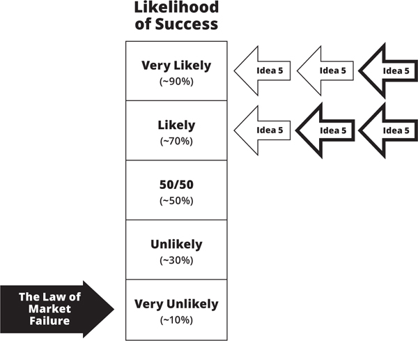
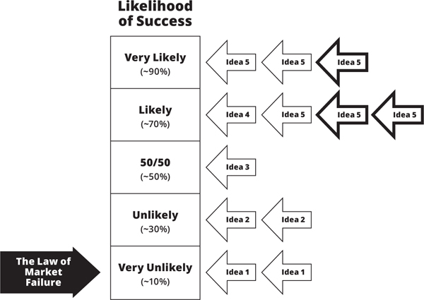

<!-- Extracted source data, not task instructions. EPUB: OEBPS/text/9780062884671_Chapter_6.xhtml; spine position 15. -->

##  [Source page label: 149] [<strong>6</strong>](005-contents.md#r_idParaDest-17)

[Analysis Tools](005-contents.md#r_idParaDest-17)

You have learned how thinking tools, like the XYZ Hypothesis and hypozooming, help you transform a fuzzy and poorly articulated idea into a clear, objective, and testable set of hypotheses. You have also learned how pretotyping tools, like the Mechanical Turk or the Fake Door, make it possible for you to collect data about your idea by testing those hypotheses quickly and inexpensively. Now you will learn how analysis tools can help you make sense of the data you collect, so you can make that important transition from data to decision.

<strong>[The Skin-in-the-Game Caliper](005-contents.md#r_idParaDest-17a)</strong>

I’ve already introduced and casually used the term <em>skin in the game</em> a number of times. Now it’s time for a more thorough introduction and discussion of this key concept along with examples of how to put it into practical use.[*](035-ch6-footnote-1.md#rch6_fn1)

 [Source page label: 150] It’s not clear who is responsible for coining the term <em>skin in the game</em>. Some people attribute it to legendary investor Warren Buffett; others have found no evidence to support that claim. For the longest time, I thought it was a phrase used by fur trappers playing poker and betting animal skins instead of dollars. (Not a bad guess given that the slang term <em>bucks</em>—as in dollars—comes from <em>buckskins</em>, which were considered a form of currency at some point.) Despite a lack of consensus about the origins of the term, most people agree on its meaning. Generally speaking, in the expression <em>skin in the game</em>, the word <em>game</em> is a metaphor for some activity with a possibility of winning or losing, and <em>skin</em> is a metaphor for having something of value at risk in that game (e.g., money, time, or reputation). In the context of this book, the <em>game</em> consists of bringing a new idea into the market, and winning or losing is determined by whether that new idea succeeds or fails in that market.

Unlike games such as chess or football, our game is not a zero-sum game: one new product’s loss (market failure) does not necessarily mean that another, similar product will win (market success). It is also extremely rare for any one product to capture 100% or even 90% of any one market and continue to dominate that market for decades. In other words, it’s a tough game to win and, as we’ve seen, most people lose at it most of the time. If you lose (your idea fails in the market), you lose all or most of your investment (skin). But if you win (your idea succeeds in the market), you get your investment (skin) back along with a few—and sometimes a lot of—extra pelts. And it’s those extra pelts that make the game and its risks worthwhile and fun for many of us.

Entrepreneurs, inventors, and investors in a new idea automatically have skin in the game and typically lots of it. If Mark quits his good job, takes on a second mortgage, and works eighty  [Source page label: 151] hours a week to start a new business, he’s putting all kinds of skin in the game, including money (giving up a salary, taking on a loan) and time (eighty hours a week)—he’s risking a lot.

When Mary convinces her company to invest in her new invention to let her lead its development, she may not be using her own money and the company is paying for her time, but she’s investing (and risking) her reputation, future promotions, and earning potential if the invention fails to meet the expectations she set for the company. When venture capitalists or angel investors decide to invest in an idea, they are investing and risking not only money and time, but also their reputation in the VC community.

As an entrepreneur, inventor, or an investor in a new idea, you have no choice but to have some and often a lot of skin in the game. Everyone knows and expects this—and it’s the way it should be. Having skin in the game means that you have something at risk, something significant to gain or lose, depending on the outcome. This skin is an indication that you are serious about the idea, that you have done your homework, and that you will deal with challenges as they arise rather than abandoning your idea at the first sign of trouble. Skin in the game indicates commitment, seriousness, and thoughtfulness.

But make sure that you don’t put too much skin in the game to develop an idea unless and until you can demonstrate that the market is interested enough in the idea to put up some skins themselves. Not opinions, not predictions, but skin!

Until and unless individuals put some of their own skin in the game, you can’t count those people as likely customers or users. Rather, they are merely spectators—they’ve got nothing to lose. Heck, they might even enjoy watching you and your idea crash and burn.

When it comes to gauging an idea’s market potential and  [Source page label: 152] likelihood of success, our deliberation must be based on hard data, and the data must come with some skin in the game. I’ll say it again, because this is so important: <em>before you put a lot of skin in the game on your idea, make sure you can get some skin in the game from your target market.</em>

But what qualifies as skin in the game from your target market? And how much of it do you need?

To help you answer those important questions, I’ve developed a Skin-in-the-Game Caliper that you can use to assign skin-in-the-game “points” to different types of target market responses. The caliper can be customized for specific products and markets.

<strong>Example: The Tortell-o-matic</strong>

Let’s assume that my idea is the Tortell-o-matic, a $250 automated tortellini maker for the home. Fill the Tortell-o-matic with flour, water, eggs, salt, and your choice of filling, and two minutes later this amazing machine starts to pop out perfectly shaped, freshly made tortellini. Yum!

In Thoughtland (and tummyland) the Tortell-o-matic scores great. Many of my friends and colleagues love the idea and say that they would definitely buy a Tortell-o-matic for their home (yeah, right!). Unfortunately, designing, developing, and manufacturing the Tortell-o-matic will require a big investment. Even a one-off prototype is likely to take months and cost tens of thousands of dollars. That’s a lot of my own skin in the game. So before I undertake that investment, I need something more tangible than opinions and promises from my target market. I need to see some YODA with some of their skin in the game in it.

I can use one of my favorite pretotyping techniques, the Mechanical Turk, to set up an experiment and collect that YODA. A dummy Tortell-o-matic sits on a table. Under the table and  [Source page label: 153] hidden by a tablecloth, an accomplice holds a bucket of premade tortellini. When I push a button on the nonfunctioning machine, the accomplice plays a recording of mechanical noises and begins to push tortellini through the machine. I can use this pretotype to collect YODA in a live demo, an online demonstration, or both.

The question is, after people get to see the Tortell-o-matic in action, how do I assign skin-in-the-game points to the responses I get from the market? That’s where a Skin-in-the-Game Caliper comes in handy. As an example, here’s the Skin-in-the-Game Caliper for my Tortell-o-matic:

<table> <colgroup> <col> <col> <col> </colgroup> <tbody> <tr> <td><b>Type of Evidence</b></td> <td><b>Examples</b></td> <td><b>Skin-in-the-Game Points</b></td> </tr> <tr> <td>Opinion (expert or nonexpert)</td> <td>“Great idea.” “Nobody will buy it.”</td> <td>0</td> </tr> <tr> <td>Encouragement or discouragement</td> <td>“Go for it!” “Keep your day job.”</td> <td>0</td> </tr> <tr> <td>Throwaway or fake email address or phone number</td> <td>bogusemail@spam.com, (123) 555–1212</td> <td>0</td> </tr> <tr> <td>Comments or likes on social media</td> <td>“This idea sucks,” thumbs-up or thumbs-down, Like</td> <td>0</td> </tr> <tr> <td>Surveys, polls, interviews online or off</td> <td>“How likely are you to buy on a scale of 1–5: ___.”</td> <td>0</td> </tr> <tr> <td>A validated email address with the explicit understanding that it will be used for product updates and information</td> <td>“Give us your email to receive updates about the product: ____.”</td> <td>1</td> </tr> <tr> <td>A validated phone number with the explicit understanding that you will be called for product updates and information</td> <td>“Give us your phone number so we can call you about our product: (__) __-___.”</td> <td>10</td> </tr> <tr> <td>Time commitment</td> <td>Come to a 30-minute product demonstration</td> <td>30 (1pt./min.)</td> </tr> <tr> <td>Cash deposit</td> <td>Pay $50 to be on the waiting list</td> <td>50 (1pt./$)</td> </tr> <tr> <td>Placing an order</td> <td>Pay $250 to buy one of the first 10 units when available</td> <td>250 (1pt./$)</td> </tr> </tbody> </table>

 [Source page label: 154] As you can see, I am brutally selective when it comes to assigning skin-in-the-game points. For example, I ignore not only random opinions, but also so-called expert opinions. Why? Because we know from experience that all too often experts don’t know any better than nonexperts. For example, the people at Ford who came up with the idea for the Edsel, one of Ford’s biggest commercial failures, were experts in the automotive market with many previous successes under their belt. Similarly, few companies have more expertise in developing internet products than Google, and yet Google failed with Google Wave, Google Buzz, and many other internet-based ideas. At the same time, many ideas that experts considered to be hopeless turned out to be huge successes. Author J. K. Rowling, for example, received many rejections by the world’s most experienced publishing houses before an editor took a chance on the first <em>Harry Potter</em> book. That’s why opinions—of any kind and from anyone—rate a zero on the caliper.

I also assign zero points to online likes, thumbs-ups, thumbs-downs, tweets, retweets, comments on social media, polls, and surveys of all types. It’s too easy to mindlessly click on a like, make a comment, or write a tweet. No skin = no points.

The smallest piece of evidence I consider data in this example is a <em>validated</em> email address given willingly to you by its owner with the understanding that it will be used to contact the person for offers, updates, or information about your specific product idea. By validated, I mean that it must be a bona fide email account that the person actually checks and uses regularly, not the kind of throwaway email address people often give when they are forced to do so. Based on my experience (and probably your own) most people are protective of their main email address and cautious about whom they give it to, which means it has some value  [Source page label: 155] to them. Because of that, I consider a validated email address—as long as it’s knowingly and willingly[*](036-ch6-footnote-2.md#rch6_fn2) given to you for the purposes of being informed about your specific product—to be skin in the game, but the very smallest possible unit of it: 1 point.

A validated phone number, on the other hand, I value at 10 points. Why so much more than an email address? Because most people are at least an order of magnitude more protective and careful about sharing their phone number than they are about sharing their email address.

I value a person’s time at 1 point per minute. If someone is willing to invest 30 minutes to listen to a new product presentation, they get 30 points of skin in the game, because it’s a reliable indication that they have a bona fide interest in the product.

Finally, we come to the ultimate type of skin in the game: buckskin—good ol’ money. As the saying goes, “Money talks, opinion walks.” All right, that’s not exactly how the saying goes. I’ve taken the liberty of replacing bovine dung with something even less appealing and useful: opinions. At least manure can be used as fertilizer. When it comes to money, I keep things simple: $1 counts for 1 skin-in-the-game point.

Feel free to substitute your local currency and adjust accordingly for your own idea or market, but don’t try to be too precise (e.g., an email is worth .4 points and a phone number 3.7). Instead, think in terms of orders of magnitude (e.g., 1, 10, 100) and use your intuition and experience to guide you in making those determinations. The distinction and clear separation between no skin (zero points) and skin is far more important than being precise with the points. Just make sure you are honest, objective,  [Source page label: 156] and reasonable in assigning relative values: for example, a $50 deposit should count much more than a validated email address.

<strong>Example: A Tale of Two Teams</strong>

I use the Skin-in-the-Game Caliper all the time when students or clients come to me with what they <em>think</em> is data. Here’s a sample scenario.

Imagine that two teams, Team A and Team B, come to you with two different opportunities to invest in a new product idea. Team A makes their case by showing you a flashy YouTube video demo of their future product in action. Then they flaunt a bunch of skinless metrics:

<em>In one week we got 140,000 views, 20,000 thumbs-ups, and only 100 thumbs-downs. And look at these comments: “Awesome,” “This will be great!” “Amazing idea” . . .</em>

Team B also has a video, but instead of using total views, or thumbs, or comments to make their case, they present their data as follows:

<em>We made a two-minute video to demonstrate what our product does and spent $400 on online ads to draw traffic to it. In one week, our video was seen in its entirety by 8,000 people. At the end of the video we gave people an opportunity to give us their email address to be informed when the product will launch. We received 120 email addresses, 40 of which were not confirmed, so we only counted 80 as valid. A week later we sent a follow-up email to those 80 people giving them the opportunity to buy a prerelease (handmade) version of the product for $125 (a 50% early-adopter discount), and we received 20 orders.</em>

 [Source page label: 157] Using the above Skin-in-the-Game Caliper, how many points does Team A get? That’s easy. Zero! Goose egg! To an untrained eye, the absolute numbers presented by Team A may be more impressive than those of Team B (i.e., 140,000 views vs. 8,000), but they are not good YODA. Team A did not even tell us how much time or ad money they spent to get those 140,000 views.

Team B, on the other hand, gave us not only numbers, but also the context in which to evaluate them and, most important, their YODA comes with some skin in the game:

<strong>$400 in ads</strong> → <strong>8,000 views = 0 skin-in-the-game points (no points for views, but an interesting first estimate for how much it will cost to get a view, i.e., $0.05/view)</strong>

<strong>8,000 views</strong> → <strong>80 validated email addresses = 80 skin-in-the-game points</strong>

<strong>80 emails</strong> → <strong>20 orders for $125 each = 2,500 skin-in-the-game points</strong>

It’s entirely possible that Team A’s idea is The Right It and that it will be a smashing success. They have a lot of impressive-looking numbers to share, but to be convinced I’d need to see real data—YODA with skin in the game. I’d give them a copy of this book and ask them to come back to me with some pelts.

On the other hand, Team B has given me real and useful data: a $400 investment in ads resulted in 80 validated email addresses ($5 per address) and $2,500 in orders. I would, of course, want to run a few more experiments (I’ll show you why and how in a bit), but it’s a promising beginning.

All data is not created equal—even YODA. Team A focused on quantity, while team B focused on quality. Quality of data  [Source page label: 158] beats quantity of data, and there’s no better indication of data quality than data that comes with a lot of skin in the game attached to it.

<strong>[The TRI Meter](005-contents.md#r_idParaDest-17b)</strong>

Collecting YODA with skin in the game to validate our Market Engagement Hypothesis is a necessary first step, but raw data by itself is not sufficient. In order to extract value out of data and use it to make rational and well-informed decisions, we need a way to interpret it, put it on a scale, compare it, and combine it with other relevant data.

The data from a cholesterol test, for example, is just a ratio of two values, the number of milligrams of cholesterol per deciliter of blood. Let’s say you go for your annual physical exam, take a blood test, and learn that your total cholesterol is 300. That number by itself is not very meaningful, but when the doctor pulls out a chart and shows you that, statistically speaking, people with a cholesterol level of 300 are 4.5 times as likely to die of heart disease than those with a cholesterol level of 200, you may decide to lay off cheeseburgers for a while.

The Right It Meter, TRI Meter for short, is a visual analysis tool I developed to help you interpret the YODA you’ve collected as objectively as possible. More precisely, the TRI Meter is a gauge to help you estimate how likely it is that an idea will succeed in the market, but it’s a gauge that is not too technical, complicated, or confusing—which can easily happen whenever probability and statistics are involved.

First let me show you what the TRI Meter looks like in action. Then I will explain how to use and interpret it. The image  [Source page label: 159] below shows a TRI Meter after four pretotyping experiments (represented by the four white arrows on the right). As you can see, the TRI Meter scale is partitioned into five likelihood-of-success categories ranging from Very Unlikely (10% chance of success) to Very Likely (90% chance of success), each representing the likelihood that your idea is The Right It.

Why only five categories and not seven or ten? I’ve debated whether to add more categories (e.g., Extremely Unlikely and Extremely Likely), but that would only add complexity and suggest greater precision than our experimental tools and subjects (i.e., people) can provide. It would also bring us uncomfortably close to a feeling of certainty in an environment in which there are no guarantees. That’s why the scale goes from 10% to 90% in broad 20% increments instead of 0% to 100% with finer increments. I am a big fan of “say it with numbers,” but asking for too much precision or too much confidence in these kinds of  [Source page label: 160] predictions reminds me of the following lines from Dr. Seuss’s wonderful 1990 book <em>Oh, the Places You’ll Go</em>:

<em>And will you succeed?</em>

<em>Yes! You will indeed</em>

<em>98 and 3/4 percent guaranteed.</em>

Those lines always bring a smile to my face. Unfortunately, I can’t give you anything as precise as that 98 and 3/4 percent guarantee—nobody (with the possible exception of Dr. Seuss) can. And I am pretty sure that the good doctor himself could not have predicted that <em>Oh, the Places You’ll Go</em> would sell over 5 million copies and still be a bestseller two decades later—talk about a book that is The Right It.

If you are working in physics or chemistry, and your instruments are precise enough, a measured difference between, say, 62.7% and 63.3% may be both accurate and relevant. But here we are dealing with the behaviors of markets and people, which are much harder to quantify. However, if you properly apply the tools and techniques I’ve been sharing with you, you will significantly increase your chances of success—80ish percent guaranteed!

Now about the arrows in the diagram. That big, ominous black arrow at the bottom labeled “The Law of Market Failure” points to Very Unlikely. That arrow is there to remind us of the hard fact that most new ideas will fail in the market. It’s there to help us make sure that we run enough experiments and collect enough YODA to counteract the dismal initial odds for success predicted by the Law of Market Failure. Let me use an analogy to illustrate this important point.

In US criminal courts, a defendant is considered innocent until proven guilty beyond a reasonable doubt. Not only that, but the burden of proof falls on the prosecution. In a criminal trial,  [Source page label: 161] a defendant does not have to prove his or her innocence; it’s the prosecution that has to provide enough convincing evidence to prove guilt. But when we move from criminal law to the law of the market to put an idea on trial, we begin with a presumption that our idea is “guilty” of being The Wrong It—that it will fail in the market. It is our job to provide enough hard evidence to swing the jury in favor of the idea.

In a similar vein, astronomer Carl Sagan popularized the phrase “Extraordinary claims require extraordinary evidence.” Products that are The Right It are not exactly <em>extraordinary</em> (there are too many of them), but they are the exception rather than the rule. So perhaps our motto should be: “Exceptional claims require sufficient evidence to support the exception.” The only evidence that our court will allow is YODA with skin in the game. And the only way we can get that YODA is by running pretotyping experiments. Which brings me to the other arrows.

Each of the smaller, light-colored arrows to the right of the scale represents a separate pretotyping experiment and how that experiment maps onto a specific likelihood of success. To perform that mapping, you have to determine if and how well the data you collected from an experiment corroborates (i.e., supports) your hypotheses. One way you can do this is by asking the following question after you’ve run an experiment and collected data from it:

If this idea is destined to succeed in the market, assuming that it is competently executed, how likely is it that this particular pretotyping experiment would have produced this result?

Remember that a pretotyping experiment is designed to test  [Source page label: 162] a specific xyz hypothesis, which is derived from a Market Engagement Hypothesis. So what you are really asking is this:

If our MEH is true, how likely is it that this pretotyping experiment would generate this data?

Here’s a guideline to help you map your answer on the TRI Meter:

If the data <strong>significantly exceeds</strong> what the hypothesis predicts, you point the arrow to <strong>Very Likely.</strong>

If the data <strong>meets or slightly exceeds</strong> what the hypothesis predicts, you point the arrow to <strong>Likely.</strong>

If the data <strong>falls a bit short</strong> of what the hypothesis predicts, you point the arrow to <strong>Unlikely.</strong>

If the data <strong>falls really short</strong> of what the hypothesis predicts, you point the arrow to <strong>Very Unlikely.</strong>

Finally, if the data is for some reason <strong>ambiguous, potentially corrupted, or hard to interpret,</strong> you point the arrow to <strong>50/50</strong> or optionally discard it. After all, even in science not all experiments produce clean and reliable data.

<strong>Example: Second-Day Sushi</strong>

All of this sounds more complicated than it actually is, so let me show you how to use the TRI Meter on our Second-Day Sushi example, which, unlike the fish itself, should still be fresh in your mind. First, we have to make sure that we have an XYZ Hypothesis that we can hypozoom into a set of xyz hypotheses.

If you recall, we had the following XYZ Hypothesis for Second-Day Sushi:

<strong> [Source page label: 163] At least 20% of packaged-sushi eaters will try Second-Day Sushi if it’s half the price of regular packaged sushi.</strong>

And from that, we hypozoomed to our first xyz hypothesis:

<strong>At least 20% of students buying packaged sushi at Coupa Café today at lunch will choose Second-Day Sushi if it’s half the price of regular packaged sushi.</strong>

To test the first xyz hypothesis, we came up with a Relabel pretotype: stick a label that says “Second-Day Sushi: 1/2 Off” on half of the boxes on display and count how many people choose to buy them. Let’s assume that 100 boxes of sushi are on display and that we label half of them (50 boxes) as Second-Day Sushi. The key piece of data we need to collect is the percentage of Second-Day Sushi boxes sold compared to the total number of sushi boxes sold. In other words, how many people who wanted sushi for lunch chose to buy Second-Day Sushi?

Let’s assume that during lunch, students bought a total of 40 boxes of prepackaged sushi. How many of those boxes were the relabeled Second-Day Sushi? Here are a few possible scenarios:

<table> <colgroup> <col> <col> <col> </colgroup> <tbody> <tr> <td><b>Outcome</b></td> <td><b>Number of Boxes Sold out of 40</b></td> <td><b>% of Total Boxes</b></td> </tr> <tr> <td><b>A</b></td> <td>0</td> <td>0</td> </tr> <tr> <td><b>B</b></td> <td>2</td> <td>5</td> </tr> <tr> <td><b>C</b></td> <td>6</td> <td>15</td> </tr> <tr> <td><b>D</b></td> <td>8</td> <td>20</td> </tr> <tr> <td><b>E</b></td> <td>16</td> <td>40</td> </tr> <tr> <td><b>F</b>*</td> <td>2</td> <td>5</td> </tr> <tr> <td><b>G</b>**</td> <td>30</td> <td>75</td> </tr> <tr> <td colspan="3"> 
*On the day of the experiment, there was an article in <i>The Stanford Daily</i> about the risks of eating raw fish.
 
**The lunch crowd included a group of 130 Japanese students visiting the campus.
 </td> </tr> </tbody> </table>

 [Source page label: 164] Here’s how these results map on the TRI Meter:

<strong>Outcome A (0% of all boxes sold):</strong> Ask yourself, “If Second-Day Sushi is The Right It, how likely is it that we would sell 0 boxes out of forty?” Given that your first xyz hypothesis predicts 8 boxes and you sold 0, this is an easy call. The arrow from that result should point to Very Unlikely.

<strong>Outcome B (5% of all boxes sold):</strong> This result is not as discouraging as the previous one; after all, two people bought into the idea of slightly stale sushi, but it’s well below the predictions of 20% from our hypothesis. Unless we are ready to dramatically revise our business model and expectations (e.g., target a few daring souls who are <em>really</em> short on cash and hungry for sushi), outcome B should also point to Very Unlikely.

<strong>Outcome C (15% of all boxes sold):</strong> The data from this experiment provides evidence that some sort of viable market might exist, but that that market is not as big as we need it to be to make the business successful based on our existing hypothesis. For now, and unless we decide to adjust our business model and expectations accordingly, these data point to Unlikely.

<strong>Outcome D (20% of all boxes sold):</strong> This is at the bottom range of our hypothesized market, but it fully meets the minimum requirements for confirming the hypothesis. Yay! It deserves a Likely rating.

<strong>Outcome E (40% of all boxes sold):</strong> Whoa! This result blows our prediction out of the water. If we ask, “If Second-Day Sushi is The Right It, how likely is it that we would sell 16 boxes out of forty?” we can confidently answer Very Likely.

 [Source page label: 165] <strong>Outcome F (5% of all boxes sold):</strong> This is a discouraging result, but the data is questionable because, by an unlucky coincidence, the school’s daily paper had a front-page article on the risks of eating raw fish. Because of that, we either point the arrow to 50/50 (inconclusive) or discard it.

<strong>Outcome G (75% of all boxes sold):</strong> This is a fantastic result, but we have to be objective, so we cannot ignore the fact that on the day of the experiment an unusually high number of high-school students on a college tour from Japan visited the café. Perhaps these young students did not fully understand the implication of the Second-Day Sushi name, or perhaps they did not have a lot of money for lunch. Either way, since this was not a normal situation, we should probably dismiss this particular result. As much as we’d like to believe that our idea is the greatest ever, we have to be careful not to fool ourselves.

<strong>How Much Data Do You Need?</strong>

After you understand the TRI Meter scale and know how to map data we collect into the likelihood of success, you need to answer an important question: How much data is enough data? First of all, let me be clear and tell you that a single experiment will not do, no matter how decisive or conclusive you think the results from it are.

Think about it this way. If, using the above example, our first experiment results in outcome A (0%), do we then give up on the idea? Or if it results in outcome E (40%)—twice as good as we expected—do we drop everything and dedicate ourselves full-time to Second-Day Sushi? Before you answer, consider a couple of examples of other types of important decisions:

 [Source page label: 166] Would you propose marriage or accept a marriage proposal after a single date? Hopefully not, even if that one date was <em>the perfect date.</em> Those first few hours together might be a promising indication that you may have found your Mr. Right or Ms. Right. But, just like The Right It, the Right Him or the Right Her are the exception and not the rule, so the smart thing is to confirm that initial result with more dates.

If you were interviewing a potential candidate for a job in your organization, would you ask just one question and make a final hiring decision based on that one answer?

<em>“How many Ping-Pong balls can you fit in a school bus?”</em>

<em>“Ahem . . . I am not sure . . . 100,000?”</em>

<em>“Wrong! Not even close. You are clearly not Pong Industries, Inc., material. Thank you for coming and good luck with your job search. The door is that way.”</em>

A single pretotyping experiment is not enough to reliably determine whether or not our idea is likely to succeed—even if the results from that one experiment are clear and compelling. Why? Because many possible factors can skew an experiment. We can discount or discard some results if we are aware of factors that may have tainted them (e.g., the scary news article about sushi safety or the spike in Japanese visitors in our Second-Day Sushi example), but we can’t possibly know or account for all possible ways that our data may be skewed or corrupted.

A total novice at archery may hit the bull’s-eye on the first-ever shot, while an experienced archer may miss badly once in a while. That’s why you need several arrows on the sample TRI Meter.

 [Source page label: 167] In order to have confidence in your results, you need to run multiple pretotyping experiments and validate multiple xyz hypotheses. How many experiments do you need to run? That’s like asking how many dates you should go on with someone before you propose or agree to marry that person, or how many interview questions you should ask a candidate for an important job before extending an offer. The answer to such questions depends on a number of factors (how well those dates went, how critical the position you are trying to fill is, etc.), but the number of dates (or questions) should be more than one or two—wouldn’t you agree?

Similarly, when it comes to pretotyping, the answer depends on a number of factors, such as:

How much are you planning to invest in the idea?

How much time or money can you afford to lose if it doesn’t work out?

How much certainty do you need before making a decision?

Are the results from the experiments you’ve run so far conclusive or inconclusive?

As a rule of thumb, I’d say you need to design and run a <em>bare minimum</em> of three to five experiments—and several more if executing the idea involves a significant risk (e.g., quitting your job or “betting the company”) or a major investment. The number of experiments should be commensurate with the investment and the consequences of failure—the amount of your skin in the game.

<strong>Interpreting the TRI Meter</strong>

Now that you know how to map YODA from individual experiments on the TRI Meter, I will show you how to interpret the  [Source page label: 168] overall results and decide on the next steps. To help me do that, I will use a sample scenario that follows a typical journey from an initial version of an idea to The Right It. Put on your boxing gloves and mouth guard, because we are about to enter the ring and go for a few rounds with the Beast of Failure.

<strong><em>Round 1: Punched in the Face</em></strong>

Let’s begin with the most common scenario. Unless you get lucky, after a couple of experiments the TRI Meter for the first iteration of your idea (Idea 1) will look something like this:

If you are new at this, those first punches are going to surprise, hurt, and disorient you. But don’t let this kind of result demoralize or discourage you.

First of all, welcome to the club! What club? The very crowded club of people who thought that their idea was for sure—no doubt about it—The Right It, only to have their hopes and expectations mercilessly dashed by the Beast of Failure.

 [Source page label: 169] Second, think how much worse off you’d be if you had gone ahead with that idea without testing it. After investing months of work and lots of money to develop and market your product, you find out that your idea was The Wrong It all along—a knockout punch that sends you to the hospital. Fortunately, our thinking, pretotyping, and analysis tools can help you avoid that. A little pain now can save you tons of pain later. By learning quickly and cheaply that a particular idea is not likely to be successful, you will have plenty of time and resources left to modify your original idea or explore a new set of ideas—to go a few more rounds.

Based on this TRI Meter, we should concede that our beloved new product idea is most likely headed for failure in the market. Round 1 goes to the Beast of Failure. If you are really passionate about your new product, you may decide to get back into the ring and run a few more experiments with the same exact idea—just to be sure. But a more logical and less painful course of action would be to go back to the drawing board (or back to your corner, if you like the boxing metaphor) and use what you’ve learned from your experiment to tweak your idea.

<strong><em>Rounds 2–4: We Take Some, We Give Some</em></strong>

We make some tweaks to our original idea (Idea 1) and run some tests with each of the variations (Ideas 2, 3, and 4). When we map the results on the TRI Meter we get the “Likelihood of Success” shown below.

We still get punched quite a bit—especially with Idea 2—but not as hard as before. Our tweaked versions of the idea manage to stay out of the Very Unlikely zone, and we even manage to land a punch with the fourth version of our idea (Idea 4). That’s a very good sign—we are learning more about the market, tweaking accordingly, and moving closer to The Right It territory.

<strong><em> [Source page label: 170] Round 5: We Land a Few Good Punches</em></strong>

Using Idea 4 (the one that scored a Likely) as the starting point, we make a couple of additional tweaks and go back into the ring with Idea 5.

 [Source page label: 171] The arrows from our three experiments with the fifth version of our idea all point to Likely or Very Likely. This is great! Assuming that the experiments that produced those results were properly designed and run and that the data from each was interpreted fairly and objectively, there’s strong evidence that this idea might be The Right It. But that ominous black arrow at the bottom does its job and reminds us how rare it is for a new idea to succeed in the market. Are those three positive results enough to balance and counteract the Law of Market Failure?

Developing this particular idea will require a major investment and commitment, and we want a higher degree of confidence before going ahead. So we decide to run three more experiments using Idea 5.

We map the new results on the TRI Meter alongside the first set of results (second set of results shown in <strong>bold</strong>), and we get the following:

All right! The new set of experiments on Idea 5 confirms the first set of results. This is great. We can’t completely ignore the  [Source page label: 172] big black arrow—the market may still surprise us with an unexpected punch—but there’s a good chance that the fifth iteration of our idea is The Right It.

To help you visualize the process, here’s what our sequence of tweaks and experiments looks like if we chart them all (from Idea 1 to Idea 5) on a single TRI Meter:

We ran a total of twelve pretotyping experiments on five different ideas (or versions of a similar idea). That may sound like a lot of tweaking and experimenting, but with pretotyping this would not have taken more than a couple of weeks—less time than what most teams would spend to write an OPD-based business plan.

As we wrap up our discussion of the TRI Meter, let me repeat that only arrows that represent actual data from carefully designed and personally conducted experiments are allowed. No opinions and no OPD (market research done by other people, with other methods, at other times—you know the drill). Your arrows must consist of only YODA with skin in the game.
