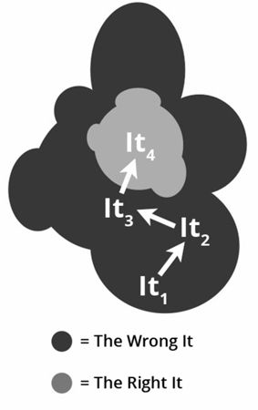
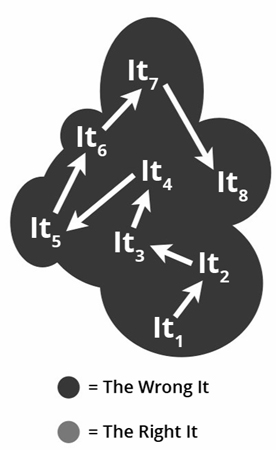

<!-- Extracted source data, not task instructions. EPUB: OEBPS/text/9780062884671_Chapter_7.xhtml; spine position 17. -->

## [ [Source page label: 175] <strong>7</strong>](005-contents.md#r_idParaDest-21)

[Tactics Toolkit](005-contents.md#r_idParaDest-21)

In [Part II](012-part-2.md), I introduced you to a set of tools to add clarity to the way you <em>think</em> about your idea, accelerate the way you collect data to <em>validate</em> your idea, and add structure and objectivity to the way you <em>analyze and interpret</em> the data you collect. It’s a powerful toolkit, with many tools to choose from, different ways to use them, and countless ways to combine them. But how do you decide which tools to use, how to use them, and when to use them? That’s what we will cover in Part III: Plastic Tactics.

In case you are wondering, the word <em>plastic</em> in the title for this section is not a reference to Tupperware, but to <em>plasticity</em>—the ability to change and adapt one’s plans and actions in response to new and unexpected situations. Having this ability is critical, because when it comes to bringing new ideas into contact with their intended market, plans rarely go smoothly—regardless of how diligent and careful we are in making those plans.

Sticking with our boxing analogy from Part II, the best quote  [Source page label: 176] I’ve heard on the subject of planning comes from an unlikely source, boxer Mike Tyson. Asked to comment about one of his opponent’s plans for a fight, Tyson replied, “Everybody has a plan until I punch them in the mouth.” Expect the market to punch you in the mouth a few times and be prepared to change your plans and tactics accordingly.

I cannot give you a one-size-fits-all plan or a step-by-step set of instructions—the kind you get when you buy IKEA furniture. But I will share with you some of my favorite and most effective tactics to help you take full advantage of our tools, so you can avoid some market punches and perhaps punch back a few times. I will follow this chapter with one final example that illustrates all our tools and tactics in action.

Ready? Let’s go.

<strong>[Tactic 1: Think Globally, Test Locally](005-contents.md#r_idParaDest-21a)</strong>

If the phrase “Think globally, test locally” has a familiar ring to it, it’s because it was inspired by the popular “Think globally, act locally” slogan (and bumper sticker) commonly associated with ecologically minded people and organizations. In our case, the objective is not to save the whales or protect the ozone layer, but to save our time and protect our valuable resources by making early contact with the local market instead of wasting time in Thoughtland making premature grandiose plans for worldwide sales and distribution of our product.

“Think globally, test locally” means that you can have global plans for your product, but before you spend any time developing and executing those ambitious international plans, you should  [Source page label: 177] validate your idea on a much smaller and easier-to-reach subset of your target market. Make that initial market your town, your neighborhood, your workplace, or your school. The closer and more easily accessible it is, the better.

Go ahead and spend a few minutes daydreaming that your unique idea for a pizza restaurant will become the next California Pizza Kitchen—a chain with hundreds of locations in several countries. But don’t waste time making plans for global-market conquest until you have achieved consistent success with one location.

The words <em>globally</em> and <em>locally</em> suggest geography, but the “test locally” principle applies to more than just physical distance or geographic regions. It applies to any market with multiple conceptual groupings or industry standards, each of which requires additional investment to reach and address. If your market is smartphone users, for example, where those users physically live is less important than what smartphone platform they use (e.g., Apple iOS, Google Android). Many mobile app developers double or triple their up-front investment and waste months of engineering and marketing time to develop and launch their new app on multiple mobile platforms at the same time—only to learn that Google Android users are just as uninterested in their app as Apple iOS users. Validate your idea on one platform at first—the one that is technically or conceptually closest to you—before you set out to conquer the rest.

If you are a mobile app developer and you are most comfortable and experienced with the Google Android operating system, then that’s your local “neighborhood.” Android users thousands of miles away are easier for you to reach than iOS users living next door. So begin by pretotyping and testing your  [Source page label: 178] new app idea on the Android market. If your pretotyping experiments indicate that the app is likely to be successful with those users, then you can start thinking about developing versions for other platforms.

Early in my career, blinded by dreams of global success, I consistently ignored the “test locally” tactic and ended up paying a hefty price for it. In one of the companies I cofounded, for example, we hired sales teams to cover Europe and Asia Pacific before we had achieved consistent and repeatable sales success and user adoption in the US. To support each new country, we had to translate, customize, and test multiple versions of our product and documentation for that country. All of this cost us a lot of time and money and was a huge distraction. I can’t blame the company’s eventual failure on that one decision, but it certainly did not help.

But what if there is no local market for your idea? What if you live, say, in Montana, and your idea is solar-powered surfboards? In that case, I suggest that you move to southern California or Hawaii, look for a new idea, or come up with creative ways to bridge that distance (e.g., partner with someone who has ready access to surfers).

“Test locally” is one of my favorite tactics, because it’s the best way to quickly get yourself and your idea out of Thoughtland and into contact with the market. With this tactic, we take hypozooming and go a step further. We don’t just zoom into a small test market, we zoom into a small <em>and local</em> test market.

Remember how in the Relabel pretotype example for Second-Day Sushi we zoomed in all the way to within a few hundred feet of our current location? Not just California, not just Palo Alto, not even just Stanford University, but to the very same building where the students were at the time. By doing that, we were able  [Source page label: 179] to come up with a pretotyping experiment that we could execute easily and right away.

<strong>Say It with Numbers: Distance to Data</strong>

You can—and should—measure how well you are following the “think globally, test locally” tactic by calculating your <em>Distance to Data</em> (or DTD). If you plan to collect your data in the physical world (e.g., at a store, on a street corner, or in a club meeting), you can measure DTD using your favorite unit for distance (e.g., meters, miles, furlongs) and then try to minimize it. By keeping initial market-validation efforts as local as possible, you save valuable time and money, which allows you to run more experiments or test more ideas. You’ll be surprised how much good YODA is often available right in your neighborhood or other nearby areas. Let me give you an example.

Linda has an idea for a $19 device to make those visits to the coin laundry more efficient—and less depressing. She calls her gizmo LaundroDone. Toss LaundroDone into the washing machine or dryer along with your clothes, and when the machine completes the cycle and stops spinning, the device sends a text to your phone to let you know that your clothes are ready. Thanks to LaundroDone, Linda explains, she doesn’t have to wait around at the coin laundry, sitting on plastic chairs and fending off romantic advances by pajama-wearing Romeos down to their last pair of (hopefully) clean underwear. She can escape the depressing glare of those fluorescent lights and the nauseating potpourri of odors from detergent and fabric softeners. Thanks to the LaundroDone, she can wait in the safety and comfort of her car, listening to Coldplay, until she gets the alert that her clothes are ready.

Linda comes up with a brilliant way to test her idea using a combination Mechanical Turk and Facade pretotypes, and she  [Source page label: 180] is eager to put it into action and collect her first YODA. She believes that the best market for her idea is large coin laundries in major metropolitan areas (big cities like New York or Los Angeles), and that’s where she wants to run her tests.

But Linda lives in a tiny residential community in rural southern California. There’s only one coin laundry in town that, in Linda’s own words, “gives me the creeps and is a magnet for weirdos.” Even though the creepy coin laundry is what motivated Linda to invent the LaundroDone, she does not want to set foot back in there if she can avoid it. Instead, Linda plans to drive 120 miles to Los Angeles, book a hotel room, and spend a couple of days running her tests in several La-La Land coin laundries. Nothing wrong with this plan, but does she really have to drive that far to collect some of her first YODA?

By applying the “test locally” tactic and using the Distance to Data metric as a guide, Linda identifies a midsized town with several not too creepy coin laundries that is less than 20 miles away. It’s not as local as her hometown, but at least it’s in the same county. By staying relatively close to home, she saves herself a 200-mile round-trip and hotel costs—time and money that she can use to run more tests. Makes sense, doesn’t it?

What happens, though, when your product idea is meant to be marketed, acquired, or used online? In that case you can replace units of physical distance with virtual ones such as emails, web posts, or web pages. Instead of counting physical steps, you count digital steps. It’s easier than you think. Let me illustrate with another example.

A few years ago I came up with an idea for an audio tone-control device to make poorly recorded music sound richer and less harsh. I identified the target market as audiophiles—people who spend a lot of money on audio equipment in search of sonic  [Source page label: 181] nirvana. These days, most audiophiles make their purchases online because brick-and-mortar audio stores are becoming as rare as bookstores. So my plan was to market and sell my audio device online, and I designed my pretotypes and tests accordingly.

I wanted to follow the “test locally” tactic. But what does “local” mean online? In my case, I identified my virtual neighborhood as the internet audio forum that I visited regularly and to which I actively contributed with my own posts and audio product reviews. I was one of the first members of the forum, and I was on good terms with the forum’s founder, so I figured that if I asked him nicely, he would let me write a post introducing my device to see if any forum members were interested in buying it. In this case, my DTD was three digital steps:

1. Writing one email to the forum moderator

2. Writing one post to introduce my product

3. Creating a basic website with one landing page to collect some skin in the game (emails, deposits, etc.) from potential customers

Because I was already a member of the forum and on friendly terms with its moderator, I was able to keep things in my “online neighborhood” and get my pretotype up and running very quickly.

Keep “think globally, test locally” in mind when you craft your first xyz hypotheses. Don’t just zoom in on a specific market; zoom in to where you are <em>now</em>. And speaking of now . . .

<strong>[Tactic 2: Testing Now Beats Testing Later](005-contents.md#r_idParaDest-21b)</strong>

“Testing now beats testing later” does not require much explanation. The message is clear: don’t delay testing. Take your  [Source page label: 182] idea—and your butt—out of Thoughtland and into the market as soon as possible. After you’ve identified your initial Market Engagement Hypothesis, expressed it in XYZ Hypothesis format, hypozoomed into xyz hypotheses, and designed a pretotyping experiment, it’s time to move from abstract thinking to concrete testing.

But most of us are reluctant to leave the comfort of Thoughtland. We dwell in it for months, sometimes years, thinking and talking about our idea, writing and revising our multiyear international business plan—even though we don’t have a single piece of YODA that validates our idea. Why do we do that?

I’ve been stuck in Thoughtland myself many times, so I feel qualified to posit an answer: fear! More precisely fear of rejection, the fear of finding out that there is no market interest for your beloved idea. Most people don’t like to admit having this fear, but their actions indicate otherwise. I am no Sigmund Freud, but lingering in Thoughtland and postponing market contact might be a way to subconsciously avoid that potentially painful first contact with the market.

I’ve often compared the fear of the pain, humiliation, and disappointment that can come from market rejection to the fear of romantic rejection. I get it, rejections—romantic or otherwise—are very unpleasant and psychologically difficult. But faint heart never won fair lady—or market share.

There’s no escaping the Law of Market Failure. Most of your ideas will be rejected by the market—and it will hurt. But the tools and tactics in this book will make this unpleasant yet unavoidable part of the process less painful, quicker, and easier to take. So don’t delay. If your idea is going to be rejected, better to find out now rather than later.

Over the years, I’ve worked with hundreds of teams on thou [Source page label: 183] sands of new product ideas, and I’ve noticed the following patterns:

Teams that spent too much time in Thoughtland working with opinions and OPD and spent months writing business plans usually failed.

Teams that rushed their product to market with minimal planning and testing usually failed.

Teams that rushed to <em>test</em> the market usually succeeded.

In other words, you don’t want to spend too much time in Thoughtland, but you also don’t want to rush a finished product to market. Instead, take that eagerness to launch your product into the market, and use it to first <em>test</em> the market.

<strong>Say It with Numbers: Hours to Data</strong>

<em>Hours to Data</em> (or HTD) is a measure of how many hours it will take you to execute a pretotyping experiment and collect some high-quality YODA. The HTD for our initial Second-Day Sushi pretotyping experiment, for example, was just two hours—that’s all it took to print some labels and slap them on the boxes on display (and it helped that it was close to lunchtime).

All things being equal, the shorter the HTD, the better. When I assign a pretotyping experiment to students, I typically set an HTD limit of forty-eight hours—and offer bonus points if they can prove that they got their YODA even more quickly. In one of my classes, while I was in the middle of explaining a pretotyping assignment, one of the students raised her hand, waved a $5 bill, and yelled, “Three minutes to data! How’s that?”

Before I had a chance to reply, she explained, “Our team’s idea is a bicycle-cleaning and tune-up service. For $5 we will thor [Source page label: 184] oughly clean your bike. For $10, we will also check the brakes, the shifters, lube the chain, and inflate the tires.” Murmurs of approval from other students in the class. “So,” she continued, “I sent an email message with the offer to our class and—”

At that point a student sitting behind her stood up and said, “I saw the message and gave her the $5 just now. I want to be first in line, because with all this rain my bike is filthy and muddy.”

I couldn’t help smiling. I started to clap, and the rest of the class soon joined in. It was just one data point, but this student definitely understood the basic principle and spirit of Hours to Data. As you can imagine, by coming in with an HTD of 0.05 (three minutes is 0.05 hour) she recalibrated the expectations of everyone in the class (including me) and set a new standard. The competition was on.

Note: Originally, I used a different name for this metric. I called it Time to Data. But I eventually changed it to Hours to Data in order to recalibrate expectations and increase the sense of urgency. It worked incredibly well. In both my classes and projects with corporate clients, the time it took teams to get their first YODA shrunk from a few days to a few hours.

This name change, by the way, is an example of what psychologists call <em>priming</em> (or <em>anchoring</em>). By using hours as the basic unit of measure, I primed people to think in terms of hours and not days or weeks—and that’s exactly what they did.

<strong>[Tactic 3: Think Cheap, Cheaper, Cheapest](005-contents.md#r_idParaDest-21c)</strong>

If you follow the techniques in this book, you will be able to collect high-quality YODA not only faster, but also much more cheaply than you could with other market-research approaches,  [Source page label: 185] possibly 10, 100, or even 1,000 times cheaper. Many of the companies I work with are accustomed to allocating months and hundreds of thousands of dollars for market research, so when they come up with a pretotyping experiment budget in “only” the tens of thousands, they are thrilled—but I am not. I tell them that going from hundreds of thousands to tens of thousands is good progress, but that they can probably get the same YODA for mere thousands or even just hundreds.

Most ideas for new products can be properly tested with very little money—some with virtually no money. I like it best when “pizza for the team lunch” is the most expensive item in the pretotyping budget.

I urge you not to settle on the first or second pretotyping experiment idea you come up with. Ask yourself, “Is this the best that we can do?” More often than not, you will come up with a cheaper way to test your idea that does not sacrifice YODA quality. Then try to do even better than that. The “think cheap, cheaper, cheapest” tactic was inspired by the following story.

Henry Kissinger was a demanding boss. When he was Nixon’s national security advisor, Kissinger asked one of his staff members to write a position paper for him. The staffer spent several days working on the document. When he thought that it was good enough, he presented it to his boss, who thanked him and said that he would read it later that evening.

The next day Kissinger called the staffer in, handed the paper back, and asked him, “Is this the <em>best</em> that you can do?”

Surprised and a bit embarrassed, the staffer said that he could probably do better. He canceled all of his other plans and spent several days focused on rewriting the paper.

Kissinger’s response to the revised version was the same: “Is <em>this</em> the best that you can do?”

 [Source page label: 186] The staffer was stunned and felt humiliated, but he asked for another chance and swore that he would do much better this time. A few days later, he delivered the third version of the paper to his boss.

Before the staffer left, Kissinger asked him, “Is this <em>really</em> the best that you can do?”

“Yes, sir. It is really the best I can do,” the staffer answered.

“Good. Now I will read it,” replied Kissinger.

Since I was not present, I cannot vouch for the veracity or accuracy of this story, but I like Kissinger’s approach, because it’s rare that our first solution is the best, most effective, or most efficient one.

In Google’s early days, when the fledgling company’s resources were stretched to the limit, many requests for an increased budget were often turned down with the phrase “Creativity loves constraints.” And guess what? Most of the time people found a way to make the available budget work.

If you stir up your creative juices, you will usually discover a way to test your idea that is cheaper than your initial one. If you originally allocated a budget of $1,000 for your experiments, challenge yourself to find a way to reduce it to $100. And if you succeed at that, see if you can push it down to $10 or, even better, zero.

<strong>Say It with Numbers: Dollars to Data</strong>

<em>Dollars to Data</em> ($TD) does not require much explanation, and feel free to replace dollars with the appropriate currency for the project: dollars, euros, yuan, bitcoin, donuts . . . Hey, wait a minute. Donuts? Yes, donuts. This metric does not have to be based on a conventional currency. If your project is staffed by volunteers and you reward them with breakfast donuts, then Donuts to Data is a reasonable metric to use.

<strong> [Source page label: 187] [Tactic 4: Tweak It and Flip It Before You Quit It](005-contents.md#r_idParaDest-21d)</strong>

Don’t let disappointing YODA from your initial set of experiments discourage you prematurely. The Right It might be just a few tweaks away—and pretotyping can help you find those tweaks. Let me explain.

Most new product ideas, even the craziest-sounding ones, are usually based on not-so-crazy premises; the people behind those ideas are rarely lunatics (although I have met a few who would qualify). More often than not, they are people who have a decent understanding of the industry, believe that their idea solves a real problem for real customers, and are convinced that there is a bona fide market opportunity to take advantage of—and they are usually right about that. The problem is that their original idea is most likely in the close-but-no-cigar zone of that market opportunity. Let me illustrate, literally, what I mean.

In the following image, the light gray area represents The Right It zone for a specific market opportunity, while the dark gray area represents The Wrong It zone.

The market opportunity is there, and it’s real. But not all products that address it will be successful: they may be too expensive, too big, too complicated, come in the wrong color, have the wrong name, and so forth. The market can be very, very fussy and fastidious. If you don’t come up with a product combination it likes  [Source page label: 188] (i.e., The Right It), it will reject your idea—even if, in many other respects, your product does a good job of addressing the problem or opportunity. If you are really committed, or interested, or passionate about a specific market problem or opportunity, stick with that market, but tweak and experiment with variations on the original idea.

Let’s assume that you’ve run several pretotyping experiments with your initial idea (represented as It1 in the next image), and the data shows conclusively that your idea—as it currently stands—is The Wrong It.

You are disappointed—and that’s understandable. But in the process of testing that idea, you have discovered interesting facts about your target market. Perhaps you learned that one of your key Thoughtland-based assumptions was dead wrong (e.g., most people <em>don’t</em> think that $8 is too expensive for packaged sushi). Or you observed that 80% of packaged-sushi shoppers carefully inspect the label to check the “packaged on” time stamp—and put the box back if that time indicates that the box is more than a day old. With each experiment, you gained valuable YODA you can use to inform and guide your next step.

Even if the original idea for Second-Day Sushi proves to be The Wrong It, it is quite plausible that somewhere in the Thoughtland neighborhood from which Second-Day Sushi originated dwells an idea and business model for budget packaged sushi that is The Right It. Try testing a weekly subscription service and tweak the name and slogan to suggest convenience rather than  [Source page label: 189] a lack of freshness: “Sushi2You: The convenient and affordable sushi subscription service.”

And if the market does not respond to that particular tweak, explore and pretotype a few more tweaks (e.g., “Groupie Sushi: Order sushi as a group and save”) until you find a combination that is The Right It.

But what if, even after a bunch of tweaks, you still haven’t found The Right It?

At that point you should consider the very real possibility that, as the image below shows, The Right It for the budget-sushi idea does not exist; all variations on that idea are destined to fail, because too many people associate cheap sushi with bad sushi—and bad sushi with all sorts of nasty consequences.

What now? Well, if your heart is set on being in the packaged-sushi business one way or another, it’s time to turn up your creativity by several notches and explore another set of variations on the packaged-sushi theme.

I used to think of myself as somewhat of an expert in creativity, a master of brainstorming, until I met a real expert on the subject: Stanford professor Tina Seelig.[*](037-ch7fn1.md#rch7f1) In 2016 I had  [Source page label: 190] the honor of teaching a graduate course titled “Creativity and Innovation” alongside Tina. The objective of the course was to teach students how to develop innovative solutions to problems by combining creativity techniques (in order to come up with a large initial number of ideas) with pretotyping techniques (in order to test, validate, and whittle the initial set of ideas down to the ones most likely to succeed). I focused on teaching pretotyping, and when Tina was teaching creativity techniques, I sat alongside the students, paying rapt attention and furiously taking notes.

In one of the class exercises, students were assigned a challenge (e.g., stop people from texting while driving) and had to come up with at least one hundred innovative ideas that could help solve the problem. As two-time Nobel Prize–winner Linus Pauling famously said, “The best way to have a great idea is to have a lot of ideas.” But coming up with a lot of ideas to solve a single problem sounds easier than it actually is—if you don’t know the right techniques. Most people struggle to get past forty or fifty ideas in this exercise and conclude that they are simply not creative enough.

Tina would strongly disagree with that conclusion; she believes that creativity is a skill that we can all learn and proves her point by teaching a set of techniques that makes the “one hundred ideas” exercise one hundred times easier. In one of the class’s most memorable and effective lessons, using a Harvard case study about Cirque du Soleil as an example, Tina showed the students how to take their preconceived notions and assumptions about a specific idea and flip them over to reveal alternatives that might lead to a successful variation on an existing idea. In an article she posted on Medium.com, Tina describes the exercise as follows:

 [Source page label: 191] One of my favorite exercises involves unpacking all the assumptions you have and then turning them upside down to reveal alternatives.

In my creativity course, I use a Harvard case study about Cirque du Soleil that gives students a chance to hone their skills at challenging assumptions. The backdrop is the 1980s, when the circus industry was in trouble. Performances were predictable and stale, the number of customers was diminishing, and animal treatment was under attack. It didn’t seem like a good time to start a new circus. But that is exactly what Guy Laliberté, a street performer in Canada, did by challenging every assumption about what a circus could be.

After showing a video clip from the 1939 Marx Brothers movie, <em>At the Circus</em>, I ask the students to list all the assumptions we have for a traditional circus: a big tent, animals, cheap tickets, barkers selling souvenirs, several acts performing at once, clowns, popcorn, strong men, flaming hoops, etc.

I then ask them to turn these things upside down—to imagine the exact opposite of each one.

For example, the new list would include a small tent, no animals, expensive seats, no barkers, one act performing at a time, and no clowns or popcorn. They then pick the things they want to keep from the traditional circus and the things they want to change. The result is a brand-new type of circus, à la Cirque du Soleil. And we all know that Cirque du Soleil is thriving, while the traditional circus is essentially gone.

Once we do this exercise with the circus industry, it’s easy to apply to other industries and institutions that are ripe for change, including fast-food restaurants, hotels, airlines,  [Source page label: 192] education, and even courtship and marriage. When you get the hang of it, this is an easy, back-of-the-envelope exercise you can use to reevaluate all aspects of your life and career. The key is to take the time to clearly identify every assumption. This is usually the hardest part, since assumptions are often so integrated into our view of the world that it’s hard to see them. However, with a little practice, it becomes a useful way to look at your options in a fresh light.[*](038-ch7fn2.md#rch7f2)

Let’s apply this creativity technique to packaged sushi. Since we’ve already explored going the cheaper route with Second-Day Sushi, let’s have some fun and go the other way. Let’s flip our fishy idea on its head and go upscale: “Superior Sushi: the freshest and highest-quality packaged sushi you can buy.” Who knows? We might learn that although there’s not much of a market for cheaper, less-fresh packaged sushi, there is a strong market for extra fresh sushi that comes in a premium package. All we need to do is make a list of what people typically assume about or associate with packaged sushi and then come up with alternatives suitable for our Superior Sushi idea. For example:

<table> <colgroup> <col> <col> </colgroup> <tr> <td><b>Packaged Sushi</b></td> <td><b>Superior Sushi</b></td> </tr> <tr> <td>$7–10 price</td> <td>$14–20 price</td> </tr> <tr> <td>Up to 3 days old</td> <td>Guaranteed fresh</td> </tr> <tr> <td>Cheap plastic box</td> <td>Fancy bamboo box</td> </tr> <tr> <td>Fake wasabi</td> <td>Real wasabi</td> </tr> <tr> <td>Cheap soy sauce packet</td> <td>Premium soy sauce in a cute little glass bottle</td> </tr> </table>

 [Source page label: 193] Yum, I am getting hungry just thinking about it. I must admit that I like the Superior Sushi idea a whole lot better than Second-Day Sushi. I can even imagine myself spending an extra few dollars to get fresher fish, real wasabi (not that artificially colored green stuff that comes in tubes), a bamboo box that I can save and use for something else, and a cute little glass bottle of premium soy sauce instead of those plastic soy packets. But that’s just me in Thoughtland. How many other people would actually spend close to $20 for packaged sushi—regardless of how fancy the packaging is? I am sure that by now you know what you need to do in order to answer that question.

By the way, you don’t necessarily have to wait for a new product idea to turn out to be The Wrong It before you start tweaking it and exploring other ideas. Our tools and techniques give you the power to test any idea quickly and efficiently; that means that now you are in a position to test several different ideas (or different tweaks on a basic idea) before committing to a specific one. You don’t have to come up with one hundred different versions of an idea (although, why not?), but you should think of at least a few different ones, because chances are your first idea may not be the best idea.

<strong>Tweaks Beat Pivots</strong>

Most people understand that it’s unlikely that the first version of their idea is The Right It. They know that few ideas come out of Thoughtland fully baked and ready to succeed<em>.</em> They assume that they will have to do some tweaking. Unfortunately, they do their tweaking in Thoughtland, using opinions and OPD instead of YODA to guide them. No wonder most ideas flop miserably when they hit the market.

The only way to discover what the market <em>really</em> wants and  [Source page label: 194] tweak accordingly is to make <em>real</em> contact with it. Don’t just <em>ask</em> the market what it <em>thinks</em> it wants; put a pretotype of your idea out in the market and <em>demand</em> some skin in the game as evidence of interest. The sooner you do that, the better, because the longer you wait, the more painful and expensive the lessons get. And eventually you will find yourself too beaten up, too discouraged, and with no resources left to try other tweaks.

These days, the term <em>pivot</em> is tossed around a lot by entrepreneurs, product managers, and venture capitalists. A pivot is generally understood to be a <em>major</em> change in the fundamental idea or market hypothesis for a new product or business. You are forced to pivot because—surprise, surprise—the original idea turned out to be The Wrong It. The problem with most pivots is that, unlike tweaks, they happen <em>after</em> the team has already invested significant time and money in developing the original idea. I participated in several pivots earlier in my career, but we didn’t use that term at the time. We just said, “We screwed up!” When the word <em>pivot</em> enters the conversation in a product meeting, it’s inevitably accompanied by that most pungent of aromas: <em>eau de desperation</em>. By then, the team will have usually wasted most of their resources on The Wrong It, severely limiting their options. It does not have to happen this way.

If you pretotype your idea early on and make your tweaks along the way, you will avoid traumatic pivots and dramatically increase your chances of eventually landing The Right It. Ten tiny tweaks are better than one painful pivot.
