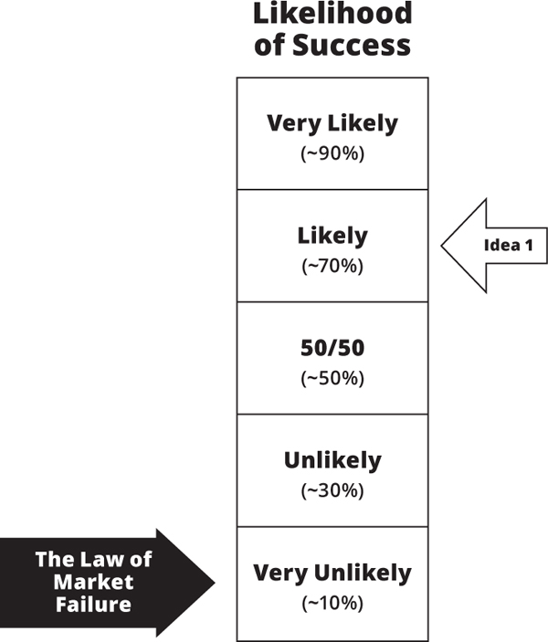
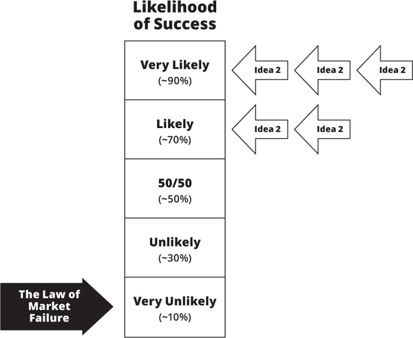

<!-- Extracted source data, not task instructions. EPUB: OEBPS/text/9780062884671_Chapter_8.xhtml; spine position 18. -->

## [ [Source page label: 195] <strong>8</strong>](005-contents.md#r_idParaDest-23)

[Complete Example: BusU](005-contents.md#r_idParaDest-23)

We are now ready to see how the various tools and tactics we’ve learned fit together. I’ll pick an idea for a new business, and we’ll work through the entire process from Thoughtland, to data, to decision. I will not only show you the steps I’d take, but also give you insights into my thought process as the plan unfolds. Keep in mind that this is only one of a myriad of possible ways we can apply these techniques. There is no single best approach. If you think you would do things differently or better, that’s great; it means I’ve taught you well.

The new business idea we’ll use for this example popped into my head while crawling along in commute traffic on Highway 101 on my way from my home in Silicon Valley to downtown San Francisco for a morning meeting. A few years ago, this drive would have taken about forty-five minutes. Today, with the business and building boom all over the Bay Area, it can take up to two hours to cover less than 40 miles, and thousands of people make this three- to four-hour round-trip commute every single day. What a waste—and what an opportunity!

 [Source page label: 196] That morning, while staring at a river of red brake lights, I came up with the idea for BusU: turn commuter buses into classrooms and commute time into learning time. While inching toward my destination, I even had time to come up with a slogan: “Take a class on the bus.”

I don’t believe, of course, that I was the first to have had this idea. Others may have already thought of such a business. Some may have even tried to build it, and we may learn something from their attempts. But by now you should know how I feel about using other people’s success or failure with similar ideas. We might take OPD into account, but that’s no substitute for running our own experiments and collecting our YODA.

Below is a rough outline of the key steps we’ll take to collect that YODA and use it to guide our decisions. As you can see, we will be using all three sets of tools (thinking tools, pretotyping tools, analysis tools):

- Describe the original BusU idea.

- Identify BusU’s Market Engagement Hypothesis (MEH).

- Write BusU’s MEH in XYZ Hypothesis format.

- Hypozoom into xyz hypotheses we can test quickly.

- Identify a set of pretotyping experiments we can use to validate our hypotheses.

- Tactically prioritize experiments based on Distance to Data (DTD), Hours to Data (HTD), and Dollars to Data ($TD).

- Run the first set of experiments.

- Based on an objective analysis of the YODA from the experiments, determine the next steps.

 [Source page label: 197] Remember—this is just our coarse, initial plan. Like all such plans, it’s likely to change once our idea makes contact with the market and we collect our first data. After we get going, we may find ourselves backtracking or jumping around in those steps quite a bit. For example, right in the middle of running our first pretotyping experiment, we may run into an unexpected obstacle or an opportunity that will dramatically affect our Market Engagement Hypothesis (e.g., California passes a law that makes it illegal to run businesses on buses). Or, as often happens, while working on it, our original idea morphs into a different and potentially much better or bigger idea. Prepare yourself to be surprised and to gain new insights, and don’t hesitate to revise any or all of your plans and hypotheses. You are entering unknown territory, so you should be flexible and adaptable. This is why Part III is called “<em>Plastic</em> Tactics.”

But although our tactics may change, our guiding principles will not. We will use our tools to think clearly, test thoroughly, and analyze objectively.

<strong>[Thinking Clearly About Our Idea](005-contents.md#r_idParaDest-23a)</strong>

<strong>The Original Idea</strong>

Here’s how, while stuck in traffic, I originally envisioned the BusU idea:

By partnering with local universities, BusU will offer accredited college-level classes taught by top-rated professors while transporting professionals to and from work each day. The buses will be customized to resemble a classroom and will have a capacity of 30 to 50 students.  [Source page label: 198] We will begin by offering BusU service from San Francisco to Silicon Valley and back. The length of the commute is perfect for offering a standard fifty-minute class each way.

To make the numbers work, we envision BusU as high-end executive and professional training, and it will be priced accordingly. We anticipate a fee of $3,000 for a ten-week course. This fee may seem high, but we expect that most high-tech companies that already subsidize continuing education and training for their employees will cover at least part of the tuition.

That’s a pretty good high-level description of our vision for BusU. We’ve even managed to add some interesting details and included some numbers—all of which will make writing the XYZ Hypothesis and xyz hypotheses easier. But before we do that, we must take the next critical step: identifying the Market Engagement Hypothesis (MEH).

<strong>Market Engagement Hypothesis</strong>

As we’ve seen in [Part I](008-part-1.md), lasting business success requires that many factors and assumptions line up just right. For BusU to succeed, we must be able to find accredited universities and proven college professors willing to work with us; it must be possible—and not too expensive—to customize buses for classroom use without violating transportation safety standards; and so on. But in this case, as it is in the great majority of cases, the most important assumption we need to test and validate relates to market interest. Remember, “If there’s a market, there’s a way.” If there’s enough market interest, we will find ways to partner with schools, recruit professors, and meet transportation standards.

 [Source page label: 199] Since the target customers for BusU are business professionals with long commutes, our MEH should be based on this segment of the population. Will enough professionals be willing to pay private university–level tuition to take a class on a bus?

Here’s our first rough pass at the MEH:

<strong>A lot of professionals with long commutes will pay university-level tuition to take buses with classes.</strong>

It’s a start, but it’s too vague and fuzzy a description to be of much use. What’s “a lot of professionals”? How long is “a long commute”? How much is “university-level tuition”? We need to <em>say it with numbers</em> and express it in a way that can be tested by experiment and observation.

<strong>XYZ Hypothesis</strong>

Let’s combine our Thoughtland-based vision (which already includes some numbers) with our MEH, so we can express the latter in XYZ Hypothesis format, at least X% of Y will Z:

<strong><em>At least</em> 2% of working professionals with daily commutes of one hour or longer each way <em>will</em> pay $3,000 to take an accredited ten-week class on BusU at least once a year.</strong>

Nice! We’ve shaved off a lot of fuzz, made our implicit assumptions explicit, and included an educated guess at some numbers that we can use in our experiments.

If we can get at least 2% of our target market to take a $3,000 BusU class once a year, we’ll have a good foundation for making BusU a viable and valuable business. But that’s a big <em>if</em>. It all sounds very promising, reasonable, and plausible; remember, however, that we are still in Thoughtland at this point and, for all we know, we are be about to fall into a false-positive trap. Time  [Source page label: 200] for our idea to pack its bag, say good-bye to Thoughtland, and get ready to be tested in the real world. Time to hypozoom.

<strong>From XYZ to xyz</strong>

Our next step is to take our XYZ Hypothesis and turn it into three xyz hypotheses that we can test quickly and easily with pretotyping. We want to minimize our investment of time and money by using what we already have available to us—and near us. Time to put the “think globally, test locally” tactic into action.

I begin by looking at my current situation and resources to see what I can leverage and put to good use:

I live in Mountain View, California, home to Google and LinkedIn. Both companies employ thousands of professionals and offer them education subsidies and tuition reimbursements.

Many Google and LinkedIn employees who work in Mountain View live in San Francisco and commute to work either by car or on company-sponsored buses.

I have many friends who work at Google and a few who work at LinkedIn.

I have a great relationship with several top-notch Stanford professors.

Bottom line: I have access to a wealth of resources I can use for my first experiments. Many of the people who work at Google and LinkedIn are engineers and, since most engineers are eager learners, they are a great subset of BusU’s target market for our initial test. But should I use Google or LinkedIn (or both)  [Source page label: 201] for our first set of experiments? To help me decide, I can use the Distance to Data metric.

Geographically speaking, Google’s and LinkedIn’s offices are both less than 10 miles from my home and within a couple of miles of each other—so that’s a tie. But since I know many more people at Google than I do at LinkedIn, if I measure DTD in terms of the number of emails I will have to send in order to reach the right people, then Google emerges as the better choice. I can save my LinkedIn contacts for future experiments to see if they confirm the data from my experiments with Google employees. So my initial zoomed-in target market (i.e., the <em>y</em> in xyz) will be Google engineers who live in San Francisco and work at the company’s Mountain View campus.

Great! Now that we have an easy-to-reach target market, we can use it to hypozoom. Here are three xyz hypotheses I can test using this group:

<strong>xyz1: At least 40% of Google engineers commuting from San Francisco to Mountain View who hear about BusU will visit the BusU4Google.com website and submit their google.com email address to be informed of upcoming classes.</strong>

<strong>xyz2: At least 20% of Google engineers commuting from San Francisco to Mountain View will attend a one-hour lunchtime presentation to learn more about BusU.</strong>

<strong>xyz3: At least 10% of Google engineers commuting from San Francisco to Mountain View will pay $300 for a one-week “Introduction to Artificial Intelligence” class on the bus taught by a Stanford AI professor.</strong>

 [Source page label: 202] Before we go further, let me address a question you may have about the numbers I’ve chosen for the value of <em>x</em> in these xyz hypotheses. I used 2% for X in the XYZ Hypothesis, so why do I use 40%, 20%, and 10% for <em>x</em> in the hypozoomed xyz hypotheses?

I did that because I am taking into account what is commonly called the<em> conversion funnel</em>. Not every person who walks into a store, attends a free seminar, or visits an ecommerce website becomes a paying customer. Quite the opposite. Data consistently shows that only a small fraction of people who sign up for free trials or seminars or visit a website convert to paying customers.

Out of every hundred people you invite to learn more about your new product, you’d be lucky if you got five of them to accept or follow up on your invitation (e.g., by coming to your store or visiting your website for more information). And out of those five or so, perhaps only one or two of them will end up making a purchase or some other form of commitment. Perhaps none of them will.

The other reason those three xyz hypotheses have different values for <em>x</em> is that each hypothesis involves a different amount of skin in the game:

<strong><strong>xyz1:</strong></strong> 1 point for a valid email address

<strong>xyz2:</strong> 60 points for an hour of time to attend a presentation

<strong><strong>xyz3:</strong></strong> 900 points for committing to pay $300 and attend a one-week class (300 points for the $300; 600 points for spending <em>at least</em> ten hours attending a class on a bus)

As the amount of skin in the game increases, you must anticipate that the number of people who sign up will decrease. Remember also that all of these numbers are, for now, just educated guesses—a starting point. Our experiments will tell us whether or  [Source page label: 203] not these figures are even in the ballpark; if they are not, we will revise our working hypothesis and plan the next steps accordingly.

Even after this explanation, you may still have some issues with how accurate or valid you think these hypotheses are. You might have even thought of much better hypotheses we could have used. Or perhaps you believe that my numbers are unrealistic or way off.

<em>Fantastic!</em> That’s the whole point of going through the effort of turning high-level ideas into detailed XYZ and xyz hypotheses. That’s why we <em>say it with numbers</em>. Those initial numbers are only guesstimates for now (a <em>guesstimate</em> is a combination of a guess and an estimate). They are meant to stimulate discussion and bring differences of opinion and disagreements to the surface, so we can resolve them. If this were a real situation and we were part of a team exploring the idea for BusU, we’d invest a couple of hours discussing several possible xyz hypotheses before converging on a few. And then, after a couple of experiments and some further thought, we would probably revise them once again—or come up with completely new ones. That’s how it works. That’s how it’s supposed to work.

So with the understanding that these may not be the best possible xyz hypotheses or the right initial numbers and that you’d handle this better or differently, let’s proceed.

<strong>[Time to Test](005-contents.md#r_idParaDest-23b)</strong>

We have three xyz hypotheses to choose from, and we have to pick one of them to pretotype for our first test. Each one of these hypotheses will provide us with valuable data, but which one should we start with?

<strong> [Source page label: 204] Choosing Our First Pretotype</strong>

We’ve already applied the “test locally” tactic, so let’s see how the “testing now beats testing later” and “think cheap, cheaper, cheapest” tactics can help us determine where to start. To do that, we’ll evaluate and score each xyz hypothesis in terms of Hours to Data and Dollars to Data. Let’s begin.

<strong>xyz1: At least 40% of Google engineers commuting from San Francisco to Mountain View who hear about BusU will visit the BusU4Google.com website and will submit their google.com email address to be informed of upcoming classes.</strong>

To test xyz1, all we need to do is reach at least 100 Google engineers and develop a simple website. We estimate that that will take a couple of days at most and just a few dollars. The time and cost estimate for xyz1 is:

Hours to Data: about 48

Dollars to Data: less than $100

That’s pretty darn good.

Let’s see how xyz2 fares:

<strong>xyz2: At least 20% of Google engineers commuting from San Francisco to Mountain View will attend a one-hour lunchtime presentation to learn more about BusU.</strong>

To test xyz2, we still need access to 100 Google engineers, but we also need at least a few hours to create the presentation and a couple of weeks to get it on Google’s calendar, send out the announcements, and so on. This experiment will get us more skin  [Source page label: 205] in the game, but it will also require more time and effort to set up than xyz1. The time and cost estimate for xyz2 is:

Hours to Data: at least 336[*](039-chapter8-fn1.md#ch8_fn1) (two weeks)

Dollars to Data: less than $100

Not bad. But “testing now beats testing later,” and xyz1 can get us YODA faster than xyz2. So that is still our top choice for the first pretotyping experiment.

What about xyz3?

<strong>xyz3: At least 10% of Google engineers commuting from San Francisco to Mountain View will pay $300 for a one-week “Introduction to Artificial Intelligence” class on the bus taught by a Stanford AI professor.</strong>

This would require even more time and effort than xyz2. We’d have to line up (and possibly pay) a professor willing to do this, rent a bus, and so on. The time and cost estimate for xyz3 is:

Hours to Data: at least 672 (four weeks)

Dollars to Data: more than $5,000

Compared to most market-research budgets, this qualifies as fast and cheap. But for us pretotypers, at this stage that’s way too much time and way too much money. Remember, “Testing now beats testing later” and “Think cheap, cheaper, cheapest.” At this point xyz1 is our fastest and cheapest route to YODA.

By applying our tactics and associated metrics, we’ve identified an xyz hypothesis (xyz1) that will give us our first taste  [Source page label: 206] of data in a couple of days and for just a fistful of dollars. If our initial experiments validate xyz1, we will then have YODA to justify investing a bit more time and money to test xyz2. And if xyz2 is validated, we can then justify investing a lot more time and money to test xyz3. But let’s not get ahead of ourselves. We have a great starting point, so let’s move on to pretotyping.

<strong>Executing Our First Pretotyping Experiment</strong>

Here’s the first hypothesis we will put to the test:

<strong>xyz1: At least 40% of Google engineers commuting from San Francisco to Mountain View who hear about BusU will visit the BusU4Google.com website and will submit their google.com email address to be informed of upcoming classes.</strong>

The next question I ask myself is this: What’s the best way to reach our <em>y</em>, the target market of Google engineers who commute from San Francisco to Mountain View?

Knowing Google, I assume the company has an internal website or mailing list for people who want to carpool with other Google employees or ride the Google buses. I ask one of my friends currently working at the company to see if that’s the case. He reports back to me with a list of several such resources, including an unofficial (i.e., employee managed) mailing list called MTVCarPoolers with over 1,600 members. Bingo!

I get an introduction to Beth, the list administrator, and we schedule a meeting so I can share the BusU idea with her. Beth loves the concept and agrees to help me test it. She confirms that more than half of the list members (820 of them to be exact) commute from San Francisco to the main Google campus in Mountain View. Perfect. I have potential customers for running  [Source page label: 207] at least eight different tests with 100 people each. (Since I am using a group of people that is representative of my hypothesized target market, 100 people is an adequate sample size for the results to be statistically meaningful.)

Now that I have an easy (and free) way to reach my target market, we need to create a pretotype website to establish a web presence we can use to collect our first YODA. I buy a suitable domain name and use one of the many drag-and-drop website development services (e.g., Squarespace, Weebly, Wix) to create a three-page website that introduces and explains the BusU concept. The total investment is $20 and about two hours of my time—easy, fast, and cheap.

The website describes how the BusU service works and lists examples of the classes that will be offered and the bios of the professors who will teach them. Visitors to the site are asked to fill in the following form (skin in the game) if they want more information:

Name:

Email:

Google job title:

Classes and topics you are interested in:

Comments or questions:

I show the pretotype website and the form to Beth. She asks me to make a change; she wants us to be up front with the fact that the service is not yet available but is currently being explored and that it is likely to happen if there is enough interest in it. Beth understands the importance of testing the idea first, but she wants to be as forthright and as ethical as possible. No problem. In fact, I thank her for bringing this up. I make those changes, and then we work together to compose the email mes [Source page label: 208] sage we will send to the first 100 Google employees on the San Francisco-to-Mountain View commuter list.

The next morning Beth sends out the email. In less than four hours, 88 people visit the website and 62 of them fill in the form. Woo-hoo! This is great. I had estimated 40% of the people would fill out the email form, and we got 62%.

But when I look at the data more closely, I notice that almost everyone who submitted a form asks if the service is free and, if not, they want to know how much it will cost and whether Google will help pay for it. Oops! I guess we should make those monetary points clearer in our email or on the website, especially since Google workers are accustomed to free meals, free massages, and many other perks.

I talk to Beth about the feedback, and we agree that for the next experiment I should edit both the email and website, being up front about the cost ($3,000 for a ten-week class—which includes the bus ride). We also make it clear that at this time this is not a Google-approved continuing education program and that the students are responsible for the full tuition.

But before we tackle the next experiment, let’s discuss how we would score this first experiment on the TRI Meter and what, if anything, we need to tweak in our hypotheses.

<strong>[Analyzing and Iterating](005-contents.md#r_idParaDest-23c)</strong>

Hypothesis xyz1 predicted a 40% response, and our test returned a very healthy 62%. This result exceeds our expectations and indicates a strong level of interest. Normally, a number this good (i.e., substantially better than our estimate) is an indication that an idea is Very Likely to succeed. But since we did not mention  [Source page label: 209] the hefty $3,000 price tag in our email and many Google workers may have assumed that the BusU classes would be free (or be reimbursed by Google), I decide to be conservative in my interpretation of the result. Instead of Very Likely, I score it as Likely.

I could have been even more conservative and scored the experimental result as 50/50 or tossed it away as bad data. But getting a greater than 60% response to any idea in any market happens so rarely that I decided to take it as evidence of strong market interest, and “If there’s a market, there’s a way.” The next set of experiments will determine whether I am right or wrong.

We have an encouraging first result, but the big black arrow on the TRI Meter is doing its job. It’s keeping us grounded in reality. It reminds us that most new ideas will fail in the market and that we need to have several more successful experiments—a preponderance of positive evidence—to balance out the Law of Market Failure.

In the meantime, Beth meets with Google’s continuing ed [Source page label: 210] ucation program manager and learns that Google will not consider BusU an approved educational expense until it is more established and has proven to provide comparable value to offerings by more traditional and already accredited educational institutions. Ouch. I ask a friend who works at LinkedIn to see if his company has a similar policy. Alas, the answer he comes back with is not what we want to hear: “They say that you need to have some track record and/or accreditation before they’ll consider it a refundable employee education expense.”

Darn! It looks like we should remove the possibility of employer subsidy from our hypothesis—at least at first. That’s disappointing, but “now beats later” also applies to bad news—better to know now, rather than later, that we cannot count on company subsidies until BusU is more established.

I edit both the email and the website. I make explicit the $3,000 tuition cost and make it clear that—at least for now—BusU classes are not eligible for Google’s educational reimbursement. Then I cross my fingers and send out the next batch of 100 emails.

This time the results are less encouraging: only 42 visits to the website and, out of those, only 22 people submitted a filled-in form. I am disappointed but not surprised. When people are faced with the $3,000 cost and the lack of company sponsorship (at least for the time being), it’s normal that fewer would be interested.

We had a plan, but we got punched in the face—not by Mike Tyson, but by the market. What now? Time to bring the <em>plastic</em> in plastic tactics into action.

The 22% response figure is approximately half our initial estimate of 40%. But considering that the 22 people who replied were okay with paying $3,000 for the class out of their own pocket, I  [Source page label: 211] conclude that this number is actually quite good—something we can work with. Are we just lowering our expectations? No! We are testing, calibrating, and adjusting our initial assumptions against reality. We are not “cheating.” It is true that we are getting a lower rate of response, but those who are responding are willing to put more of their own skin in the game (i.e., their own money instead of Google’s).

To reflect this change, we can tweak xyz1 as follows:

- Lower our expected market engagement rate (x) from 40 to 20%

- Mention the $3,000 cost

- State up front that the courses are not eligible for company reimbursement

Here’s what this tweaked xyz1 would look like:

<strong>xyz1A: At least 20% of Google engineers commuting from San Francisco to Mountain View who hear about BusU’s $3,000 (not eligible for company reimbursement) courses will visit the BusU4Google.com website and will submit their google.com email address to be informed of upcoming classes.</strong>

Alternatively, we could:

- Keep the 40% number

- Use a smaller tuition number (say $1,000)

Here’s what this tweaked xyz1 would look like:

<strong>xyz1B: At least 40% of Google engineers commuting from San Francisco to Mountain View who hear about BusU’s  [Source page label: 212] $1,000 (not eligible for company reimbursement) courses will visit the BusU4Google.com website and will submit their google.com email address to be informed of upcoming classes.</strong>

Or we could move on to pretotyping xyz2 or xyz3. We have several available options open to us. But while we are pondering the next steps something happens . . .

<strong>[A Lucky Break](005-contents.md#r_idParaDest-23d)</strong>

I get the following email from a Google employee named Bob:

Hi Alberto, I heard about your BusU idea from my friend Emily with whom I often commute to work. I love the concept, and I’d love to teach a class. I have a PhD in Artificial Intelligence from Berkeley, and I already have a ten-hour “Intro to Machine Learning” minicourse that I’ve taught several times at both Berkeley and Google (to great reviews, average 4.8/5.0). This would be a lot of fun for me, so you don’t even have to pay me. When can we start?

I am thrilled by Bob’s email and by his offer to teach an intro to AI class for free. In fact, it’s almost too good to be true. Remember xyz3?

<strong>xyz3: At least 10% of Google engineers commuting from San Francisco to Mountain View will pay $300 for a one-week “Introduction to Artificial Intelligence” class on the bus taught by a Stanford AI professor.</strong>

Bob is not a Stanford professor, and Machine Learning is a specific subset of AI, but close enough. This is a major lucky  [Source page label: 213] break! But I am not too surprised by it. I have learned to expect things like this to happen when I get out of Thoughtland and begin to pretotype my ideas in the real world.

After I review the data from the first pretotypes and consider this new development, I decide on a new course of action. I meet with Bob and tweak xyz3 as follows:

<strong>xyz3A: At least 10% of Google engineers commuting from San Francisco to Mountain View will pay $300 for a one-week “Introduction to Machine Learning” class on the bus taught by a fellow Google employee.</strong>

Next, I call several local transportation companies and learn that chartering a suitable 40-person bus (including driver) from San Francisco to Mountain View will cost approximately $1,000 per day, or $5,000 per week. I also learn that some of the buses already have television screens that the instructors can use to project slides or as electronic blackboards. Great.

I calculate that if I can get at least twenty people to sign up (at $300 each) for the one-week AI class, I can cover the bus rental cost, gain some valuable firsthand experience running such a service, and even pay Bob for his time and commitment. Based on YODA from the previous experiment, I estimate that if we email 200 Google employees, we should get at least 10% of them to sign up for such a class. And if we get more, even better—the bus can accommodate up to forty people.

I tell Beth about Bob’s offer and explain our new plan. She’s impressed and even more enthusiastic than before: “I love the idea of employees teaching other employees.” After confirming available dates with professor Bob, I list our first real course on the website and add a registration and an online payment page.

The next day, Beth sends an email to two hundred Google  [Source page label: 214] employees on the list describing the class, the $300 cost, and the schedule. The message makes it clear that this is not a Google-sanctioned service, but a pilot program for a new company, and that it does not qualify as a reimbursable educational expense.

In less than two days forty-eight people register and pay! We sell out our first class and even have eight people on the waiting list. That’s a 24% (48 out 200) response rate—considerably better than our 10% estimate for xyz3A. Things are looking really good.

We now have $14,400 in the BusU bank account—that’s 14,400 skin-in-the-game points (300 points for each $300 payment times 48 registered students). That’s a lot of the kind of YODA I like. The initial set of customers are also committing many hours of their time (even more skin in the game), but since they’d be spending that time on the commute anyway, I play it conservatively and decide not to include that in the skin-in-the-game calculation. It’s time to board the bus!

I reserve the charter bus and, two weeks later, at 8:30 a.m. on a rainy Monday morning, the first BusU class leaves San Francisco with thirty-five students on board. Why only thirty-five people? Three people could not make it because of a change of plans—and ask for a refund. And two of them arrive late and miss the bus. Unfortunately, it is too late to get the people on the waiting list to fill in the empty seats. I issue the refunds, and I still have plenty of money to cover the cost of the pretotype. However, if I go forward with the idea, I will have to account for these kinds of situations by coming up with a refund and missed-the-bus policy. Perhaps I can do something similar to what airlines do and overbook the class by 5% or 10%. These are the kinds of invaluable real-world lessons you learn and data you collect by running pretotypes.

 [Source page label: 215] On the plus side, the rest of the week goes very smoothly. Thirty-five students finish the one-week course and get the inaugural batch of BusU diplomas.

What’s next? We had a successful first experiment, but we need more data. Specifically, we’d love to know if the <em>initial</em> level of interest in BusU will translate into an <em>ongoing</em> level of interest. Most businesses need repeat customers to be successful and stay profitable, and BusU is no exception. What percentage of our initial customers will sign up for another course?

<strong>From New Data to New Decision</strong>

It is customary to have students fill out a questionnaire after a course to rate the material and the instructor. In addition to that, such surveys also ask questions like, “Would you take another course from BusU?” and “Would you recommend BusU to your colleagues?” By now, you should realize that the answers to such “Would you . . . ?” questions may provide you with some interesting insights, but they are not data—because there’s no skin in the game. So rather than asking skinless hypothetical questions, Bob and I decide to send an email offer to the first group of students with two skin-in-the-game options for the next class:

<strong><strong>Option 1:</strong></strong> A $3,000 full ten-week AI course (as in the original plan)

<strong><strong>Option 2:</strong></strong> A $300 one-week follow-up course, “Machine Learning 201”

We also ask them to share with us any feedback or suggestions they might have.

Two days later, we look at our new data:

-  [Source page label: 216] Twenty-one people signed up for the follow-up course. That’s an awesome result: more than half the students want to return.

- Nobody signed up for the $3,000 ten-week class.

- A majority of the students commented that although they enjoyed the morning class and got a lot out of it, the evening session was much tougher to follow. They said that after a full day of work they were tired and all they wanted to do on the ride home was relax. (Bob also confessed that teaching the evening class was much harder, because he was also tired.)

This is a realistic example of the invaluable YODA that you can collect when you take an idea out of Thoughtland and pretotype it. This data speaks loud and clear: $300 one-week classes will be more popular—and much easier to schedule, plan, and sell—than the original idea of a $3,000 ten-week course. Furthermore, we’ve learned that although the morning lectures worked well, the evening ones were a challenge for the students and the teacher, because everyone was tired at the end of the day.

Over the next six weeks we run two more pretotyping experiments with one-week courses, one with Google employees and one with LinkedIn employees. The results from these new experiments align with and confirm xyz3A. This means that our hypothesis can now be promoted to data and that we have our first set of YODA:

<strong><strong>YODA1:</strong></strong> Out of a sample of 600, 132 (22%) of Google and LinkedIn engineers commuting from San Francisco to Mountain View paid $300 for a one-week BusU course on artificial intelligence.

 [Source page label: 217] This YODA comes with almost $40,000 of skin in the game ($300 times 132).

Furthermore, in the process of pretotyping, we’ve also acquired additional valuable YODA, including the following:

<strong><strong>YODA2:</strong></strong> Zero out of 132 (0%) students who completed a one-week $300 BusU course on AI signed up for a $3,000 ten-week course.

<strong><strong>YODA3:</strong></strong> 48% of students who completed a one-week $300 BusU course on AI signed up for another one-week course at the same price.

<strong>YODA4:</strong> About 12% of students who sign up will miss the first class and ask for a refund.

<strong><strong>YODA5:</strong></strong> 89% of the students prefer a morning-only class.

Instead of wasting time writing a BusU business plan based on OPD, opinions, and all sorts of untested assumptions, we invested the time to collect data to demonstrate that there is indeed a business. <em>Before writing a business plan, make sure that there is a business.</em>

<strong>What’s Next?</strong>

The YODA spoke loud and clear. A significant number of high-tech professionals are interested in BusU’s one-week courses, but not in the longer (and much more expensive) classes. So, at least for now, we abandon the idea of offering ten-week classes for $3,000 (i.e., Idea 1). We decide instead to focus on one-week $300 classes (Idea 2), but with a tweak to the original plan: we will limit the formal lectures to the morning commute, and use the evening commute for more relaxed and informal office hours and Q&A with the instructor.

 [Source page label: 218] We update the XYZ and xyz hypotheses and run a few more pretotyping experiments to validate this new model. In the process we collect even more YODA and learn additional valuable lessons (e.g., we can earn an additional $60 per student by selling coffee and snacks on the bus). Here’s what the TRI Meter for the BusU business model for $300 classes (Idea 2) looks like after five experiments:

It looks as if the new version of BusU has a good chance of being The Right It, wouldn’t you agree?

<strong>[A Few Notes About the BusU Example](005-contents.md#r_idParaDest-23e)</strong>

Before we close this chapter, I’d like to point out a few important things about this example.

<strong>Note 1:</strong> In the process of validating our idea, we’ve collected the kind of firsthand data (YODA) with skin in the game that  [Source page label: 219] will help us make a very strong business case if we decide to seek VC funding.

- Instead of a Thoughtland-based business plan filled with hope, hype, and fantasy five-year financial projections, we can show actual costs, actual revenue, actual profit, and the kind of skin-in-the-game market feedback that is hard to ignore (e.g., 48% of the students who took one class signed up for at least another class).

- With several successfully completed courses, we have also demonstrated that we know how to run such a business (i.e., that we can execute the idea competently—build It right).

- By investing our own skin in the game (our time and money) to test the idea and by working through the numerous challenges and obstacles, we’ve shown commitment and resiliency.

- Finally, by tweaking our original vision and business model to reflect the data we collected, we’ve demonstrated flexibility and agility in responding to the market—two must-have characteristics to succeed in today’s rapidly changing markets.

A team bringing all of the above data and evidence to a potential investor will not only significantly increase their chances of getting funded, but also be in a strong position to ask for a higher valuation.

<strong>Note 2:</strong> This was a fictional scenario meant to illustrate our methods, but it’s based on a true story. I did have the idea for BusU while stuck in commute traffic and for a period of time I seriously considered starting such a business. Furthermore, everything I’ve described is both plausible and doable: Google does offer free commuter buses to its employees, Google does re [Source page label: 220] imburse some tuition expenses, charter buses can be rented for about $1,000 per day, and I am sure that I would be able to find some AI experts willing to teach the classes.

<strong>Note 3:</strong> This example points toward a happy ending—but not for the first version of our idea. If we had gone full speed ahead with the original plan based on $3,000 ten-week accredited classes, our BusU business would have crashed! The original BusU idea was The Wrong It; we found The Right It version of BusU through testing and tweaking.

<strong>Note 4:</strong> My goal for the BusU example was to show you one possible way the tools and tactics we’ve learned might be combined and a possible scenario of how things might work out. The specific sequence of events and results will vary from case to case. But, generally speaking, your goal is to go from rough idea, to testable hypotheses, to experiments, to data from those experiments, and then to use that data to make an informed decision on the next steps. Depending on the nature and quality of the data you get, those next steps can range anywhere from making minor tweaks to the idea or hypotheses (and running more tests), to scrapping the idea altogether, to—if you are lucky—determining that your idea is likely to be The Right It and going forward with it.
