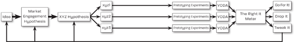

<!-- Extracted source data, not task instructions. EPUB: OEBPS/text/9780062884671_Chapter_9.xhtml; spine position 19. -->

## [ [Source page label: 221] <strong>9</strong>](005-contents.md#r_idParaDest-25)

[Final Words](005-contents.md#r_idParaDest-25)

I began this book with the following ominous warning:

<strong>It waits. Patient.</strong>

<strong>Confident that it will soon get its prey—it always does.</strong>

<strong>Few escape its bite, none its tentacles.</strong>

<strong>One way or another, the Beast of Failure gets us all.</strong>

I wrote those somber words in one of my notebooks in the days right after my startup failed. They came out of my pen as I was trying to figure out how the hell this could have happened. As you can probably tell, I wasn’t exactly in a cheery mood at the time. It was a dark and bitter period for me for two reasons, one obvious and one not so obvious.

The obvious reason for my gloomy mood was that our company, after an incredibly promising start, almost $25 million of investment from three of the most successful VC firms in the world, and five years of really hard work by dozens of top-notch  [Source page label: 222] people, had to be shut down and sold off. As much as that hurt and embarrassed me and many of the people associated with the company, I knew we’d all recover and move on.

The final meeting with the investors, the board of directors, and the lawyers was not exactly fun, but it was not as terrible as I—a novice at failure on this scale—thought it would be. No one yelled, no one got angry, no one pointed blaming fingers. Instead, the tone of the meeting was a combination of disappointment, understanding, and—to my surprise—a <em>lack</em> of surprise. The investors, the other board members, and the lawyers had been through the same scenario (brilliant idea + good plan + plenty of funding + strong and experienced team + competent execution = failure) many times already. For them it was par for the course. Most startups fail, even those that hold much promise and seem like a sure thing. Remember Webvan?

I knew the stats about startup failure too, but somehow I didn’t think that those dismal odds had any relevance to our company. They couldn’t possibly apply to us. For starters, we had gone through exhaustive technical due diligence, done our market research, wrote a great business plan, and gotten funding from great investors. Then, after putting together an amazing team, we built the exact product we said we were going to build and our target market told us they wanted, needed, and would definitely buy. In other words, we had checked all the boxes.

So WTF!? Why The Failure!? It made no sense to me.

That was the root of the second, less obvious (but deeper and longer-lasting) reason for my gloom. What made it so pitch dark, so bitter, and so pervasive was that several of my deeply held beliefs about the way the world is supposed to work had been shattered. The formula for success that I witnessed,  [Source page label: 223] learned, believed in, and emulated had failed me. To my internal logic it was as if, all of a sudden, I could no longer count on 2 plus 2 adding up to 4.

At first, I felt lost, hopeless, betrayed. Then, slowly but steadily, the shock and pain of my first big failure morphed into something healthier: a desire to understand how and why something like this could happen—not just to our company, but to anyone who tries to bring a new idea into the world. I wanted to use that understanding to prevent it from happening again. As I mentioned in the Prelude, the Beast of Failure had bitten me, and I decided to bite back, or at least learn how to armor and defend myself against the worst of its bite.

I would figure out where and how we had gone wrong, discover ways to prevent those errors in the future, and share those findings with the world. That’s what this book is all about.

In this concluding chapter I review and summarize those findings, repeat and highlight some of the most important points, and close with some important final words of advice and encouragement.

<strong>[The Right It: A Recap](005-contents.md#r_idParaDest-25a)</strong>

<strong>A Review of the Hard Facts</strong>

[Part I](008-part-1.md) began with the following imperative, the guiding principle of this book:

<strong>Make sure you are building The Right It before you build It right.</strong>

To reach The Right It, you must come to terms with a number of hard facts, hard because they are hard to take, hard to  [Source page label: 224] avoid, and unlikely to change. The mother of all hard facts is the Law of Market Failure:

<strong>Most new products will fail in the market, even if competently executed.</strong>

Most new products that make it to market fail because they are The Wrong It, defined as <em>an idea for a new product that, even if competently executed, will fail in the market.</em>

Next hard fact:

<strong>No amount of design brilliance, engineering prowess, or marketing fireworks can save a product that is The Wrong It from the jaws of the Beast of Failure.</strong>

This second fact explains why even the world’s most successful companies (e.g., Coca-Cola, Disney, Google) will often launch new products that fail in the market. These expertly executed new products fail because they are based on the wrong Premise—the market is not interested in them regardless of how well (or by whom) they are designed, built, or marketed.

I then introduced the hero of our book: The Right It is <em>an idea for a new product that, if competently executed, will succeed in the market.</em> Which brought us to our third hard fact:

<strong>Your only chance for success is to combine competent execution with a product that is The Right It.</strong>

But how can we know if a product is The Right It before we have actually built It? How can we tell if the market will want It if It does not even exist yet? The seemingly logical—but catastrophically wrong—answer to that question is: “We’ll ask people if they want it or will buy it.”

Unfortunately, this approach, conceived of and carried out in  [Source page label: 225] Thoughtland, produces opinions, not data. And people’s opinions, including so-called expert opinions, are not reliable predictors of success, because our thought process and conclusions are invariably distorted by a covey of cognitive errors and biases. In Thoughtland, many ideas that are The Wrong It get an enthusiastic thumbs-up from the target market (a false positive), while many ideas that are The Right It get shot down as lame or ludicrous (a false negative).

So when it comes to validating ideas for new products, we cannot depend on what people think, say, or promise. Instead, we must escape the treacherous trolls of Thoughtland by recognizing and acting upon our fourth hard fact:

<strong>Data beats opinions.</strong>

But not just any old data, especially not Other People’s Data (OPD). OPD is at best unreliable, because what happened to other people, with other products, at other times does not necessarily apply to our idea for a new product.

So the next hard fact specifies what kind of data we need:

<strong>You need to collect Your Own DAta (YODA).</strong>

If “data beats opinions” and YODA beats OPD, then does that mean that <em>YODA beats every other possible source or form of data</em> about the likelihood of success of your idea? Yes! Most emphatically YES! YODA beats them all—provided that YODA is collected, filtered, and analyzed rigorously and objectively.

The final hard fact assures the quality of your data:

<strong>To count as proper YODA, your market data must come with some skin in the game.</strong>

You cannot just ask the market if they are interested in and  [Source page label: 226] likely to buy your new product and take their word for it. You need something of value to back up their statements and promises, ideally money—the most universal and quantifiable form of skin in the game. But how do you solve the chicken-and-egg challenge of collecting YODA to determine if your idea is The Right It unless you have already built It? You use the tools in [Part II](012-part-2.md).

<strong>A Review of the Sharp Tools</strong>

Finally, after a barrage of hard facts, the first bit of good news: not only is YODA the most reliable and relevant indicator of potential market success, but collecting YODA is faster, cheaper, and more fun than collecting worthless opinions and stale OPD—provided you have the right tools.

<strong><em>Thinking Tools</em></strong>

The first step in our quest for reliable YODA is to rid our idea of the mental fuzz (vague descriptions, unspoken assumptions, etc.) acquired in Thoughtland and <em>articulate it as precisely and as clearly as possible</em>. This step is particularly valuable for teams, because it helps identify and reconcile conceptual differences among team members.

Behind every idea for a new product is a Market Engagement Hypothesis (MEH). The MEH is a high-level description of how we assume (or hope) the market will engage with our product. In the case of Second-Day Sushi, for example, the MEH was:

<strong>Many people will buy less-than-fresh sushi if we make it cheap enough.</strong>

The Market Engagement Hypothesis is a necessary starting point, but it’s usually too vague to be usable. We need to <em>say it  [Source page label: 227] with numbers,</em> turning the fuzzy MEH into an unambiguous XYZ Hypothesis using the format: “At least X% of Y will Z.”

<strong>At least 20% of packaged-sushi eaters will try Second-Day Sushi if it’s half the price of regular packaged sushi.</strong>

Finally, we need to go from a broad XYZ Hypothesis to a set of smaller xyz hypotheses that we can test quickly and cheaply. Here’s one example:

<strong>At least 20% of students buying packaged sushi at Coupa Café today at lunch will choose Second-Day Sushi if it’s half the price of regular packaged sushi.</strong>

In three quick steps, we went from a vague high-level idea to a clearly stated, ready-to-be-tested hypothesis. Now, armed with our xyz hypothesis, we are ready to test our new product idea on our target market. Even though we don’t have the product to test our hypotheses with yet, pretotyping will enable us to forge ahead without it.

<strong><em>Pretotyping Tools</em></strong>

Pretotyping can play a key role in validating our idea. Pretotyping differs from traditional prototyping in that pr<strong><em>o</em></strong>totypes are usually designed, built, and used to verify that an idea can be built, to explore the best ways to build it, and to test that it will work as expected, and pr<strong><em>e</em></strong>totypes are built for a single—but singularly important—purpose: to validate our Market Engagement Hypothesis.

Prototypes help us answer the key question: <em>Can</em> we build it? Pretotypes, in contrast, answer a very different question: <em>Should</em> we build it? With pretotyping, we can answer this question quickly and inexpensively. Whereas traditional prototypes  [Source page label: 228] can take weeks, months, or years to develop and cost millions, pretotyping experiments can produce data in a matter of hours or days and cost little.

Some pretotyping techniques include the Mechanical Turk, the Pinocchio, the Fake Door, the Facade, the YouTube, the One-Night Stand, the Infiltrator, the Relabel, but these are just a small sample of the many great effective, efficient, and fun ways to pretotype an idea. For any new product idea there is—at least—one great way to pretotype it and to get some YODA in a matter of hours. I encourage you to modify, adapt, and combine these basic techniques to best fit your idea. Better yet, invent and experiment with your own technique and give it a name (e.g., Mike’s Magic Carpet pretotype).

<strong><em>Analysis Tools</em></strong>

After running a few well-crafted pretotyping experiments you will finally possess the most valuable, relevant, and reliable type of data: fresh YODA straight from your target market. But having fresh YODA is not enough; you need to calibrate it and interpret it before you can use it to reach a conclusion on which to base a decision. A pair of analysis tools, the Skin-in-the-Game Caliper and the TRI (The Right It) Meter, will help you weigh, analyze, and interpret the YODA you collected with rigor and objectivity.

The <em>Skin-in-the-Game Caliper</em> allows you to assign the proper value to the data you collect according to how much skin in the game accompanies it. A $250 preorder counts more than, say, a $50 deposit to be put on the waiting list, which counts more than a submitted email address. Opinions, of course, are worth zero points; as are thumbs-ups, likes, and comments.

The <em>TRI Meter</em> is a graphic tool designed to help you take  [Source page label: 229] the result from each pretotyping experiment, put it against your XYZ and xyz hypotheses, and judge the degree to which the YODA supports the likelihood that your idea is The Right It. The TRI Meter uses a five-step scale that ranges from Very Unlikely to Very Likely, and, as a reminder that most new ideas will fail in the market, at the bottom, pointing to Very Unlikely, is the big black Law of Market Failure arrow. That arrow reminds us that we need more than just a couple of encouraging experiments to balance out those initial odds.

Since most new ideas will fail, if you’ve been objective in designing the experiments and fair in evaluating the results, you should not be surprised if your first few TRI Meters yield Unlikely or Very Unlikely scores. But if you keep at it, unless you are really unlucky, you will eventually find yourself staring at a TRI Meter with Idea arrows pointing to Likely or Very Likely. There are no guarantees, of course, but—assuming that you’ve been careful, objective, and fair in applying the tools and judging the data—a positive TRI Meter should allow you to move on to the next stage in the development of your idea: building It right.

<strong>A Review of the Plastic Tactics</strong>

Some tactics to help you use our tools more efficiently and effectively include “Think globally, test locally,” “Testing now beats testing later,” and “Think cheap, cheaper, cheapest.” Those tactics suggest that you design your experiments to minimize Distance to Data, Hours to Data, and Dollars to Data. A final tactic, “Tweak it and flip it before you quit it,” teaches the importance of tweaking your idea before abandoning it if the YODA from your initial set of experiments is discouraging. The first version of your idea may be The Wrong It, but you may be just a few tweaks away from The Right It: test, tweak, repeat.

 [Source page label: 230] A final comprehensive example, BusU, teaching classes on commuter buses, showed how the many tools and tactics can be applied, combined, and put into action. We went from idea, to hypotheses, to experiments, to decisions. The example was realistic and peppered with unexpected challenges and opportunities. These demonstrated that it’s perfectly okay to tweak your original idea and change your plans along the way based on what you learn about the market as you run your experiments. In fact, it’s more than okay—it’s exactly what you should do.

<strong>There Are No Guarantees</strong>

Phew, we’ve covered a lot of ground, haven’t we? It may seem like a lot to keep track of. If I could have made it shorter or simpler, I would have, as in the quote usually attributed to Albert Einstein, “Everything should be made as simple as possible, but not simpler.” However, each of the steps fits into a logical sequence that should make it easier to remember and that, with a bit of practice, will become second nature and automatic.

1. Start with an idea.

2. Identify the Market Engagement Hypothesis.

3. Turn the MEH into a say-it-with-numbers XYZ Hypothesis.

4. Hypozoom into a set of smaller, easier to test xyx hypotheses.

5.  [Source page label: 231] Use pretotyping techniques to run experiments and collect YODA.

6. Use the TRI Meter with the Skin-in-the-Game Caliper to help you analyze the YODA.

7. Decide on the next step:

   1. <em> Go for it!</em> You can’t be 100% sure that your idea is The Right It, but the YODA looks promising enough for you to take a calculated risk.

   2. <em> Drop it.</em> As much as you’d like your idea to succeed, the YODA stubbornly indicates otherwise.

   3. <em>Tweak it.</em> In the process of testing your idea, you have learned invaluable things about your target market and its willingness (or unwillingness) to engage with your product. Don’t hesitate to tweak your original idea (or your hypotheses) to reflect what you’ve learned along the way. You may find that although there is not enough market interest in your original idea, there may be great interest in something related to it. Or try flipping the idea on its head and see what you come up with.

Even if competently executed, these steps cannot guarantee that an idea will succeed in the market. It’s impossible to predict or take steps to prevent all of the possible external factors that  [Source page label: 232] can turn even the most promising and well-tested idea into a market failure. But if you diligently follow and apply what I’ve shared with you in this book, I feel confident enough to make you three promises.

<strong><em>Promise 1: You will dramatically reduce your probability of failure.</em></strong> How dramatically? If you run enough well-designed pretotyping experiments, and their results provide strong and consistent validation for your hypotheses, then you have probably found an idea that is The Right It. Armed with The Right It, you should be able to flip the odds in your favor: from an 80ish percent chance of failure to an 80ish percent chance of success. Provided, of course, that you execute the idea competently (i.e., you build It right). Unforeseeable and unpreventable external events and bad luck may still cause you to ultimately fail. But if that happens I can make the next promise to you.

<strong><em>Promise 2: Even if you fail, you will not feel like a fool.</em></strong> If you crash and burn in the market <em>because</em> you haven’t adequately tested your idea, you should feel like a fool. Especially now, because after reading this book you should know better. But if you fail <em>despite</em> all your diligent and objective market testing, then you might feel disappointed and discouraged, but you should not feel foolish. If a poker player holding four aces (1 in more than 4,000 odds) bets big and loses to another player’s royal flush (1 in more than 70,000 odds), that’s not being foolish; that’s being extremely unlucky.

<strong><em>Promise 3: If you stick with it, you will eventually succeed.</em></strong> Throughout the book, I’ve talked a lot about the Beast of Failure and the Law of Market Failure. Failure is the villain of this book and, like all good villains, it grabs our interest and demands attention. But we should not forget that although market success happens much less frequently, it is not <em>that</em> rare. It’s not a one-in- [Source page label: 233] a-million shot. It’s not like winning the lottery. It’s much, much better than that. If 80% to 90% of new products fail in the market, that means that some 10% to 20% succeed. Those are odds that we can work with.

That means that, with some luck, if you apply what you’ve learned in this book, you may have to go through and test five or ten ideas (or variations on the original idea), but you will eventually hit on an idea that is The Right It—provided, of course, that each successive idea (or idea variation) integrates and takes into account what you’ve learned from your previous market experiments. Even if a pretotyping experiment fails to validate your hypotheses, you will discover something new about the market: new facts, new opportunities you did not know about, new resources. And if you are smart, you will use that new information and those newly discovered resources to guide your next steps—which will help you find The Right It sooner.

It’s a bit like card counting in blackjack: if you keep track of the cards that have already been dealt and bet accordingly (bet less when the remaining deck is unfavorable, more when it’s favorable), you can turn the odds of winning in your favor. That’s why most casinos ban card counters. The real world is, of course, infinitely more complicated and far less predictable than a casino game. In the market, the risks, rewards, and odds of success for any given idea change all the time (that’s why it’s so important to have fresh firsthand data—YODA). But the fact remains that the more data you collect by experimenting in a given market, the better you will understand some of its behaviors, and the more likely you are to converge on an idea that is The Right It.

All right, we are almost done. But there is one final exceedingly important topic that we need to cover.

<strong> [Source page label: 234] [What to Build?](005-contents.md#r_idParaDest-25b)</strong>

As I hope you will learn firsthand by applying them, the tools and tactics I’ve shared with you are powerful stuff. They have the power, if properly used, to help you avoid The Wrong It, find The Right It, and thus flip the odds for success in your favor. And that’s no small thing. In fact, it’s a <em>huge</em> advantage!

But, as they say, with power comes responsibility. How will you use that power? Or more precisely, what kind of new idea would you create and bring to market if you were reasonably confident (say 80ish percent) that it would succeed?

That’s a big question. An existential question. One that deserves a lot of thought, because even if you are sure that you have The Right It, it will still take a lot of time, investment, effort, sacrifice, and commitment to build It right and to keep It going. A full and proper answer to this question is beyond the scope of this book and probably deserves a book of its own. But I will briefly address two key aspects of this question:

Is this idea The Right It for you?

Is this idea The Right It for the world?

<strong>Make Sure It’s The Right It for You</strong>

The best ideas—the ones to which the market responds with the greatest interest and enthusiasm—are often the ones that require the most effort and commitment. Before you know it, you may find yourself with thousands of eager customers knocking on your (fake) door. It’s exciting, but it can also be overwhelming. And unless you are fully committed to your idea and prepared for all the work ahead, that kind of success can create more pain and headaches than a failure.

 [Source page label: 235] Early in my career, one of my managers had an expression for that kind of situation; he called it a <em>success disaster</em>. He was fond of saying, “If you think failure is hard, you haven’t experienced real success.” I didn’t fully understand what he meant until I found myself in a success-disaster scenario myself. He was right! Failure is a beast, but success can be a beast too. The experience of finding and latching on to an idea that is The Right It can often be compared to having the proverbial tiger by the tail. Just ask Tesla’s Elon Musk.

As I am writing this, Musk is experiencing just such a success disaster. In 2016 Tesla announced the long-awaited Tesla Model 3—the company’s most affordable car, about half the price of the previous models. Following the proven Tesla playbook, the company required people to put down a $1,000 deposit (skin in the game) to get in line for the car. Preorders poured in by the hundreds of thousands (talk about YODA!). The first year of production for the Model 3 sold out in a matter of days, and the orders kept pouring in. Eventually Tesla found itself with approximately 500,000 preorders—half a billion dollars of skin in the game, an unprecedented and unqualified success by most automotive-industry standards. Now all that Tesla had to do was to build and deliver a few hundred thousand Model 3s. That’s a lot of cars for a fledgling and relatively small auto company.

Fast-forward a year or so and, not too surprisingly, a series of production issues resulted in significant delays and uncertainty in delivery dates. Many of the people who had put their $1,000 deposits in Tesla’s bank account were getting upset and wanted to know if and when they would get their cars. Elon Musk responded (via Twitter) as follows to one of those people:

You’ll know as soon as we do.

We are deep in production hell.

 [Source page label: 236] On another occasion, Musk tweeted the following about the situation: “The reality is great highs, terrible lows, and unrelenting stress. Don’t think people want to hear about the last two.”

But people did want to hear more about the “last two”—and how Musk handles terrible lows and unrelenting stress. He replied as follows (emphasis mine): “I’m sure there are better answers than what I do, which is just take the pain and <em>make sure that you really care about what you’re doing</em>.”

Thank you, Elon, for providing us with the inspiration, and even the wording, for the key message of this section—an important qualification to our main message:

<strong>Make sure you are building The Right It</strong>

<strong><em>and make sure that you really care about It</em></strong>

<strong>before you build It right.</strong>

As we’ve learned, finding The Right It is not easy; it takes a lot of work, creativity, and persistence. Unless you are very lucky, it will take several rounds of testing, failing, and going back to the drawing board before you land on an idea that survives our market validation process. So when you finally discover that winning idea for a new product, be prepared to do it justice—and be prepared for the hard work ahead. Finding The Right It is the end of one quest and the beginning of another, longer and harder quest: building It right, and then marketing It right, selling It right, servicing It right, and so on, all the while fighting the competitors that inevitably pop up when a new idea that is The Right It is discovered.

It’s unlikely that you’ll ever find yourself in a success-disaster situation of the same magnitude as Elon Musk’s, but I guarantee you that you will have to deal with a wide range of problems, complications, and mini-disasters of your own. And unless you  [Source page label: 237] really care about that idea of yours, you will not have the motivation necessary to handle those obstacles and see it to fruition. In other words, in order to ultimately succeed with an idea, it’s not enough to know that the idea is The Right It for the market; it has to be The Right It for you. It has to be a two-way match.

How can you know ahead of time if an idea is right for you? Once again, I can give you no guarantees. But leaving Thoughtland and going through the pretotyping process will teach you not only about the market’s actual response to the idea, but also about <em>your</em> response to working with the idea. And that’s another great reason to do pretotyping. Let me explain.

Being clear about your hypotheses, putting them to the test, and analyzing the results objectively is the most effective and efficient way to validate your idea against the market. It requires commitment and quite a bit of work, but it should also be fun, exciting, and engaging. If you are not experiencing at least some fun and excitement working with your idea at this early stage (e.g., devising, creating, and running pretotyping experiments), either you are doing it wrong or the idea and market you are testing are probably not a good match for you. And that’s something that you should not overlook, because it’s a strong indicator that the idea you are working on may not be The Right It for you.

If you are not enjoying the pretotyping process, at some point you have to ask yourself some tough questions:

Even if this idea that I hatched in Thoughtland turns out to be The Right It, is it likely to be <em>my thing</em>?

Am I cut out for this kind of job, this kind of product (or service or business)?

Do I really want to be in this market for the next few years?

 [Source page label: 238] If you cannot answer these questions affirmatively, you should reconsider pursuing the idea—even if that means abandoning an idea that is likely to succeed in the market. You don’t want to be stuck working on something you don’t care about. Sooner or later (and probably sooner rather than later) you will get fed up with it and stop giving it your best—you’ll stop building It right. And that’s not fair to your idea, your investors, your customers, or yourself.

Many people, including myself, dream of starting a restaurant. My wife and I talk about it all the time. In Thoughtland owning a restaurant sounds great: you get to have fun designing the dining room, creating the menu, hobnobbing with the customers, and making lots of money along the way. The reality, as every restaurateur knows, is very different—more grungy than glamorous. Even if your restaurant concept is The Right It, you will be spending more time on marketing, personnel issues, supplier problems, accounting, and so forth, than coming up with the perfect steak tartare (yum!).

As you pretotype your idea, you will learn not only if the idea is The Right It, but if you are the Right Person (or Team) to execute the idea. And that’s just as important. Let me share with you a typical example.

Two years ago, I received an email from a young entrepreneur; let’s call him Darrell. Darrell had an idea for an innovative and eco-friendly diaper-delivery and -disposal service. He had read my preto-book <em>Pretotype It</em> and thought that two of the pretotyping techniques I described were perfectly suited for testing his idea. To make sure he was on the right track, he contacted me to explain his concept and to get some feedback on his plans for pretotyping it. I suggested a couple of minor tweaks to make his tests more objective, wished him good luck, and asked  [Source page label: 239] him to keep me posted. And since my children are now in their twenties, that’s the last I thought about diapers for a while.

A few months later, Google asked me to teach a seminar on pretotyping to the diapers division of a major consumer-goods company. While preparing for the event, I was reminded of Darrell’s diaper-delivery idea. I was curious to know how his pretotyping experiments turned out, so I contacted him to get an update. The next day I received an email from him:

Sorry I didn’t keep you posted as promised, Alberto.

I ran the experiments we discussed and got good results—enough to convince me that the idea had a really good chance to be The Right It.

But in the process of doing that I realized that I don’t really want to be in the diaper business. It’s not my thing. I am now pretty sure I can make my idea for the business successful—perhaps even very successful—but I had no fun working on it. To be honest, I hated it! It was a good idea, and someone else should do it, but it won’t be me. I learned that I don’t give a darn about diapers. I don’t even have children. I would just do it for the money, and that’s not good enough. My real passion and interest is soccer. So I will try to come up with a soccer-related idea and use your techniques on that.

I am sorry for wasting your time and sorry to disappoint you.

Darrell didn’t waste my time (or his), nor did he disappoint me. Far from it. He didn’t find the diaper business sufficiently, ahem, absorbing. Good for him! He discovered that this industry is not his thing—and that’s <em>a great thing</em>. Better that he discovered  [Source page label: 240] that now rather than later, when he would be knee-deep in it.

When you use pretotyping to test an idea against the market, the idea and the market are also testing <em>you</em>—sort of. So while you are collecting market data about your idea’s market <em>desirability</em>, also keep an eye on its <em>enjoyability</em>. Would you enjoy working with this product, in this market, for the long term? Running a business based on your idea may sound great in Thoughtland, but as Darrell and many aspiring restaurateurs have discovered, the reality is often very different.

Make sure that your idea is not just a good match for the market, but also a good match for you.

<strong>Make Sure It’s The Right It for the World</strong>

I saved this section for last not because I consider it an afterthought, a postscript, something relatively unimportant. On the contrary, I saved it for last because I consider it to be extremely important. These are the words with which I want to leave you.

Everything I’ve shared with you up to now has been factual, practical, logical: tools, techniques, tactics; metrics, markets, money; testing, trying, tweaking. Time to shift gears and raise the level of our discourse. Time to get a little philosophical—for your own long-term benefit and that of the world. Don’t worry, I am not going to go all preachy on you. I just want to make sure that now that you have the tools and know-how to help you succeed, you will feel confident to go after bigger, better, more worthwhile ideas. Not every idea is equally worthy of our efforts—even if, technically, it is The Right It.

<strong><em>Stay Away from Breaking-Bad Ideas</em></strong>

If we define The Right It based purely on market demand (i.e., lots of people wanting, needing, buying your product) and mar [Source page label: 241] ket success (i.e., a highly profitable multimillion-dollar industry), then crack cocaine, meth, cigarettes, and a number of other recently developed addictive products and substances, both legal and illegal, would qualify.

Where should you draw the line to determine if an idea is the <em>wrong</em> Right It, a product that will succeed in the market but will do more harm than good to everyone involved in it? I can’t tell you that. I obviously have my own set of totally subjective and biased criteria: crack cocaine, bad; microbrewed beer, good (and single-malt scotch even better). Let a combination of your conscience, local laws, and customs be your guide. Asking yourself, “What would my grandma think of this?” should also steer you right most of the time. (I say <em>should</em> because I don’t know your grandma.)

With the tools and knowledge that you now have at your disposal, you possess the means to explore and test a wide range of ideas, so there is no reason to get involved in the kind of dangerous, shady, or illegal products and businesses that can get you and others in trouble. Hopefully, your idea for a new business does not involve cooking up a superior variety of meth in the middle of the desert. Don’t go <em>Breaking Bad</em> on me. On the other hand, if your new idea involves tasty microbrewed beer or single-malt scotch, feel free to send me samples.

<strong><em>Think Beyond Quick-Buck Ideas</em></strong>

Some ideas for new products may not violate any laws or customs; they are neither immoral nor unethical. But they are also not the best use of your knowledge, time, and effort. Such ideas may not make the world a worse place, but they won’t make it a better place either—they won’t make much of a difference one way or another. They are the kind of gimmicky products that are bought on im [Source page label: 242] pulse, used once or twice, and then tossed away or forgotten.

Soon after the original iPhone was launched, for example, the market was inundated with all kinds of really silly 99¢ apps: fart machines, simulated paper staplers, virtual cigarette lighters, “games” in which you compete against others to see how many times you can tap on a virtual button, and so on. (Full disclosure: I admit to buying one such app in 2008—but you’ll have to guess which one.) There’s nothing inherently wrong with pursuing quick-buck ideas—especially at the beginning of your career (say, to pay off your student loans) or when you have an urgent need for cash (say, to buy a Tesla . . . just joking . . . well, sort of). But if you have the programming skills to develop a mobile phone app, do you really want to use them to turn a smartphone (which is an amazing tour de force of technology) into a virtual whoopee cushion?

<strong><em>Think Beyond Business</em></strong>

Most of the examples in the book are based on business ideas, but all the concepts and tools you learned about can—and should—be applied to other areas. Nonprofit organizations such as charities, hospitals, schools, and even governments are subject to the Law of Market Failure just as much as commercial ventures. Social entrepreneurs measure their success using metrics other than money (e.g., percentage of people with access to clean water, reduction in the number of deaths by malaria, number of freed political prisoners), but they still have to deal with the very high probability that their new idea or approach will not work as well as they think or hope. In fact, when it comes to many of the world’s worst problems (including famines, preventable diseases, and all sorts of violence), we are still desperately looking for solutions that are The Right It. The Beast of Failure will not give  [Source page label: 243] you a pass just because you are working for a good cause, but our tools and tactics will help you <em>fight the good fight</em> and win.

<strong>Go for the <em>Right</em> Right It</strong>

What would you build if you knew that it would succeed? What kind of product, service, book, or company would you create?

The world is full of serious problems waiting for solutions and meaningful opportunities looking for champions. My hope is that what you’ve learned in this book will give you not just the know-how, but the confidence and courage to aim high and to build and bring into the world something of lasting value, something that will make the world better, something worthy—and worthy of you.

Finding an idea that is The Right It, building It right, achieving market success, and reaping the financial rewards that can come from it feels great. But accomplishing the same with an idea that is particularly meaningful to you and beneficial to the world feels <em>amazing</em>.

Furthermore, you will discover that if an idea is meaningful to you and beneficial to the world, your odds for success will increase dramatically for two reasons. First, if you really care about the problem you are solving and the market you are serving, you will be much less likely to abandon the idea when you run into your first (second, third, or umpteenth) obstacle. You will find the motivation and energy to keep going and overcome whatever challenges come your way.

Second, if your product is beneficial and valuable to the world, you will not only experience much less resistance to it, but also find all sorts of unexpected people and organizations popping up to help you and cheer for you along the way because they want to see you and your idea succeed.

 [Source page label: 244] So don’t settle on just any idea. Look for an idea that is the <em>right</em> Right It—an idea that, if competently executed, will not only be successful in the market, but will also be meaningful to you and beneficial to the world. Then do It justice and build It right.

I am rooting for you!

<strong>The beast is still there.</strong>

<strong>Still waiting. Still hungry.</strong>

<strong>Unchanged and unchangeable.</strong>

<strong>Ready to fight . . .</strong>

<strong>and so am I.</strong>
