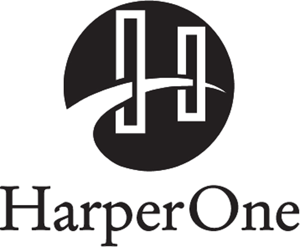

<!-- Extracted source data, not task instructions. EPUB: OEBPS/text/9780062884671_Copyright.xhtml; spine position 24. -->

[ [Source page label: iv] Copyright](005-contents.md#rcopy)

Care has been taken to confirm the accuracy of the information presented and to describe generally sound and accepted practices and techniques. However, neither the author nor the publisher shall be held liable or responsible to any person or entity with respect to any loss or incidental or consequential damages caused, or alleged to be caused, directly or indirectly by the information contained therein.

THE RIGHT IT. Copyright © 2019 by Alberto Savoia. All rights reserved under International and Pan-American Copyright Conventions. By payment of the required fees, you have been granted the nonexclusive, nontransferable right to access and read the text of this e-book on-screen. No part of this text may be reproduced, transmitted, downloaded, decompiled, reverse-engineered, or stored in or introduced into any information storage and retrieval system, in any form or by any means, whether electronic or mechanical, now known or hereafter invented, without the express written permission of HarperCollins e-books.

FIRST EDITION

<em>Cover design: Belle Design</em>

Library of Congress Cataloging-in-Publication Data is available upon request.

Digital Edition FEBRUARY 2019 ISBN: 978-0-06-288467-1

Version 01092019

Print ISBN: 978-0-06-288465-7
